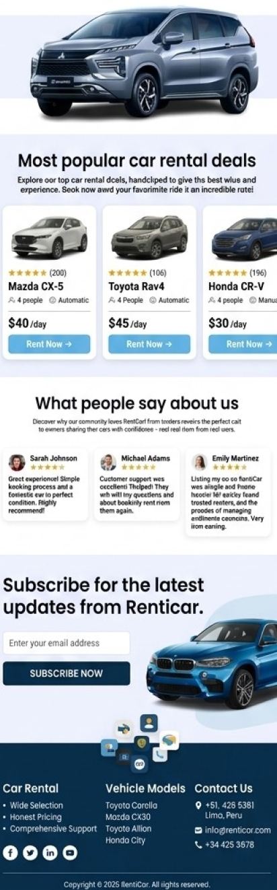

<div align="center">

<p align="center">
  
</p>

<h3 align="center">
Universidad Peruana de Ciencias Aplicadas
</h3>

<h3 align="center">
Ingeniería de Software  
<br><br>
Periodo: 202620 
<br><br>
1ACC0238 - Diseño de Experimentos de Ingeniería de Software
<br><br>
NRC: 9090  
<br><br>
Docente: Juan Antonio Flores Moroco
<br><br>
<strong>Informe de Trabajo Final</strong>  
<br><br>
Startup: Codexa-Team
<br><br>
Producto: Por hacer
<br><br>
<br><br>
<strong>Integrantes</strong>  
<br><br>
u202314354 - Solís Campos, Estefano Sebastian
<br><br>
U202311086 - Landa Ortiz, Sergio Javier
<br><br>
U20231D400 - Angeles Rojas, Sheila Jasmin
<br><br>
U202019409 - Linares Bernable, Cesar Alejandro
<br><br>
U202313403 - Via Luna, Bruce
<br><br>
2026-02
</h3>
</div>

<div style="break-after: page;"></div>

## Registro de Versiones del Informe

| Versión | Fecha | Autor  | Descripción de modificación   |              
| ------- |-----|-----------|---------------------------|
| 1.0  | 10/09/2026 | Bruce Via Luna  | Creacion del documento|

## Project Report Collaboration Insights

**AUTHORS:**

- Bruce Via Luna
- Cesar Alejando Linares Bernable
- Sheila Jasmin Angeles Rojas
- Estefano Sebastian Solis Campos
- Sergio Javier Landa Ortiz

|  URL del repositorio del reporte  |
| :-----------------------------------: |
| https://github.com/Codexa-Team/Project-Report |

**AV1:**


## Contenido

- [Student Outcome](#student-outcome)

- [Part I: As-Is Software Project](#part-i-as-is-software-project)

- [Capítulo I: Introducción](#capítulo-i-introducción)
    - [1.1. Startup Profile](#11-startup-profile)
        - [1.1.1. Descripción de la Startup](#111-descripción-de-la-startup)
        - [1.1.2. Perfiles de integrantes del equipo](#112-perfiles-de-integrantes-del-equipo)
    - [1.2. Solution Profile](#12-solution-profile)
        - [1.2.1. Antecedentes y problemática](#121-antecedentes-y-problemática)
        - [1.2.2. Lean UX Process](#122-lean-ux-process)
            - [1.2.2.1. Lean UX Problem Statements](#1221-lean-ux-problem-statements)
            - [1.2.2.2. Lean UX Assumptions](#1222-lean-ux-assumptions)
            - [1.2.2.3. Lean UX Hypothesis Statements](#1223-lean-ux-hypothesis-statements)
            - [1.2.2.4. Lean UX Canvas](#1224-lean-ux-canvas)
    - [1.3. Segmentos Objetivo](#13-segmentos-objetivo)

- [Capítulo II: Requirements Elicitation & Analysis](#capítulo-ii-requirements-elicitation-&-analysis)
    - [2.1. Competidores](#21-competidores)
        - [2.1.1. Análisis competitivo](#211-análisis-competitivo)
        - [2.1.2. Estrategias y tácticas frente a competidores](#212-estrategias-y-tácticas-frente-a-competidores)
    - [2.2. Entrevistas](#22-entrevistas)
        - [2.2.1. Diseño de entrevistas](#221-diseño-de-entrevistas)
        - [2.2.2. Registro de entrevistas](#222-registro-de-entrevistas)
        - [2.2.3. Análisis de entrevistas](#223-análisis-de-entrevistas)
    - [2.3. Needfinding](#23-needfinding)
        - [2.3.1. User Personas](#231-user-personas)
        - [2.3.2. User Task Matrix](#232-user-task-matrix)
        - [2.3.3. User Journey Mapping](#233-user-journey-mapping)
        - [2.3.4. Empathy Mapping](#234-empathy-mapping)
        - [2.3.5. As-is Scenario Mapping](#235-as-is-scenario-mapping)
    - [2.4. Ubiquitous Language](#24-ubiquitous-language)

- [Capítulo III: Requirements Specification](#capítulo-iii-requirements-specification)
    - [3.1. To-Be Scenario Mapping](#31-to-be-scenario-mapping)
    - [3.2. User Stories](#32-user-stories)
    - [3.3. Product Backlog](#33-product-backlog)
    - [3.4. Impact Mapping](#34-impact-mapping)

- [Capítulo IV: Product Design](#capítulo-iv-product-design)
    - [4.1. Style Guidelines](#41-style-guidelines)
        - [4.1.1. General Style Guidelines](#411-general-style-guidelines)
        - [4.1.2. Web Style Guidelines](#412-web-style-guidelines)
        - [4.1.3. Mobile Style Guidelines](#413-mobile-style-guidelines)
            - [4.1.3.1. iOS Mobile Style Guidelines](#4131-ios-mobile-style-guidelines)
            - [4.1.3.2. Android Mobile Style Guidelines](#4132-android-mobile-style-guidelines)
    - [4.2. Information Architecture](#42-information-architecture)
        - [4.2.1. Organization Systems](#421-organization-systems)
        - [4.2.2. Labeling Systems](#422-labeling-systems)
        - [4.2.3. SEO Tags and Meta Tags](#423-seo-tags-and-meta-tags)
        - [4.2.4. Searching Systems](#424-searching-systems)
        - [4.2.5. Navigation Systems](#425-navigation-systems)
    - [4.3. Landing Page UI Design](#43-landing-page-ui-design)
        - [4.3.1. Landing Page Wireframe](#431-landing-page-wireframe)
        - [4.3.2. Landing Page Mock-up](#432-landing-page-mock-up)
    - [4.4. Mobile Applications UX/UI Design](#44-web-applications-uxui-design)
        - [4.4.1. Mobile Applications Wireframes](#441-web-applications-wireframes)
        - [4.4.2. Mobile Applications Wireflow Diagrams](#442-web-applications-wireflow-diagrams)
        - [4.4.3. Mobile Applications Mock-ups](#443-web-applications-mock-ups)
        - [4.4.4. Mobile Applications User Flow Diagrams](#444-web-applications-user-flow-diagrams)
    - [4.5. Mobile Applications Prototyping](#45-web-applications-uxui-design)
        - [4.5.1. Android Mobile Applications Prototyping](#451-web-applications-wireframes)
        - [4.5.2. iOS Mobile Applications Prototyping](#452-web-applications-wireflow-diagrams)
    - [4.6. Web Applications UX/UI Design](#46-web-applications-uxui-design)
        - [4.6.1. Web Applications Wireframes](#461-web-applications-wireframes)
        - [4.6.2. Web Applications Wireflow Diagrams](#462-web-applications-wireflow-diagrams)
        - [4.6.3. Web Applications Mock-ups](#463-web-applications-mock-ups)
        - [4.6.4. Web Applications User Flow Diagrams](#464-web-applications-user-flow-diagrams)
    - [4.7. Web Applications Prototyping](#47-web-applications-prototyping)
    - [4.8. Domain-Driven Software Architecture](#48-domain-driven-software-architecture)
        - [4.8.1. Software Architecture Context Diagram](#481-software-architecture-context-diagram)
        - [4.8.2. Software Architecture Container Diagrams](#482-software-architecture-container-diagrams)
        - [4.8.3. Software Architecture Components Diagrams](#483-software-architecture-components-diagrams)
    - [4.9. Software Object-Oriented Design](#49-software-object-oriented-design)
        - [4.9.1. Class Diagrams](#491-class-diagrams)
        - [4.9.2. Class Dictionary](#492-class-dictionary)
    - [4.10. Database Design](#410-database-design)
        - [4.10.1. Relational/Non-Relational Database Diagram](#4101-realtional/non-realtional-database-diagram)

- [Capítulo V: Product Implementation](#capítulo-v-product-implementation)
    - [5.1. Software Configuration Management](#51-software-configuration-management)
        - [5.1.1. Software Development Environment Configuration](#511-software-development-environment-configuration)
        - [5.1.2. Source Code Management](#512-source-code-management)
        - [5.1.3. Source Code Style Guide & Conventions](#513-source-code-style-guide--conventions)
        - [5.1.4. Software Deployment Configuration](#514-software-deployment-configuration)
    - [5.2. Product Implementation & Deployment.](#52-product-implementation--deployment)
        - [5.2.1. Sprint Backlogs.](#521-sprint-backlogs)
        - [5.2.2. Implemented Landing Page Evidence](#522-implemented-landing-page-evidence)
        - [5.2.3. Implemented Frontend-Web Application Evidence](#523-implemented-frontend-web-application-evidence)
        - [5.2.4. Acuerdo de Servicio - SaaS](#524-acuerdo-de-servicio---saas)
        - [5.2.5. Implemented Native-Mobile Application Evidence](#525-implemented-native-mobile-application-evidence)
        - [5.2.6. Implemented RESTful API and/or Serverless Backend Evidence](#526-implemented-restful-api-andor-serverless-backend-evidence)
        - [5.2.7. RESTful API documentation](#527-restful-api-documentation)
        - [5.2.8. Team Collaboration Insights](#528-team-collaboration-insights)
    - [5.3. Video About-the-Product.](#53-video-about-the-product)

- [Conclusiones](#conclusiones)
- [Bibliografía](#bibliografía)
- [Anexos](#anexos)

## Student Outcome

El curso contribuye al cumplimiento del Student Outcome ABET:

**ABET – EAC - Student Outcome 4**

**Criterio:**  La capacidad de reconocer responsabilidades éticas y
profesionales en situaciones de ingeniería y hacer juicios informados, que debenc considerar el impacto de las soluciones de ingeniería en contextos globales, económicos, ambientales y sociales.

<div align="center">

<table>
    <thead>
        <tr>
            <th>Criterio específico</th>
            <th>Acciones realizadas</th>
            <th>Conclusiones</th>
        </tr>
    </thead>
    <tbody>
        <tr>
            <td>Reconoce responsabilidad ética y
profesional en situaciones de ingeniería de
software.</td>
            <td>
            </td>
            <td>
            </td>
        </tr>
        <tr>
            <td>Emite juicios informados considerando
el impacto de las soluciones de ingeniería de
software en contextos globales, económicos,
ambientales y sociales..
</td>
            <td>
            </td>
            <td>
            </td>
        </tr>
    </tbody>
</table>

</div>
<div style="break-after: page;"></div>

## Part I: As-Is Software Project

# Capítulo I: Introducción

## 1.1. Startup Profile

En esta sección presentamos a InnovaSoft, nuestra startup tecnológica, así como el sector en el que buscamos incursionar, la problemática identificada y la solución propuesta. Este apartado tiene como finalidad brindar una visión clara del proyecto y de los objetivos que orientan a nuestro equipo.

### 1.1.1. Descripción de la Startup

InnovaSoft es una startup fundada por estudiantes de la carrera de Ingeniería de Software, orientada al desarrollo de soluciones digitales innovadoras. Para el presente ciclo académico, hemos planteado el desarrollo de una aplicación web denominada RentiCar, una plataforma destinada al alquiler de vehículos en el Perú.

Actualmente, el mercado de alquiler de autos en el país enfrenta limitaciones: procesos poco digitalizados, escasa confianza entre arrendadores y arrendatarios, y la ausencia de un sistema que centralice ofertas de forma segura y sencilla. Frente a esta problemática, RentiCar busca convertirse en un espacio confiable que conecte a propietarios de vehículos con clientes interesados en alquilarlos, garantizando una experiencia rápida, segura y transparente.

### Mision:

Facilitar el acceso al alquiler de vehículos en el Perú mediante una plataforma digital segura, confiable y de fácil uso, que conecte de manera transparente a propietarios y clientes.

### Vision: 

Convertirnos en la plataforma líder de alquiler de vehículos en el Perú y expandirnos hacia Latinoamérica, ofreciendo una experiencia innovadora, eficiente y 100% confiable, que transforme la forma en que las personas acceden a soluciones de movilidad.

### 1.1.2. Perfiles de integrantes del equipo


<table>
    <tr>
        <td>Perfil</td>
        <td>Foto</td>
    </tr>
    <tr>
        <td><b>Nombre:</b> Bruce Via Luna <br>
            <b>Carrera:</b> Ingenieria de Software <br>
        <b>Descripcion:</b> Soy Bruce Via Luna de codigo u202313403, entusiasta sobre el control y manejo de bases de datos con conocimientos en C# y C++
        <td></td>
    </tr>
    <tr>
        <td><b>Nombre:</b> - Cesar Alejando Linares Bernable <br>
            <b>Carrera:</b> Ingenieria de Software <br>
        <b>Descripcion:</b>  
        <td></td>
    </tr>
    <tr>
        <td><b>Nombre:</b> Sagastegui Rodriguez, Luis Jesus <br>
            <b>Carrera:</b> Ingenieria de Software <br>
        <b>Descripcion:</b> 
        <td></td>
    </tr>
    <tr>
        <td><b>Nombre:</b> Solis Campos, Estefano Sebastian <br>
            <b>Carrera:</b> Ingenieria de Software <br>
        <b>Descripcion:</b> 
        <td></td>
    </tr>
    <tr>
        <td><b>Nombre:</b> Sheila Jasmin Angeles Rojas <br>
            <b>Carrera:</b> Ingenierìa de software <br>
        <b>Descripcion:</b> 
        <td></td>
    </tr>
   <table>

## 1.2. Solution Profile

### 1.2.1 Antecedentes y problemática

En el Perú, el mercado de alquiler de vehículos se encuentra rezagado frente a otros servicios de movilidad, debido principalmente a la informalidad de las transacciones, la ausencia de plataformas centralizadas confiables y la desconfianza existente entre propietarios y clientes. Actualmente, la mayoría de operaciones se realiza mediante redes sociales, anuncios clasificados o contactos directos, lo que genera serios riesgos de fraude, pérdida de dinero, incumplimiento en los acuerdos y falta de respaldo legal. A esto se suma que, en la mayoría de los casos, los procesos son poco prácticos y requieren múltiples pasos presenciales, dificultando el acceso a un servicio rápido y eficiente.

Si bien existen alternativas en el mercado internacional, su cobertura en el Perú es limitada, costosa o no responde a la realidad del usuario promedio. Esto deja un vacío en el sector, el cual representa una oportunidad para el desarrollo de una solución digital innovadora. Por ello, resulta fundamental plantear una propuesta que brinde seguridad, transparencia y facilidad de uso, y que al mismo tiempo fomente la confianza entre los actores involucrados. Con este proyecto buscamos no solo atender una necesidad inmediata de movilidad, sino también impulsar la digitalización del sector y promover nuevas oportunidades económicas para los propietarios de vehículos.

A continuación, se presenta un análisis detallado de esta problemática empleando la metodología ‘5W2H’.

**Who** <br>

Por un lado, se encuentran los propietarios de vehículos, personas que muchas veces tienen un automóvil que no utilizan de forma constante y buscan una manera práctica y segura de generar ingresos adicionales a través de su alquiler. Por otro lado, están los clientes que requieren un vehículo de manera temporal, ya sea por motivos de viaje, trabajo, emergencias o simplemente por no contar con un automóvil propio. Ambos grupos comparten una necesidad común: acceder a un sistema que les permita conectarse de forma confiable y sencilla, sin tener que recurrir a procesos engorrosos o inseguros.

**What** <br>

Se identifica la urgencia de contar con una plataforma que funcione como un puente seguro y transparente entre propietarios y clientes. Actualmente, la falta de un servicio centralizado hace que el proceso de alquiler sea desordenado y arriesgado, lo cual limita el crecimiento del sector. Una solución digital debe resolver estos problemas principales: la confianza entre ambas partes, la formalización de los acuerdos y la rapidez en el proceso de búsqueda y alquiler.

**Where** <br>

El problema se concentra principalmente en el Perú, especialmente en las grandes ciudades como Lima, Arequipa y Trujillo, donde existe una mayor demanda de movilidad. Sin embargo, la problemática no es exclusiva de estas zonas; en regiones más pequeñas la necesidad es incluso mayor, ya que los servicios de alquiler tradicionales suelen ser escasos o inexistentes. Esto abre la posibilidad de que, una vez consolidada la solución en el ámbito nacional, se pueda escalar hacia otros países de Latinoamérica que presentan contextos similares.

**When** <br>

Con el avance de la digitalización y el creciente uso de plataformas para todo tipo de servicios, los usuarios esperan soluciones inmediatas y seguras. Sin embargo, el alquiler de vehículos aún no se ha adaptado a estas expectativas de forma integral en el Perú. Por lo tanto, el momento de implementar una plataforma como RentiCar es ahora, antes de que la brecha entre lo que el usuario espera y lo que el mercado ofrece se amplíe aún más.

**Why** <br>

Los clientes enfrentan altos niveles de incertidumbre al alquilar un vehículo, ya que no cuentan con garantías ni respaldo en caso de inconvenientes. Los propietarios, por su parte, ven limitado su potencial de generar ingresos debido al miedo al incumplimiento de acuerdos o al mal uso de sus vehículos. Una plataforma digital que brinde confianza, formalidad y simplicidad responde directamente a esta necesidad, ofreciendo beneficios tangibles a ambos actores y contribuyendo a mejorar el ecosistema de movilidad en el país.

**How** <br>

Esta plataforma permitirá a los propietarios registrar sus vehículos, establecer condiciones de alquiler y gestionar solicitudes de forma ordenada. Del mismo modo, los clientes podrán buscar, comparar y reservar autos de manera ágil, contando con herramientas de validación de usuarios, contratos digitales y sistemas de pago seguro. De esta manera, se garantizará una experiencia fluida y confiable para ambas partes.

**How Much** <br>

Es necesario destacar que el modelo de negocio propuesto se basa en un esquema de comisión por cada transacción realizada dentro de la plataforma. Esto implica que tanto la barrera de entrada como los costos iniciales de adopción para los usuarios serán bajos, lo cual favorece la masificación del servicio. La mayor inversión, en esta primera etapa, estará enfocada en el desarrollo tecnológico y en las estrategias de marketing para captar una base sólida de usuarios que permita validar y escalar el proyecto en el corto plazo.

### 1.2.2 Lean UX Process

#### 1.2.2.1. Lean UX Problem Statements

El estado actual del alquiler de vehículos en el Perú se caracteriza por procesos informales, inseguros y desorganizados, que dependen principalmente de redes sociales, acuerdos verbales o contactos personales. Esta situación genera falta de confianza, riesgos de fraude, ausencia de respaldo legal y pérdida de tiempo tanto para propietarios como para clientes. Como resultado, los propietarios tienen miedo de arriesgar sus vehículos y los clientes carecen de garantías al momento de alquilar.

Nuestro producto busca cerrar esta brecha mediante el desarrollo de una plataforma digital confiable, diseñada para ofrecer procesos de verificación de identidad, contratos digitales y pagos seguros, con el fin de generar confianza y formalizar el mercado de alquiler de autos en el país.

Nuestro enfoque inicial se dirigirá a propietarios de vehículos interesados en generar ingresos adicionales y a clientes que necesitan movilidad temporal de forma segura y rápida, priorizando a usuarios urbanos familiarizados con servicios digitales.

Sabremos que tenemos éxito cuando logremos una reducción en la informalidad de las transacciones, un incremento en la confianza y satisfacción de propietarios y clientes, y un crecimiento sostenido en la cantidad de vehículos registrados y reservas confirmadas dentro de la plataforma.

#### 1.2.2.2. Lean UX Assumptions

En esta sección se formulan las hipótesis basadas en las suposiciones previas, estableciendo relaciones claras entre las características del producto, los comportamientos esperados de los usuarios y los resultados de negocio deseados.

1. Business Assumptions:

Asumimos que en el Perú existe un mercado con alto potencial para el alquiler de vehículos mediante plataformas digitales, debido a que actualmente predomina la informalidad y los usuarios carecen de una opción confiable que centralice la oferta y la demanda. Los propietarios de autos buscan generar ingresos adicionales y estarán interesados en publicar sus vehículos si se les ofrece un sistema con respaldo legal y garantías de seguridad, mientras que los clientes valorarán la posibilidad de alquilar un auto de forma rápida, segura y sin depender de trámites presenciales.

2. Business Outcome Assumptions:

Asumimos que si implementamos una plataforma segura, intuitiva y accesible, lograremos incrementar la confianza en el proceso de alquiler de vehículos en el país. Esto permitirá aumentar el número de autos registrados en la plataforma y generar un mayor volumen de transacciones. Un esquema de comisiones justo servirá como incentivo para que tanto propietarios como clientes prefieran RentiCar frente a canales informales, garantizando así la sostenibilidad del modelo de negocio.

3. User Assumptions:

Asumimos que los propietarios y clientes cuentan con acceso a internet y a dispositivos que les permiten interactuar con plataformas digitales, tal como ya lo hacen en servicios de transporte o delivery. Los propietarios sienten preocupación por la seguridad y buscan garantías que reduzcan riesgos de fraude o mal uso de sus autos, mientras que los clientes esperan procesos simples, rápidos y transparentes que les permitan alquilar sin depender de contactos personales.

4. User Outcome Assumptions:

Asumimos que si los propietarios perciben que la plataforma ofrece seguridad y respaldo, estarán dispuestos a alquilar sus autos con mayor frecuencia y a obtener ingresos adicionales de forma constante. Por su parte, los clientes, al encontrar un proceso confiable y fácil de usar, recurrirán al servicio de manera recurrente y lo recomendarán a otros. Una experiencia positiva aumentará la satisfacción y fidelización de los usuarios, contribuyendo al crecimiento orgánico de la comunidad.

5. Feature Assumptions:

Asumimos que las funcionalidades esenciales como la verificación de identidad, los contratos digitales, el sistema de reservas, los pagos seguros y las calificaciones entre usuarios serán suficientes para generar confianza en la etapa inicial. Una interfaz sencilla permitirá que incluso usuarios con poca experiencia digital utilicen la plataforma sin dificultad, mientras que el lanzamiento de un MVP con estas características será suficiente para validar el modelo de negocio y escalar posteriormente hacia funcionalidades más avanzadas como aplicaciones móviles, seguros integrados o servicios complementarios.

#### 1.2.2.3. Lean UX Hypothesis Statements

En esta sección se presentan las suposiciones clave que sustentan el diseño y desarrollo del producto. Estas suposiciones se basan en el entendimiento actual de las necesidades y comportamientos de los usuarios, así como en las condiciones del mercado. Identificar y documentar estas suposiciones permite al equipo alinearse en torno a expectativas comunes y establecer una base sólida para el proceso de validación a través de pruebas e iteraciones futuras.

**Hypothesis Statements 1:**

Creemos que en el Perú existe un mercado desatendido para el alquiler de vehículos mediante plataformas digitales, ya que la mayoría de transacciones se realizan de forma informal y sin garantías. Si ofrecemos un servicio confiable, con respaldo legal y mecanismos de seguridad, los propietarios estarán dispuestos a registrar sus autos y los clientes a alquilarlos con confianza.

**Hypothesis Statements 2:**

Creemos que al implementar una plataforma segura, transparente y de fácil uso lograremos aumentar el número de autos registrados y la cantidad de transacciones realizadas. Esto permitirá generar ingresos sostenibles a través de un esquema de comisiones, consolidando a RentiCar como la opción preferida frente a los canales informales y asegurando la viabilidad del negocio.

**Hypothesis Statements 3:**

Creemos que los propietarios de autos con acceso a internet y dispositivos digitales desean nuevas formas de generar ingresos y están preocupados por la seguridad de sus vehículos, mientras que los clientes buscan una experiencia de alquiler rápida y confiable. Una solución que combine facilidad de uso y garantías de seguridad responderá a las necesidades de ambos segmentos.

**Hypothesis Statements 4:**

Creemos que si los propietarios perciben que RentiCar les ofrece seguridad, respaldo legal y un sistema confiable, utilizarán la plataforma de forma recurrente y la recomendarán a otros. Al mismo tiempo, los clientes satisfechos por la simplicidad y confianza del servicio volverán a alquilar vehículos y contribuirán al crecimiento de la comunidad mediante la fidelización y el boca a boca.

**Hypothesis Statements 5:**

Creemos que al integrar funcionalidades clave como verificación de identidad, contratos digitales, pagos seguros, calificaciones y un sistema de reservas intuitivo, lograremos generar confianza en la etapa inicial. Estas características serán suficientes para validar la propuesta de valor en un MVP, y posteriormente podrán ampliarse con funcionalidades más avanzadas como aplicaciones móviles, seguros integrados y servicios complementarios.

#### 1.2.2.4. Lean UX Canvas

<table>
    <tr>
        <th colspan="1" valign="top">
            <p><b>Business Problem</b></p>
            <p>El alquiler de vehículos en el Perú se realiza mayoritariamente de manera informal, lo que genera desconfianza, riesgo de fraudes, falta de garantías legales y pérdida de tiempo para propietarios y clientes. La ausencia de una plataforma confiable centraliza este problema y limita el desarrollo de un mercado digital seguro
            </p>
        </th>
        <th colspan="1" rowspan="2" valign="top">
            <p><b>Solution Ideas</b></p>
            <p>Plataforma web que conecte a propietarios y clientes en un entorno seguro.</p>
            <p>Registro y verificación de identidad de usuarios.</p>
            <p>Publicación de vehículos con fotos, precios y disponibilidad.</p>
            <p>Sistema de reservas en línea con contratos digitales automáticos.</p>
            <p>Pasarela de pagos segura y protegida.</p>
            <p>Calificaciones y reseñas para generar confianza.</p>
        </th>
        <th colspan="1" valign="top">
            <p><b>Business Outcomes</b></p>
            <p>Aumentar el número de vehículos registrados y transacciones mensuales.</p>
            <p>Generar ingresos sostenibles mediante comisiones por alquiler.</p>
            <p>Reducir la informalidad del mercado de alquiler de autos.</p>
            <p>Posicionar a RentiCar como la plataforma más confiable del Perú.</p>
        </th>
    </tr>
    <tr>
        <td colspan="1" valign="top">
            <p><b>User & Customers</b></p>
            <p>Propietarios de vehículos que buscan generar ingresos adicionales.</p>
            <p>Clientes que requieren movilidad temporal de forma rápida y confiable.</p>
        </td>
        <td colspan="1" valign="top">
            <p><b>User Benefits</b></p>
            <p><b>Propietarios:</b> Seguridad en sus transacciones, respaldo legal y una fuente estable de ingresos adicionales.</p>
            <p><b>Clientes:</b> Acceso rápido y confiable a vehículos, con un proceso claro, seguro y transparente.</p>
        </td>
    </tr>
    <tr>
        <td colspan="1" valign="top">
            <p><b>Hypotheses</b></p>
            <p>Creemos que si ofrecemos una plataforma con pagos seguros y contratos digitales, los propietarios estarán dispuestos a registrar sus autos.</p>
            <p>Creemos que si los clientes encuentran un servicio rápido, confiable y con precios competitivos, recurrirán al alquiler de manera recurrente.</p>
            <p>Creemos que un MVP con funcionalidades básicas (registro, publicación, reservas, pagos y calificaciones) será suficiente para validar el modelo de negocio.</p>
        </td>
        <td colspan="1" valign="top">
            <p><b>What’s the most important thing we need to learn first?</b></p>
            <p>Construir un MVP con las funcionalidades esenciales: registro y verificación de usuarios, publicación de vehículos, sistema de reservas y pagos seguros. Esto permitirá validar rápidamente la adopción de la plataforma, medir el interés de propietarios y clientes, y comprobar si el modelo de negocio es viable antes de invertir en características avanzadas.</p>
        </td>
        <td colspan="1" valign="top">
            <p><b>What’s the least amount of work we need to do to learn the most important thing?</b></p>
            <p>Lo más importante que necesitamos aprender primero es si los usuarios (propietarios y clientes) confían lo suficiente en la plataforma para usarla como canal principal de alquiler de vehículos. La confianza es la base del modelo de negocio: si logramos demostrar que los usuarios se sienten seguros, el crecimiento y la adopción podrán escalar de manera sostenible.</p>
        </td>
    </tr>
</table>

## 1.3. Segmentos objetivo

<b>Segmento 1 (Arrendador de vehículo):</b>

Dueños de autos que no usan su vehículo con frecuencia y desean generar ingresos extras, estos serían personas de edad entre 25 a 45 años que residen en Lima Metropolitana.

<b>Segmento 2 (Arrendatario de vehículo):</b>

Personas que necesitan un vehículo de manera temporal que tengan edad entre 25 a 45 años con residencia en Lima Metropolitana y estos no tendrían un auto propio o profieran no usarlo todo el tiempo, así buscando una alternativa más económica y flexible frente a taxis o apps de transporte.

---

# Capítulo II: Requirements Elicitation & Analysis

## 2.1. Competidores

|                                                        Nombre del Competidor                                                         | Descripción |
|:------------------------------------------------------------------------------------------------------------------------------------:| :---------- |
|       Peru Rent a Car  [Link](https://www.perurentacar.com/)       | Life Alert es una de las marcas más reconocidas en sistemas de alerta médica, famosa por su eslogan “¡He caído y no puedo levantarme!”. Ofrece sistemas de emergencia diseñados para ayudar a personas mayores a solicitar asistencia rápidamente. Su principal dispositivo es un botón de emergencia que puede usarse en el hogar o fuera de él, enviando alertas a un centro de monitoreo disponible las 24 horas del día. |
| Clase A Rent a Car  [Link](https://www.alquilerautoslima.net/) | MobileHelp es un proveedor líder de sistemas de alerta médica que ofrece dispositivos portátiles y basados en el hogar para personas mayores. Sus dispositivos están diseñados para alertar a los servicios de emergencia en caso de una caída u otro incidente. Además de las soluciones de emergencia en el hogar, MobileHelp destaca por su cobertura fuera de casa gracias a su integración con redes móviles, lo que ofrece a los usuarios mayor independencia y movilidad. |
|                    Rento  [Link](https://rento.pe/)                    | CarePredict es una empresa tecnológica que se enfoca en el monitoreo preventivo para adultos mayores. Utiliza dispositivos portátiles equipados con sensores para rastrear patrones de comportamiento y signos vitales. A través de la inteligencia artificial, CarePredict predice posibles problemas de salud antes de que ocurran, como caídas o infecciones, y permite la intervención proactiva de cuidadores y familiares. |


### 2.1.1. Análisis competitivo

<table>
  <tr>
    <th colspan="7" valign="top"><b>Competitive Analysis Landscape</b></th>
  </tr>
  <tr>
    <td colspan="2" rowspan="2">¿Por qué llevar a cabo este análisis?</td>
  </tr>
  <tr>
    <td colspan="5">Comparar las características y funcionalidades clave de nuestra solución con las de la competencia para identificar ventajas competitivas y posibles áreas de mejora.</td>
  </tr>
  <tr>
    <td colspan="3">Competidores</td>
    <td colspan="1" valign="top" style="font-weight: bold;text-align: center">
        RentiCar 
    <td colspan="1" valign="top" style="font-weight: bold;text-align: center">
        Peru Rent a Car 
    </td>
    <td colspan="1" valign="top" style="font-weight: bold;text-align: center" >
        Clase A Rent a Car 
      </td>
    <td colspan="1" valign="top" style="font-weight: bold;text-align: center" >
        Rento
    </td>
  </tr>
  <tr>
    <td colspan="1" rowspan="2"><p>Perfil</p></td>
    <td colspan="2">Overview</td>
    <td colspan="1" valign="top">Plataforma web P2P para conectar dueños de autos con clientes de alquiler. Busca ser rápida, segura y fácil de usar, apostando por digitalización total y confianza.
    </td>
    <td colspan="1" valign="top">Empresa tradicional con más de 20 años en el mercado peruano. Ofrece autos, camionetas y vans con seguro, asistencia y soporte para turistas y empresas.
    </td>
    <td colspan="1" valign="top">Empresa local de alquiler con sede en Lima, enfocada en brindar vehículos modernos, en buen estado y con contratos flexibles. Reconocida por su trato personalizado.
    </td>
    <td colspan="1" valign="top">Primera app P2P de alquiler de autos particulares en Perú. Incluye seguro RIMAC, GPS, monitoreo 24/7 y verificación de usuarios. Opera solo en Lima pero con visión de crecer a nivel nacional.
    </td>
  </tr>
  <tr>
    <td colspan="2">Ventaja competitiva</td>
    <td colspan="1" valign="top">Modelo 100% colaborativo y escalable, con costos más bajos y posibilidad de crecer en número de autos sin necesidad de flota propia.
    </td>
    <td colspan="1" valign="top">Reputación consolidada, flota amplia y experiencia. Fiabilidad percibida por clientes corporativos y turistas.
    </td>
    <td colspan="1" valign="top">Atención cercana y personalizada. Ideal para clientes que priorizan confianza y flexibilidad de trato.
    </td>
    <td colspan="1" valign="top">Innovación tecnológica y respaldo asegurador fuerte. Modelo digital pionero en Perú.
  </tr>
  <tr>
    <td colspan="1" rowspan="2"><p>Perfil de Marketing</p></td>
    <td colspan="2">Mercado objetivo</td>
    <td colspan="1" valign="top"> Jóvenes profesionales, turistas digitales, empresas pequeñas que buscan movilidad flexible y propietarios de autos que quieren generar ingresos extra.
    </td>
    <td colspan="1" valign="top">Turistas extranjeros y nacionales, empresas que requieren autos para personal o ejecutivos, familias que buscan viajes seguros.
    </td>
    <td colspan="1" valign="top">Residentes de Lima y clientes que buscan un servicio confiable y directo con atención humana.
    </td>
    <td colspan="1" valign="top">Dueños de autos que buscan monetizar su vehículo, arrendatarios jóvenes urbanos, millennials y usuarios tecnológicos.
    </td>
  </tr>
  <tr>
    <td colspan="2">Estrategias de marketing</td>
    <td colspan="1" valign="top">Campañas digitales (redes, SEO/SEM), promociones de lanzamiento, alianzas con aseguradoras y fintechs, programas de referidos.
    </td>
    <td colspan="1" valign="top">Presencia en buscadores, alianzas con agencias de viajes, ferias de turismo y marketing tradicional.
    </td>
    <td colspan="1" valign="top">Publicidad local, confianza por reputación y marketing boca a boca.
    </td>
    <td colspan="1" valign="top">Estrategia digital intensiva en redes sociales, marketing de confianza basado en seguridad y respaldo legal.
    </td>
  </tr>
  <tr>
    <td colspan="1" rowspan="3"><p>Perfil de Producto</p></td>
    <td colspan="2">Productos & Servicios</td>
    <td colspan="1" valign="top">Alquiler P2P, validación digital de usuarios, registro de autos particulares, seguros, sistema de alertas y soporte técnico.
    </td>
    <td colspan="1" valign="top">Alquiler de autos, camionetas, vans y pickups. Incluye seguros, GPS opcional, servicios corporativos y entrega en aeropuertos.
    </td>
    <td colspan="1" valign="top">Alquiler de autos modernos, seguros incluidos, contratos adaptables según el cliente, soporte continuo.
    </td>
    <td colspan="1" valign="top">Alquiler peer-to-peer, seguro todo riesgo, GPS obligatorio, verificación de identidad y central de monitoreo 24/7.
    </td>
  </tr>
  <tr>
    <td colspan="2">Precios y Costos</td>
    <td colspan="1" valign="top">Precios competitivos, definidos por los propietarios pero regulados por la plataforma. Comisiones más bajas que empresas tradicionales.
    </td>
    <td colspan="1" valign="top">Tarifas medias-altas. Reflejan el costo de mantener una flota propia, seguros completos y servicios adicionales.
    </td>
    <td colspan="1" valign="top">Tarifas medias. Ajustadas a la atención personalizada y al buen estado de la flota.
    </td>
    <td colspan="1" valign="top">Tarifas dinámicas, generalmente más bajas que rent a car tradicionales gracias al modelo P2P.
    </td>
  </tr>
  <tr>
    <td colspan="2">Canales de distribución</td>
    <td colspan="1" valign="top">Pagina Web. Alianzas con aseguradoras y canales digitales.
    </td>
    <td colspan="1" valign="top">Oficinas físicas en Lima + página web y contacto telefónico.
    </td>
    <td colspan="1" valign="top">Oficina física, reservas por teléfono y página web.
    </td>
    <td colspan="1" valign="top">Aplicación móvil y web con reservas 100% digitales.
    </td>
  </tr>
  <tr>
    <td colspan="1" rowspan="5"><p>Análisis SWOT</p></td>
    
  </tr>
  <tr>
    <td colspan="2">Fortalezas</td>
    <td colspan="1" valign="top">Modelo escalable sin necesidad de flota propia, digitalización completa, costos más bajos, foco en experiencia de usuario.
    </td>
    <td colspan="1" valign="top">Reputación, infraestructura establecida, atención corporativa, variedad de flota.
    </td>
    <td colspan="1" valign="top">Atención personalizada, trato humano, autos modernos y cuidados.
    </td>
    <td colspan="1" valign="top">Innovación tecnológica, confianza gracias a seguro RIMAC y GPS, pioneros en P2P.
    </td>
  </tr>
  <tr>
    <td colspan="2">Debilidades</td>
    <td colspan="1" valign="top">Startup nueva sin reputación consolidada, confianza inicial a construir.
    </td>
    <td colspan="1" valign="top">Modelo rígido y menos flexible, procesos más burocráticos.
    </td>
    <td colspan="1" valign="top">Escala limitada y menos variedad de flota frente a grandes competidores.
    </td>
    <td colspan="1" valign="top">Flota aún limitada, dependencia del crecimiento de usuarios particulares.
    </td>
  </tr>
  <tr>
    <td colspan="2">Oportunidades</td>
    <td colspan="1" valign="top">Crecimiento de la economía colaborativa, demanda de digitalización, aumento de turismo y movilidad urbana.
    </td>
    <td colspan="1" valign="top">Aumento del turismo post-pandemia, expansión del mercado corporativo.
    </td>
    <td colspan="1" valign="top">Crecimiento de clientes que buscan atención diferenciada.
    </td>
    <td colspan="1" valign="top">Expansión nacional, crecimiento de usuarios P2P en Perú.
    </td>
  </tr>
  <tr>
    <td colspan="2">Amenazas</td>
    <td colspan="1" valign="top">Competencia consolidada, regulaciones del sector transporte, desconfianza inicial.
    </td>
    <td colspan="1" valign="top">Ingreso de apps digitales y startups más ágiles.
    </td>
    <td colspan="1" valign="top">Pérdida de clientes frente a plataformas digitales con mayor alcance.
    </td>
    <td colspan="1" valign="top">Aparición de nuevos competidores internacionales o nacionales con más capital.
    </td>
  </tr>
</table>


### 2.1.2. Estrategias y tácticas frente a competidores

<table>
  <tr>
    <th colspan="3" valign="top"></th>
    <th colspan="4" valign="top"><b>OPORTUNIDADES</b></th>
    <th colspan="4" valign="top"><b>AMENAZAS</b></th>
  </tr>
  <tr>
    <th colspan="3" valign="top"></th>
    <td colspan="4" valign="top">
      <li> Crecimiento del turismo interno y extranjero en Perú.
      <li> Tendencia a la digitalización de servicios de movilidad.
      <li> Aumento de la demanda de opciones económicas y flexibles en transporte.
      <li> Interés de PYMEs y startups por servicios de movilidad alternativos.
    </td>
    <td colspan="4" valign="top">
      <li> Alta competencia de empresas consolidadas (Peru Rent a Car, Clase A).
      <li> Competidores emergentes con modelo digital similar (Rento).
      <li> Riesgo de guerra de precios.
      <li> Desconfianza cultural hacia plataformas nuevas.
    </td>
  </tr>

  <tr>
    <th colspan="3" valign="top"><b>FORTALEZAS</b></th>
    <th colspan="4" valign="top"><b>ESTRATEGIAS FO (Ofensivas)</b></th>
    <th colspan="4" valign="top"><b>ESTRATEGIAS FA (Defensiva)</b></th>
  </tr>
  <tr>
    <td colspan="3" valign="top">
      <li> Plataforma 100% digital con reservas rápidas y seguras.
      <li> Flexibilidad en planes de alquiler (por horas, días o suscripción mensual).
      <li> Uso de tecnología IoT (GPS, monitoreo en tiempo real).
      <li> Enfoque en experiencia del usuario y atención 24/7.
    </td>
    <td colspan="4" valign="top">
      <li> Posicionar a RentiCar como la plataforma de alquiler más ágil y flexible para turistas y jóvenes en Lima. 
      <li> Usar la tecnología IoT como diferenciador innovador, mostrando seguridad y control en tiempo real.
      <li> Generar alianzas con hoteles, agencias de turismo y startups para integrar RentiCar en experiencias de viaje y negocios.
    </td>
    <td colspan="4" valign="top">
      <li> Diferenciarse de grandes competidores mediante la rapidez y simplicidad digital.
      <li> Competir con Rento ofreciendo mayor cobertura y disponibilidad de vehículos.
      <li> Evitar la guerra de precios destacando valor agregado: seguridad, flexibilidad y soporte 24/7.
    </td>
  </tr>

  <tr>
    <th colspan="3" valign="top"><b>DEBILIDADES</b></th>
    <th colspan="4" valign="top"><b>ESTRATEGIAS DO (Reorientación)</b></th>
    <th colspan="4" valign="top"><b>ESTRATEGIAS DA (Supervivencia)</b></th>
  </tr>
  <tr>
    <td colspan="3" valign="top">
      <li> Marca nueva sin historial ni reputación consolidada.
      <li> Flota inicial limitada frente a grandes competidores.
      <li> Recursos financieros más reducidos que empresas consolidadas.
      <li> Dependencia de la confianza digital en un mercado aún en transición.
    </td>
    <td colspan="4" valign="top">
      <li> Reforzar la confianza en la marca mediante certificaciones, seguros y políticas transparentes.
      <li> Expandir la flota progresivamente a través de convenios con propietarios particulares y PYMEs.
      <li> Aprovechar la digitalización para compensar la falta de trayectoria, mostrando procesos claros, seguros y amigables.
    </td>
    <td colspan="4" valign="top">
      <li> Lanzar campañas de marketing educativo sobre la seguridad y beneficios de alquilar en plataformas digitales.
      <li> Implementar un programa de fidelización para generar usuarios recurrentes desde el inicio.
      <li> Diversificar fuentes de ingreso (planes corporativos, suscripciones, alquiler por horas) para reducir vulnerabilidad frente a la competencia.
    </td>

  </tr>

</table>

## 2.2. Entrevistas

### 2.2.1. Diseño de entrevistas

**Segmento 1:** Dueño de vehiculo

#### Preguntas de Información General:

- ¿Cuál es tu nombre?
- ¿Cuántos años tienes?
- ¿En qué distrito vives?
- ¿A qué te dedicas actualmente?

#### Preguntas sobre el alquiler de sus vehículos:

- ¿Que tipo de documento exiges para proceder con el alquiler?
- ¿Qué tipo de vehículo ofreces para el alquiler?
- ¿Cual es la cantidad minima y maxima de tiempo que permites alquilar tu vehiculo?
- ¿Cómo llevas la cuenta de todos tus vehículos, tanto alquilados como sin alquilar?

#### Preguntas sobre la plataforma:

- ¿Que tipo de plataforma usas para ofrecer tu vehiculo?
- ¿En qué dispositivos accedes a dichas plataformas?
- ¿Consideras que las aplicaciones te dan facilidades para identificar clientes confiables?
- ¿Estarías dispuesto a ofrecer tus vehículos en una nueva plataforma que te permita consultar reseñas de un cliente previo al alquiler?
- ¿Estarías dispuesto a ofrecer tus vehículos en una nueva plataforma que te ofrezca un panel donde registrar tus vehículos y consultar su estado?
- ¿Estarías dispuesto a ofrecer tus vehículos en una nueva plataforma que te permita reseñar a los clientes?

**Segmento 2:** Usuario que busca alquilar un vehiculo

#### Preguntas de Información General:

- ¿Cuál es tu nombre?
- ¿Cuántos años tienes?
- ¿En qué distrito vives?
- ¿A qué te dedicas actualmente?

#### Preguntas sobre el alquiler de sus vehículos:

- ¿Qué tipo de documento te exigen para proceder con el alquiler?
- ¿Que tipo de vehiculo buscas alquilar?
- ¿Que documentos te suelen pedir previo al alquiler del vehiculo?
- ¿Que restricciones se te imponen previo al alquiler del vehiculo?

#### Preguntas sobre el alquiler de sus vehículos:

- ¿Qué tipo de plataforma usas para buscar vehículos?
- ¿En qué dispositivos accedes a dichas plataformas?
- ¿Consideras que las aplicaciones te dan facilidades para identificar vehículos o arrendadores confiables?
- ¿Estarías dispuesto a migrar a una nueva plataforma que te permita consultar reseñas de arrendadores antes de alquilar?
- ¿Estarías dispuesto a usar una nueva plataforma que te permita reservar un vehículo en unas fechas concretas antes de alquilarlo?
- ¿Estarías dispuesto a usar una nueva plataforma que te permita reseñar a los arrendadores?

### 2.2.2. Registro de entrevistas


*Entrevistas a arrendadores de vehiculos*
---
<br>

<table align="center">
  <tr>
    <th colspan="2" style="text-align:center">Entrevista 1</th>
  </tr>
  <tr>
    <td><strong>Entrevistado</strong></td>
    <td>Oriana Caceres</td>
  </tr>
  <tr>
    <td><strong>Edad</strong></td>
    <td>35 años</td>
  </tr>
  <tr>
    <td><strong>Distrito</strong></td>
    <td>Cercado de Lima</td>
  </tr>
  <tr>
    <td><strong>Timing</strong></td>
    <td>0:16-5:01</td>
  </tr>
  <tr>
    <td><strong>URL</strong></td>
    <td>
      
  `https://youtu.be/B3n8FB8qZX8`

  </td>
  </tr>
  <tr>
    <td colspan="2" style="text-align:justify">
      Resumen: <br>
      Oriana, contadora graduada, reside en el distrito de Cercado de Lima, habla sobre como el tener un auto que no usa mucho le sirve para tener un ingreso adicional al alquilarlo para servicios de uber, le gustaria una alternativa donde su auto sea separado de la identidad del conductor para mejor reputacion y seguridad.
    </td>
  </tr>
  <tr>
    <td colspan="2"><br>
      <br>
    </td>
  </tr>
</table>

<table align="center">
  <tr>
    <th colspan="2" style="text-align:center">Entrevista 2</th>
  </tr>
  <tr>
    <td><strong>Entrevistado</strong></td>
    <td>Margot Arnable</td>
  </tr>
  <tr>
    <td><strong>Edad</strong></td>
    <td>45 años</td>
  </tr>
  <tr>
    <td><strong>Distrito</strong></td>
    <td>San Martin de Porres</td>
  </tr>
  <tr>
    <td><strong>Timing</strong></td>
    <td>0:31-8:34</td>
  </tr>
  <tr>
    <td><strong>URL</strong></td>
    <td>
      
  `https://youtu.be/B3n8FB8qZX8`

  </td>
  </tr>
  <tr>
    <td colspan="2" style="text-align:justify">
      Resumen: <br>
      Margot, obstreta, reside en el distrito de San Martin de Porres, 
    </td>
  </tr>
  <tr>
    <td colspan="2"><br>
      <br>
    </td>
  </tr>
</table>

<table align="center">
  <tr>
    <th colspan="2" style="text-align:center">Entrevista 3 </th>
  </tr>
  <tr>
    <td><strong>Entrevistado</strong></td>
    <td>Noelia Gomez</td>
  </tr>
  <tr>
    <td><strong>Edad</strong></td>
    <td>25 años</td>
  </tr>
  <tr>
    <td><strong>Distrito</strong></td>
    <td>Pueblo Libre</td>
  </tr>
  <tr>
    <td><strong>Timing</strong></td>
    <td>03:49 - 07:32 minutos (Duración: 3:43 minutos)</td>
  </tr>
  <tr>
    <td><strong>URL</strong></td>
    <td>
  `https://youtu.be/EWyy7faTG3Y`
  </td>
  </tr>
  <tr>
    <td colspan="2" style="text-align:justify">
      <b>Resumen:</b><br>
      Comenta su experiencia alquilando su auto personal, un Sedán. Actualmente, gestiona el alquiler a través del calendario de su celular y lo publicita en Facebook Marketplace y grupos de WhatsApp, pero reconoce que estos medios no le brindan facilidades para verificar la confiabilidad de los clientes, teniendo que guiarse por su instinto. Estaría muy dispuesta a usar una nueva plataforma que le permita consultar reseñas de clientes previos para tener más tranquilidad, así como un panel para registrar su vehículo de forma más profesional. Además, considera fundamental poder reseñar a los clientes para fomentar un sistema de confianza y responsabilidad mutua.
    </td>
  </tr>
  <tr>
    <td colspan="2" style="text-align:center"><br>
      <br>
    </td>
  </tr>
</table>

<br>

*Entrevistas a arrendatarios de vehiculos*
---
<table align="center">
  <tr>
    <th colspan="2" style="text-align:center">Entrevista 1</th>
  </tr>
  <tr>
    <td><strong>Entrevistado</strong></td>
    <td>Sebastian Altamirano</td>
  </tr>
  <tr>
    <td><strong>Edad</strong></td>
    <td>22 años</td>
  </tr>
  <tr>
    <td><strong>Distrito</strong></td>
    <td>Cercado de Lima</td>
  </tr>
  <tr>
    <td><strong>Timing</strong></td>
    <td>0:10-7:41</td>
  </tr>
  <tr>
    <td><strong>URL</strong></td>
    <td>
      
  `https://youtu.be/UtvLuMLGYto`

  </td>
  </tr>
  <tr>
    <td colspan="2" style="text-align:justify">
      Resumen: <br>
      Sebastian, estudiante universitario con licencia de conducir, reside en el distrito de Cercado de Lima, habla sobre como se le suelen pedir permisos de mas para poder alquilar un auto ademas de que le es complicado reservar para fechas muy concurridas por lo que le gustaria poder alquilar por modelo y para fechas exactas.
    </td>
  </tr>
  <tr>
    <td colspan="2"><br>
      <br>
    </td>
  </tr>
</table>

<table align="center">
  <tr>
    <th colspan="2" style="text-align:center">Entrevista 2</th>
  </tr>
  <tr>
    <td><strong>Entrevistado</strong></td>
    <td> Yinno Ovalo Carranza</td>
  </tr>
  <tr>
    <td><strong>Edad</strong></td>
    <td>20 años</td>
  </tr>
  <tr>
    <td><strong>Distrito</strong></td>
    <td> Chorrillos</td>
  </tr>
  <tr>
    <td><strong>Timing</strong></td>
    <td> 0:15 - 3:23 </td>
  </tr>
  <tr>
    <td><strong>URL</strong></td>
    <td>
      
  `https://youtu.be/sIelvvtnsms`

  </td>
  </tr>
  <tr>
    <td colspan="2" style="text-align:justify">
      Resumen: <br>
     Gino Ábalos Carranza, arquitecto de 20 años residente en Chorrillos, suele alquilar vehículos sedán para movilizarse y busca sus opciones principalmente en Facebook; aunque señala que actualmente solo le solicitan   
      DNI para el trámite, considera que dicha red social carece de especialización para el servicio, por lo que expresa un total interés en migrar a una plataforma dedicada que integre un sistema de reseñas sobre los          arrendadores y le permita agendar reservas para fechas concretas.
    </td>
  </tr>
  <tr>
    <td colspan="2"><br>
      <br>
    </td>
  </tr>
</table>


### 2.2.3. Análisis de entrevistas
El análisis del primer segmento revela una marcada necesidad de transición desde la informalidad digital hacia una plataforma especializada. Un aspecto central es la alta motivación económica derivada de la subutilización de sus vehículos, los cuales pasan la mayor parte del tiempo estacionados y buscan ser monetizados como ingresos pasivos por perfiles profesionales. No obstante, los propietarios dependen actualmente de métodos rudimentarios e informales ,tales como Facebook Marketplace, grupos de WhatsApp y calendarios personales, viéndose obligados a guiarse únicamente por su instinto ante la absoluta ausencia de filtros de verificación y control previos. Esto genera una profunda exposición al riesgo, impulsando una fuerte exigencia por contar con herramientas profesionales de gestión, tales como un panel centralizado de control, sistemas de reseñas bidireccionales para fomentar la responsabilidad mutua y la necesidad de resguardar su seguridad frente a incidentes externos.

Por otro lado, el análisis del segundo segmento expone las deficiencias críticas que experimentan los conductores al buscar vehículos en el mercado actual. Al recurrir a redes sociales y canales informales, se enfrentan a una dualidad frustrante: procesos excesivamente laxos que apenas solicitan un documento de identidad y generan desconfianza general, o bien permisos innecesarios que entorpecen la experiencia. Asimismo, ambos perfiles coinciden en las severas complicaciones para asegurar reservas en fechas de alta demanda o temporadas concurridas debido a la falta de estandarización en la oferta. Esto genera un claro interés por migrar hacia una solución digital especializada que les permita filtrar vehículos por modelos específicos, agendar con precisión para fechas exactas y consultar reseñas previas sobre los arrendadores para asegurar una experiencia transparente y confiable.

Al contrastar ambos segmentos, se evidencia que tanto arrendadores como arrendatarios comparten el mismo dolor raíz, operan en un ecosistema altamente informal, inseguro y carente de trazabilidad. Mientras que el propietario busca mitigar el riesgo de daños y validar estrictamente la identidad del conductor, el arrendatario exige certidumbre, agilidad y transparencia en los precios y disponibilidad de los modelos. En consecuencia, la oportunidad de valor se centra en consolidar una plataforma unificada que actúe como un filtro de confianza bidireccional. Mediante la integración de módulos de verificación estricta de identidad, reputación basada en calificaciones mutuas y un dashboard especializado de gestión, es posible resolver las fricciones de ambos lados del mercado, transformando un proceso basado en la intuición en una experiencia profesional, segura y escalable.

De acuerdo con las entrevistas y su respectivo análisis, a continuación se presenta un gráfico que resume los principales puntos de dolor y lo que busca cada segmento:
<br>
      <br>
      
## 2.3. Needfinding
### 2.3.1. User Personas

Los User Personas son representaciones ficticias pero fundamentadas en los hallazgos de las entrevistas realizadas a 
los dos segmentos objetivo del proyecto: arrendadores y arrendatarios. Su función es sintetizar las características, 
motivaciones, necesidades y frustraciones de los usuarios principales, permitiendo orientar el diseño de la aplicación 
hacia soluciones que respondan a sus expectativas reales. A continuación, se presentan los perfiles construidos con 
sus respectivos avatares ilustrativos, que servirán como referencia durante el proceso de desarrollo y validación de 
la plataforma.

###### Segmento Objetivo 1 (Arrendador de vehículos)

###### Segmento Objetivo 2 (Arrendatario de vehículos)

### 2.3.2. User Task Matrix

| **User Task Matrix**                     | **Arrendador – Frecuencia** | **Arrendador – Importancia** | **Arrendatario – Frecuencia** | **Arrendatario – Importancia** |
|------------------------------------------|-----------------------------|------------------------------|-------------------------------|--------------------------------|
| Publicar vehículo en la plataforma       | Siempre                     | Alta                         | Nunca                         | Baja                           |
| Gestionar reservas activas               | A menudo                    | Alta                         | Siempre                       | Alta                           |
| Revisar reseñas de usuarios              | Siempre                     | Alta                         | A menudo                      | Alta                           |
| Acceso a documentos de garantía          | Siempre                     | Alta                         | A veces                       | Media                          |
| Consultar estado y ubicación IoT del auto| A menudo                    | Alta                         | A veces                       | Media                          |
| Reservar un vehículo                     | Nunca                       | Baja                         | Siempre                       | Alta                           |

---

###### Análisis de la User Task Matrix

El análisis de la matriz de tareas muestra diferencias claras entre los dos segmentos principales. El **arrendador** 
concentra sus actividades en la **publicación de vehículos, la gestión de reservas y la revisión de reseñas**, todas 
ellas consideradas de alta importancia, ya que están directamente relacionadas con la protección de su inversión. 
Asimismo, para este segmento es fundamental contar con acceso a **documentos de garantía** y con un **módulo IoT 
básico** que permita visualizar el estado y ubicación del vehículo, lo cual incrementa la confianza y reduce el 
riesgo de fraudes.

Por su parte, el **arrendatario** enfoca su experiencia en la **reserva de vehículos** y en la posibilidad de 
**consultar reseñas de arrendadores**, funciones que le otorgan seguridad y transparencia en el proceso. Aunque 
reconoce la utilidad del acceso a documentos y del indicador IoT, estas tareas no son percibidas como prioritarias 
frente a la necesidad principal de encontrar y reservar un vehículo de manera confiable.

En conclusión, la matriz evidencia que ambos segmentos comparten la necesidad de un sistema que promueva 
**transparencia, seguridad y confianza**. El arrendador busca reducir riesgos en la entrega de sus vehículos, 
mientras que el arrendatario demanda una experiencia clara y confiable al alquilar. Estos hallazgos guían 
directamente las funcionalidades clave a priorizar en el diseño de la plataforma.


### 2.3.3. User Journey Mapping

El **User Journey Mapping** permite visualizar de manera detallada la experiencia que atraviesan los usuarios 
durante la interacción con las plataformas actuales de alquiler de vehículos. Este ejercicio hace posible identificar 
los puntos de contacto, emociones y frustraciones de cada segmento objetivo, mostrando las debilidades del 
proceso actual y evidenciando las oportunidades de mejora que justifican la propuesta de valor de la 
nueva aplicación.

###### Segmento Objetivo 1 (Arrendador de vehículos)

El recorrido del arrendador refleja un flujo de trabajo que no resulta del todo eficiente ni satisfactorio. Aunque 
logra captar clientes mediante plataformas gratuitas de amplia difusión como Facebook o WhatsApp, se muestra 
frustrado por la escasa seguridad y falta de garantías que estas herramientas ofrecen. A pesar de ello, continúa 
utilizándolas debido a su alcance y practicidad, aunque reconoce la necesidad de migrar a una solución más confiable 
y profesional.

###### Segmento Objetivo 2 (Arrendatario de vehículos)

Por el lado del arrendatario, la experiencia está marcada por la limitada disponibilidad de opciones confiables y 
la inseguridad que transmiten las plataformas gratuitas. Esta situación genera desconfianza y lo obliga a depender 
de la identificación previa de arrendadores de confianza, reduciendo el uso de dichas plataformas a casos 
estrictamente necesarios. Esto evidencia que, aunque existe una necesidad de movilidad, la falta de transparencia 
y seguridad limita la satisfacción y continuidad en el uso de los servicios actuales.

### 2.3.4. Empathy Mapping

El **Empathy Mapping** es una herramienta que permite comprender de manera profunda a los usuarios, identificando 
lo que **piensan, sienten, dicen y hacen** durante su experiencia con el servicio. Este recurso facilita visualizar 
no solo sus necesidades funcionales, sino también sus motivaciones, frustraciones y expectativas, lo que ayuda a 
orientar el diseño de la solución hacia una experiencia más centrada en el usuario.


###### Segmento Objetivo 1 (Arrendador de vehículos)


###### Segmento Objetivo 2 (Arrendatario de vehículos)


### 2.3.5. As-is Scenario Mapping

## 2.4. Ubiquitous Language

Con el fin de establecer un lenguaje común entre los desarrolladores y los usuarios, se definió un conjunto de 
términos que se emplearán de forma consistente a lo largo del proyecto. Este lenguaje ubicuo evita confusiones 
conceptuales y facilita la comunicación dentro del equipo, asegurando que todos comprendan los mismos procesos 
con las mismas palabras.

**Términos principales en el dominio de Renticar:**

- **Arrendador**: Persona que registra y ofrece su vehículo en la plataforma.

- **Arrendatario**: Usuario que alquila un vehículo registrado en la plataforma.

- **Publicación**: Ficha que contiene los datos del vehículo y sus condiciones de alquiler.

- **Reserva**: Confirmación del alquiler de un vehículo por un periodo determinado.

- **Contrato digital**: Documento electrónico que formaliza las condiciones del alquiler.

- **Reseña**: Evaluación realizada al finalizar la reserva, que permite calificar la experiencia.

- **Estado del vehículo**: Indicador del sistema que señala si el auto está Disponible, En uso o Finalizado.

- **Ubicación IoT**: Dato de localización y estado general del vehículo, mostrado de manera ligera durante la reserva.

- **Panel de gestión**: Espacio central del sistema donde los usuarios consultan publicaciones, reservas y reseñas.

Este lenguaje compartido no solo guía el diseño de la solución, sino que también constituye la base para la 
documentación, la arquitectura del software y las interacciones con los futuros usuarios, fortaleciendo la 
alineación entre el negocio y la tecnología.

# Capítulo III: Requirements Specification

## 3.1. To-Be Scenario Mapping

## 3.2. User Stories

| **Epic / Story ID** | **Título**                            | **Descripción**                                                                                                     | **Criterios de Aceptación**                                                                                                                                                                                                                                                                                                                     | **Relacionado con (Epic ID)** |
|---------------------|---------------------------------------|---------------------------------------------------------------------------------------------------------------------|-------------------------------------------------------------------------------------------------------------------------------------------------------------------------------------------------------------------------------------------------------------------------------------------------------------------------------------------------|-------------------------------|
| US-01               | Registro de Usuario                   | Como visitante, quiero registrarme en la aplicación para poder publicar vehículos o consultar opciones de alquiler. | Escenario 1: Given que un visitante accede al formulario de registro, when ingresa datos válidos y selecciona “Registrar”, then el sistema crea la cuenta y muestra un mensaje de confirmación. Escenario 2: Given que el visitante ingresa datos inválidos, when intenta registrarse, then el sistema muestra un error solicitando corrección. | EP-01                         |
| US-02               | Log In                                | Como usuario, quiero iniciar sesión con mis credenciales para acceder a mis publicaciones o realizar reservas.      | Escenario 1: Given que el usuario ya está registrado, when ingresa credenciales válidas, then accede al sistema. Escenario 2: Given que el usuario ingresa credenciales incorrectas, when intenta acceder, then el sistema muestra un aviso para reintentar.                                                                                    | EP-01                         |
| US-03               | Recuperación de Contraseña            | Como usuario, quiero restablecer mi contraseña en caso de pérdida de acceso a la cuenta.                            | Escenario 1: Given que el usuario olvidó su contraseña, when ingresa su correo válido, then se envía un link de recuperación. Escenario 2: Given que el usuario ingresa datos erróneos, when solicita recuperación, then el sistema muestra un error de validación.                                                                             | EP-01                         |
| US-04               | Dashboard del usuario                 | Como usuario, quiero contar con un Dashboard donde pueda consultar información de mis reservas.                     | Escenario 1: Given que el usuario accede al sistema, when selecciona “Log-In”, then se carga la pestaña “Dashboard”. Escenario 2: Given que está en otra pestaña, when selecciona “Dashboard”, then se redirige al panel principal.                                                                                                             | EP-02                         |
| US-05               | Sección Destacados del Dashboard      | Como usuario, quiero ver una sección de destacados con vehículos recomendados.                                      | Escenario 1: Given que el usuario accede al Dashboard, when está en la sección “Destacados”, then se muestran autos sugeridos. Escenario 2: Given que selecciona “Ver más”, when lo hace, then se redirige al catálogo de autos.                                                                                                                | EP-02                         |
| US-06               | Sección Publicados del Dashboard      | Como usuario, quiero visualizar mis vehículos publicados desde el Dashboard.                                        | Escenario 1: Given que accede al Dashboard, when se sitúa en la sección “Mis Publicaciones”, then se muestran sus autos publicados. Escenario 2: Given que selecciona “Nueva Publicación”, when lo hace, then se redirige al formulario de publicación.                                                                                         | EP-02                         |
| US-07               | Cancelar reserva de vehículo          | Como usuario, quiero cancelar una reserva de un vehículo.                                                           | Escenario 1: Given que está en su Dashboard, when selecciona una reserva, then puede cancelarla. Escenario 2: Given que selecciona varias reservas, when elige cancelación múltiple, then puede eliminarlas en lote.                                                                                                                            | EP-02                         |
| US-08               | Pestaña de Publicación                | Como usuario, quiero acceder a una pestaña de publicación para crear y gestionar mis vehículos en alquiler.         | Escenario 1: Given que desea publicar un vehículo, when selecciona “Nueva Publicación”, then se muestra el formulario. Escenario 2: Given que está en otra pestaña, when selecciona “Publicación”, then se redirige.                                                                                                                            | EP-03                         |
| US-09               | Creación de publicaciones             | Como usuario, quiero registrar publicaciones para ofrecer mis autos en alquiler.                                    | Escenario 1: Given que selecciona crear, when ingresa la información, then se guarda la publicación. Escenario 2: Given que selecciona una publicación, when la edita, then puede actualizar su información.                                                                                                                                    | EP-03                         |
| US-10               | Visualizar una publicación            | Como usuario, quiero consultar la información de una publicación creada.                                            | Escenario 1: Given que está en publicaciones, when selecciona una, then se muestran los datos. Escenario 2: Given que selecciona “Modificar”, when lo hace, then puede actualizar los datos registrados.                                                                                                                                        | EP-03                         |
| US-11               | Eliminar una publicación              | Como usuario, quiero eliminar una publicación ya creada.                                                            | Escenario 1: Given que selecciona una publicación, when hace clic en “Eliminar”, then se borra. Escenario 2: Given que selecciona varias publicaciones, when elige “Eliminar múltiples”, then puede eliminarlas en lote.                                                                                                                        | EP-03                         |
| US-12               | Pestaña de Navegación                 | Como usuario, quiero recorrer las publicaciones de autos disponibles en alquiler.                                   | Escenario 1: Given que desea explorar, when accede a “Navegación”, then se muestran los autos disponibles. Escenario 2: Given que está en otra pestaña, when selecciona “Navegación”, then se redirige a la sección.                                                                                                                            | EP-04                         |
| US-13               | Ordenar el precio de los alquileres   | Como usuario, quiero ordenar los alquileres según precio.                                                           | Escenario 1: Given que está en Navegación, when selecciona el ícono de ordenar, then los precios se listan de menor a mayor. Escenario 2: Given que ya ordenó, when vuelve a hacer clic, then se ordenan de mayor a menor.                                                                                                                      | EP-04                         |
| US-14               | Filtrado de marcas                    | Como usuario, quiero filtrar los vehículos en base a su marca.                                                      | Escenario 1: Given que escribe una marca en el campo, when confirma, then se muestran autos de esa marca. Escenario 2: Given que restablece filtros, when hace clic en “Borrar Filtros”, then se muestran todos nuevamente.                                                                                                                     | EP-04                         |
| US-15               | Reseñar publicaciones de alquiler     | Como usuario, quiero dejar reseñas sobre los autos que alquilé.                                                     | Escenario 1: Given que completó una reserva, when selecciona “Dejar Reseña”, then puede puntuar del 1 al 5. Escenario 2: Given que añade comentario, when lo guarda, then queda visible en la publicación.                                                                                                                                      | EP-04                         |
| US-16               | Reserva de vehículo                   | Como usuario, quiero reservar un auto en línea para asegurar su disponibilidad.                                     | Escenario 1: Given que está en una publicación, when selecciona “Reservar”, then elige fecha y horario. Escenario 2: Given que confirma reserva, when finaliza, then se registra en el sistema.                                                                                                                                                 | EP-04                         |
| US-17               | Ver estado IoT del auto               | Como usuario, quiero visualizar un indicador de ubicación y estado del vehículo durante la reserva.                 | Escenario 1: Given que tengo una reserva activa, when consulto la ficha del vehículo, then se muestra un widget con estado (Disponible/En uso) y ubicación general. Escenario 2: Given que el auto no tiene IoT activo, when consulto la ficha, then el widget no se muestra.                                                                   | EP-04                         |
| US-18               | Pestaña de Perfil                     | Como usuario, quiero acceder a mi perfil con mis datos personales y documentos.                                     | Escenario 1: Given que accedo a “Perfil”, when lo selecciono, then puedo ver o editar mi información. Escenario 2: Given que estoy en otra pestaña, when selecciono “Mi Perfil”, then se me redirige a la pestaña.                                                                                                                              | EP-05                         |
| US-19               | Crear Perfil                          | Como usuario, quiero crear un perfil con mis datos personales.                                                      | Escenario 1: Given que accedo a “Nuevo Perfil”, when ingreso datos, then se guarda mi información. Escenario 2: Given que dejo campos vacíos, when finalizo, then se me pide completarlos correctamente.                                                                                                                                        | EP-05                         |
| US-20               | Modificar Perfil                      | Como usuario, quiero editar la información ya registrada en mi perfil.                                              | Escenario 1: Given que accedo a mi perfil existente, when selecciono “Modificar”, then puedo cambiar información. Escenario 2: Given que ingreso datos inválidos, then el sistema me muestra un mensaje de corrección.                                                                                                                          | EP-05                         |
| US-21               | Cargar documentos de garantía         | Como usuario, quiero subir documentos personales para validar mi identidad y poder alquilar autos.                  | Escenario 1: Given que estoy en mi perfil, when selecciono “Cargar Documentos”, then puedo subir archivos. Escenario 2: Given que selecciono un archivo ya existente, when lo reemplazo, then se guarda la nueva versión.                                                                                                                       | EP-05                         |
| US-22               | Acceso a la Landing Page              | Como visitante, quiero acceder a la landing page de Renticar y conocer el servicio.                                 | Given que accedo a la landing page, when navego por sus secciones, then debo visualizar beneficios y características del producto.                                                                                                                                                                                                              | EP-06                         |
| US-23               | Ver Información del Producto          | Como visitante, quiero leer información clara sobre el producto.                                                    | Given que estoy en la landing, when accedo a “Why Choose Us”, then debo ver las características principales.                                                                                                                                                                                                                                    | EP-06                         |
| US-24               | Consultar los modelos disponibles     | Como visitante, quiero revisar una muestra de vehículos disponibles en la página principal.                         | Given que estoy en la landing, when accedo a “Popular Cars”, then debo visualizar opciones destacadas.                                                                                                                                                                                                                                          | EP-06                         |
| US-25               | Leer Testimonios de Clientes y Dueños | Como visitante, quiero leer testimonios de clientes y dueños para confiar en el servicio.                           | Given que estoy en la landing, when accedo a “Testimonials”, then debo ver reseñas verificadas.                                                                                                                                                                                                                                                 | EP-06                         |
| TS-26               | Traducción de la Landing Page         | Como visitante, quiero cambiar el idioma de la landing page.                                                        | Given que estoy en la landing, when selecciono idioma “Español/Inglés”, then el contenido se actualiza.                                                                                                                                                                                                                                         | EP-06                         |
| TS-27               | Call To Action                        | Como visitante, quiero suscribirme dejando mi correo para recibir novedades.                                        | Given que estoy en la landing, when selecciono “Know More” y completo el formulario, then mi correo queda registrado para recibir noticias.                                                                                                                                                                                                     | EP-06                         |

### **Epic 01: Creación y Gestión de Cuenta**
| **Story ID** | **Título**                |
|--------------|---------------------------|
| US-01        | Registro de Usuario       |
| US-02        | Inicio de Sesión          |
| US-03        | Recuperar Contraseña      |

### **Epic 02: Dashboard del Usuario**
| **Story ID** | **Título**                    |
|--------------|-------------------------------|
| US-04        | Dashboard del usuario         |
| US-05        | Destacados en el Dashboard    |
| US-06        | Publicaciones en el Dashboard |
| US-07        | Cancelar Reserva de Vehículo  |

### **Epic 03: Creación y Visualización de Publicaciones**
| **Story ID** | **Título**             |
|--------------|------------------------|
| US-08        | Pestaña de Publicación |
| US-09        | Crear Publicación      |
| US-10        | Visualizar Publicación |
| US-11        | Eliminar Publicación   |

### **Epic 04: Navegación de Alquileres Disponibles**
| **Story ID** | **Título**                  |
|--------------|-----------------------------|
| US-12        | Navegación de Publicaciones |
| US-13        | Ordenar por Precio          |
| US-14        | Filtrar por Marca           |
| US-15        | Reseñar Publicaciones       |
| US-16        | Reservar Vehículo           |
| US-17        | Ver estado IoT del auto     |

### **Epic 05: Perfil de Usuario**
| **Story ID** | **Título**                    |
|--------------|-------------------------------|
| US-18        | Pestaña de Perfil             |
| US-19        | Crear Perfil                  |
| US-20        | Modificar Perfil              |
| US-21        | Cargar documentos de garantía |

### **Epic 06: Interacción con la Landing Page**
| **Story ID** | **Título**                    |
|--------------|-------------------------------|
| US-22        | Acceso a Landing Page         |
| US-23        | Información del Producto      |
| TS-24        | Catálogo Popular              |
| TS-25        | Testimonios                   |
| TS-26        | Traducción de la Landing Page |
| TS-27        | Call To Action                |

## 3.3. Product Backlog

El Product Backlog recoge todas las funcionalidades que se han definido en forma de User Stories para la aplicación web de alquiler de 
vehículos con integración ligera de IoT. Su importancia radica en que permite organizar de manera priorizada las tareas de desarrollo, 
estimando el esfuerzo de cada una mediante Story Points y asegurando que se atiendan primero las funcionalidades más críticas para los 
usuarios, como las reservas y la visualización del estado de los vehículos.

| Orden | User Story ID | Título                        | Descripción resumida                                                               | Story Points |
|-------|---------------|-------------------------------|-----------------------------------------------------------------------------------|--------------|
| 1     | US-16         | Reservar Vehículo             | Realizar reserva de un vehículo seleccionando fecha y horario.                     | 8            |
| 2     | US-17         | Ver estado IoT del auto       | Visualizar estado y ubicación básica IoT del vehículo reservado.               | 8            |
| 3     | US-01         | Registro de Usuario           | Permitir registro de visitantes para publicar o alquilar vehículos.                | 5            |
| 4     | US-02         | Inicio de Sesión              | Autenticar usuarios registrados para acceder al sistema.                           | 5            |
| 5     | US-04         | Dashboard del Usuario         | Mostrar panel principal con información de reservas y publicaciones.               | 5            |
| 6     | US-06         | Publicaciones en el Dashboard | Visualizar y gestionar publicaciones desde el Dashboard.                           | 5            |
| 7     | US-07         | Cancelar Reserva de Vehículo  | Cancelar una o varias reservas activas desde el Dashboard.                         | 5            |
| 8     | US-09         | Crear Publicación             | Registrar publicaciones de vehículos disponibles para alquiler.                    | 5            |
| 9     | US-15         | Reseñar Publicaciones         | Dejar reseñas de autos después de completar una reserva.                           | 5            |
| 10    | US-19         | Crear Perfil                  | Crear perfil personal ingresando datos básicos.                                    | 5            |
| 11    | US-20         | Modificar Perfil              | Editar la información personal registrada en el perfil.                            | 5            |
| 12    | US-21         | Cargar Documentos de Garantía | Subir documentos personales en el perfil para validar identidad.                   | 5            |
| 13    | US-26         | Traducción de la Landing Page | Cambiar el idioma de la landing page entre inglés y español.                       | 5            |
| 14    | US-03         | Recuperar Contraseña          | Restablecer la contraseña de usuarios que la olvidaron.                            | 3            |
| 15    | US-05         | Destacados en el Dashboard    | Visualizar autos destacados/recomendados en el Dashboard.                          | 3            |
| 16    | US-08         | Pestaña de Publicación        | Acceder a sección para crear y gestionar publicaciones.                            | 3            |
| 17    | US-10         | Visualizar Publicación        | Consultar la información de una publicación existente.                             | 3            |
| 18    | US-11         | Eliminar Publicación          | Eliminar publicaciones individuales o múltiples.                                  | 3            |
| 19    | US-12         | Navegación de Publicaciones   | Recorrer publicaciones de autos disponibles.                                       | 3            |
| 20    | US-13         | Ordenar por Precio            | Ordenar publicaciones según el precio del alquiler.                                | 3            |
| 21    | US-14         | Filtrar por Marca             | Filtrar publicaciones de autos por su marca.                                       | 3            |
| 22    | US-18         | Pestaña de Perfil             | Acceder a perfil con datos personales y documentos.                                | 3            |
| 23    | US-22         | Acceso a Landing Page         | Acceder a la página principal para conocer el producto.                            | 3            |
| 24    | US-23         | Información del Producto      | Consultar información detallada sobre el producto en la landing page.              | 3            |
| 25    | US-24         | Catálogo Popular              | Revisar muestra de autos destacados en la página principal.                        | 3            |
| 26    | US-25         | Testimonios                   | Leer testimonios de clientes y dueños en la landing page.                          | 3            |
| 27    | US-27         | Call To Action                | Suscribirse ingresando correo en la landing page para recibir novedades.           | 3            |

## 3.4. Impact Mapping

El **Impact Mapping** es una técnica de planificación estratégica que permite vincular los **objetivos del 
proyecto** con los **actores involucrados**, los **impactos esperados** y las **entregas o funcionalidades 
necesarias** para alcanzarlos. Esta herramienta ayuda a mantener la trazabilidad entre lo que se quiere lograr 
y las acciones que se deben implementar, asegurando que cada funcionalidad aporte valor real al sistema. 
En el caso de *Renticar*, el Impact Mapping se utiliza para alinear los intereses de arrendadores y 
arrendatarios con los objetivos del producto, priorizando la seguridad, la transparencia y la confianza 
como ejes principales de la plataforma.


###### Segmento Objetivo 1 (Arrendador de vehículos)


###### Segmento Objetivo 2 (Arrendatario de vehículos)


# Capítulo IV: Product Design
## 4.1. Style Guidelines

En esta sección se establecen los lineamientos de diseño orientados a garantizar la coherencia 
tanto visual como funcional del producto. Dichos lineamientos abarcan elementos de la 
identidad corporativa, la tipografía, la paleta de colores, el uso de íconos, así como los 
componentes interactivos —como botones— y su relación directa con la experiencia del usuario.

### 4.1.1. General Style Guidelines

- **Branding**:
    - **Color Primario**: #003F70 (Azul oscuro) – Utilizado en el fondo, elementos destacados
      y menús. Este color representa seguridad y confianza, ideal para una plataforma de alquiler
      de vehículos.
      <br>
      <br><br>
      <br>
    - **Color Secundario**: #52B6F2 (Azul claro) – Es el color de los botones principales,
      como "Sign up" y "Search". Este color añade un toque de frescura y accesibilidad, además
      de hacer que las llamadas a la acción sean visualmente atractivas.
      <br>
      <br><br>
      <br>
    - **Color de Fondo**: #FFFFFF (Blanco) – Se utiliza para el fondo general de la página,
      proporcionando claridad y asegurando que los elementos visuales no se sobrecarguen.
      <br>
      <br><br>
      <br>
    - **Colore Secundarios de Contraste**: #F1F1F1 (Gris claro) para las áreas de soporte
      visual, como formularios o tarjetas de contenido. Además, #1F2A44 (gris oscuro) se usa
      para textos secundarios y menús.
      <br>
      <br><br>
      <br>


- **Typography**:<br>
  Se ha elegido la tipografía Poppins debido a su claridad, modernidad y legibilidad.
  Las distintas variaciones de peso permiten crear una jerarquía visual efectiva.
    - **ExtraBold**: Usado para encabezados y titulos.
    - **Semibold**: Para subtítulos o elementos secundarios.
    - **Regular**: Para el cuerpo del texto.
    - **Light**: Para textos menos relevantes o secundarios.<br>
      <br>
      <br>
      <br>

- **Icons**: <br>
  Los íconos son lineales y minimalistas, alineados con el estilo moderno de la plataforma.
  Se utilizan para una comunicación clara y rápida, permitiendo a los usuarios identificar
  fácilmente las acciones disponibles.<br>
  <br>
  <br>
  <br>

- **Buttons**: <br>
  Los botones deben ser altamente visibles y accesibles. Usamos colores vibrantes como
  #52B6F2 (Azul claro) para las acciones principales y bordes redondeados para mejorar la
  interacción en dispositivos táctiles.<br>
  <br>
  <br>
  <br>

- **Spacing and Layout**: <br>
  Se establece un sistema de espaciado uniforme, lo que garantiza la claridad visual y un
  flujo de contenido bien organizado. El espacio adecuado entre los elementos facilita la
  navegación sin que la interfaz se sienta sobrecargada.


### 4.1.2. Web Style Guidelines

- **Responsive Design**:
  Todo el diseño está optimizado para ser completamente responsivo. Esto garantiza que los
  elementos sean accesibles y fáciles de interactuar en cualquier dispositivo, desde móviles
  hasta escritorios.

- **Color Accessibility**:
  Los colores están seleccionados con criterios de contraste adecuados, cumpliendo con los
  estándares de accesibilidad (WCAG). Todo el texto será legible y fácil de leer, con
  alternativas de alto contraste para usuarios con discapacidades visuales.<br>
  <br>
  <br>
  <br>

- **Hover and Active States**:
  Los botones, enlaces e iconos incluyen estados de "hover" y "active" claramente definidos,
  lo cual proporciona retroalimentación visual a los usuarios. Esto es esencial para mejorar
  la experiencia de usuario y evitar errores.

- **Performance Optimization**:
  Se priorizan diseños ligeros que cargan rápidamente, utilizando imágenes y recursos
  optimizados. La eficiencia en la carga es crucial para mantener la fluidez del sitio en
  un entorno de uso rápido.
- **Navigation and Interactivity**:
  La navegación está diseñada para ser intuitiva, con accesos directos a funciones clave
  y un uso mínimo de submenús. Los elementos interactivos incluyen retroalimentación visual
  y táctil para mejorar la experiencia del usuario.
- **Consistent Component Usage**:
  Se utilizan componentes reutilizables y consistentes en toda la interfaz web, como
  botones, tarjetas y formularios. Esto garantiza una experiencia de usuario cohesiva y
  facilita el mantenimiento y la escalabilidad del código.

### 4.1.3. Mobile Style Guidelines

#### 4.1.3.1. iOS Mobile Style Guidelines

#### 4.1.3.2. Android Mobile Style Guidelines
* **Tipografía:** Mantenimiento de la fuente **Poppins** para títulos (Bold) y cuerpos de texto (Regular/Light), alineándose con los principios de Material Design.
* **Sistema de Colores:** Aplicación de la paleta institucional (`#003F70` y `#52B6F2`) integrando tarjetas (*cards*) y elevaciones sutiles para diferenciar los modelos de vehículos y los paneles.
* **Navegación e Interacción:** Implementación de barras de navegación inferior estándar y animaciones de respuesta táctil nativas de Android.

## 4.2. Information Architecture

La arquitectura de información define cómo se organiza, etiqueta, busca y navega en la 
aplicación web. Este apartado busca garantizar que *Renticar* sea intuitiva y accesible 
para arrendadores y arrendatarios, mejorando la experiencia de usuario y asegurando la 
eficiencia en los procesos.


### 4.2.1. Organization Systems

El sistema de organización de *Renticar* se basa en una estructura **jerárquica y funcional**, con secciones principales que responden a las necesidades detectadas en los segmentos objetivos.
- **Arrendador:** Publicaciones, gestión de vehículos, reservas, reseñas.
- **Arrendatario:** Búsqueda de autos, reservas, reseñas, perfil.
- **Común:** Dashboard, perfil de usuario, landing page informativa.  
  Esta organización facilita que cada usuario encuentre de manera rápida las funciones más relevantes según su rol.

---

### 4.2.2. Labeling Systems

Se utilizarán etiquetas claras y consistentes, priorizando un lenguaje sencillo y directo, evitando tecnicismos. Algunos ejemplos:
- **“Mis Publicaciones”** → sección donde el arrendador gestiona sus vehículos.
- **“Reservar Ahora”** → acción directa para el arrendatario.
- **“Dashboard”** → punto central para acceder a la información principal.  
  El etiquetado estará alineado con las convenciones de usabilidad y las necesidades de accesibilidad, garantizando comprensión rápida.

---

### 4.2.3. SEO Tags and Meta Tags

Para mejorar la visibilidad en buscadores, se incorporarán **etiquetas SEO y metadatos optimizados**:
- **Meta Title:** “Renticar – Plataforma confiable para alquiler de vehículos con IoT en Perú”.
- **Meta Description:** “Renticar conecta arrendadores y arrendatarios de forma segura, con gestión digital, reseñas verificadas y soporte IoT para mayor transparencia.”
- **Keywords:** “alquiler de autos Perú, rentar vehículos seguros, plataforma IoT alquiler”.  
  Estas prácticas permiten posicionar el producto en los primeros resultados de búsqueda y atraer usuarios interesados.

---

### 4.2.4. Searching Systems

El sistema de búsqueda permitirá a los arrendatarios localizar vehículos de manera eficiente mediante filtros y ordenamientos:
- **Filtros principales:** Marca, modelo, precio, ubicación.
- **Filtros secundarios:** Tipo de vehículo (sedán, SUV, hatchback), disponibilidad, kilometraje permitido.
- **Ordenamientos:** Precio (menor-mayor), valoración de usuarios, cercanía geográfica.  
  Se prioriza un diseño que reduzca el tiempo de búsqueda y que brinde resultados relevantes de manera inmediata.

---

### 4.2.5. Navigation Systems

El sistema de navegación seguirá un modelo **híbrido**:
- **Menú principal superior (Toolbar):** acceso directo a Dashboard, Publicaciones, Navegación, Perfil.
- **Menú secundario contextual:** disponible dentro de cada sección, con accesos rápidos a acciones específicas (ej. “Nueva Publicación”, “Cancelar Reserva”).
- **Breadcrumbs:** para ubicar al usuario dentro de la aplicación.
- **Navegación responsiva:** optimizada para dispositivos móviles, asegurando accesibilidad en smartphones y tablets.

Este esquema garantiza que los usuarios puedan moverse de manera intuitiva por el sistema, 
encontrando siempre las funciones más relevantes según su objetivo.

## 4.3. Landing Page UI Design
### 4.3.1. Landing Page Wireframe 

<br>

Link del Figma: https://www.figma.com/design/PChWJ99signLAO8NcRCRrY/Landing-RentiCar?node-id=2461-182&t=FAwGoGSyUJDdEzex-1

### 4.3.2. Landing Page Mock-up

<br>

Link del Figma: https://www.figma.com/design/PChWJ99signLAO8NcRCRrY/Landing-RentiCar?node-id=2461-182&t=FAwGoGSyUJDdEzex-1

### 4.3.3. Landing Page Wireframe (MOVIL) 

<br>
<br>

Link del Figma: https://www.figma.com/design/l0LFaLS4ss0q10lzrFVtQK/Landing-Page-Androi?node-id=2461-182&t=pYAuwdTIyfYky3Zu-1

### 4.3.4. Landing Page Mock-up  (MOVIL)

<br>
<br>

Link del Figma: https://www.figma.com/design/l0LFaLS4ss0q10lzrFVtQK/Landing-Page-Androi?node-id=1046-41&t=pYAuwdTIyfYky3Zu-1

## 4.6. Web Applications UX/UI Design

En esta sección se presenta la propuesta visual y de interacción para la aplicación web Automovil-Unite. El diseño se ha centrado en los dos segmentos objetivos identificados: arrendadores (dueños de vehículos) y arrendatarios (clientes que buscan alquilar). La prioridad ha sido crear una experiencia de usuario intuitiva, segura y eficiente, aplicando principios de diseño inclusivo y una arquitectura de información clara para facilitar la navegación y el cumplimiento de los objetivos de cada usuario.

### 4.6.1. Web Applications Wireframes

Los wireframes de Automovil-Unite se han diseñado para establecer la estructura fundamental de la aplicación, priorizando la funcionalidad y la jerarquía de la información antes de aplicar el estilo visual. Se ha buscado una disposición limpia y organizada que guíe a los usuarios a través de las tareas clave, como publicar un vehículo o reservar uno. El diseño es adaptable para garantizar una experiencia consistente tanto en navegadores de escritorio como en dispositivos móviles.

**Enlace al proyecto en Figma:** [https://www.figma.com/design/ICtIq3D2cmTwZMzqJPUxF7/Automovil-Unite?node-id=2-4606&t=mjT7rlE8qUSnwcfL-1](https://www.figma.com/design/ICtIq3D2cmTwZMzqJPUxF7/Automovil-Unite?node-id=2-4606&t=mjT7rlE8qUSnwcfL-1)

1.  *Iniciar Sesión / Registrarse*
    Permite a los usuarios crear una cuenta o acceder a la plataforma. El formulario de registro solicita información básica y permite elegir el tipo de perfil (arrendador o arrendatario) para personalizar la experiencia desde el inicio.

    **1. Inicio de Sesión (Sign In)**
    

    **2. Registro de Arrendatario (Tenant Register)**
    

    **3. Registro de Arrendador (Hirer Register)**
    

    **4. Recuperación de Contraseña**
    

2.  *Dashboard del Arrendador*
    Muestra un resumen de los vehículos publicados, las reservas activas y las ganancias generadas. Ofrece accesos directos para añadir un nuevo vehículo y gestionar las publicaciones existentes.

    

    

    

    


3.  *Dashboard del Arrendatario*
    Presenta un resumen de las reservas realizadas, vehículos recomendados y accesos rápidos para buscar nuevas opciones. El diseño se enfoca en facilitar la continuación de una búsqueda o la gestión de un alquiler en curso.

    

    

    

    

    Muestra un resumen de los vehículos publicados, las reservas activas y las ganancias generadas. Ofrece accesos directos para añadir un nuevo vehículo y gestionar las publicaciones existentes.

## 4.6.2. Web Applications Wireflow Diagrams

Los wireflows diagraman las rutas que los usuarios siguen para completar tareas específicas dentro de la aplicación. Se ha creado un wireflow para cada objetivo principal de nuestros User Personas, asegurando que cada paso sea lógico y sin fricciones.

---

### 1. Segmento 1: Arrendatarios

*User Goal:* Como usuario, quiero gestionar mi perfil de forma integral, pudiendo editar mi información personal, cambiar mi foto y cargar los documentos necesarios para validar mi cuenta.


- Wireflow


*User Goal:* Como arrendatario, quiero administrar el ciclo de vida completo de mis reservas, desde ver sus detalles y cancelarlas, hasta dejar una reseña una vez finalizado el alquiler.


- Wireflow


*User Goal:* Como arrendatario, quiero buscar un vehículo con filtros específicos, ver sus detalles en profundidad y completar el proceso de reserva de manera fluida.


- Wireflow


*User Goal:* Como arrendatario, quiero acceder desde mi dashboard a la gestión de mis reservas activas para poder ver sus detalles o cancelarlas si es necesario.


*User Goal:* Como arrendatario, quiero poder explorar las recomendaciones de vehículos directamente desde mi dashboard y realizar una reserva de forma rápida y sencilla.


### 2. Segmento 2: Arrendadores

*User Goal:* Como arrendador, quiero ver un resumen rápido del estado de mi negocio, incluyendo mis vehículos publicados y las reservas pendientes, tan pronto como inicie sesión.


*User Goal (Crear):* Como arrendador, quiero añadir un nuevo vehículo a la plataforma de forma rápida y sencilla para empezar a alquilarlo.
*User Goal (Editar):* Como arrendador, quiero poder modificar fácilmente los detalles de mis publicaciones existentes, como el precio o la descripción, para mantener la información actualizada.
*User Goal (Eliminar):* Como arrendador, quiero retirar de la plataforma los vehículos que ya no están disponibles para alquilar, con una simple acción de eliminación.


*User Goal:* Como arrendador, quiero gestionar las solicitudes de alquiler de mis vehículos de manera eficiente, pudiendo aceptarlas o rechazarlas desde un panel de control.


*User Goal:* Como arrendador, quiero mantener mi perfil actualizado con mi información de contacto y documentos de garantía para generar confianza en los clientes.


### 4.6.3. Web Applications Mock-ups
||||||||||||||

### 4.6.4. Web Applications User Flow Diagrams
||||||||||||||||||||||||
## 4.7. Web Applications Prototyping

||||||||||||Ponganle texto

[Mira el prototipo de la aplicación web aquí](https://upcedupe-my.sharepoint.com/:v:/g/personal/u202314354_upc_edu_pe/ETjEvnFfTMVGg504DkKQo9cBVH1Coad3hieTwbFWm9x8gQ?e=t2sINN&nav=eyJyZWZlcnJhbEluZm8iOnsicmVmZXJyYWxBcHAiOiJTdHJlYW1XZWJBcHAiLCJyZWZlcnJhbFZpZXciOiJTaGFyZURpYWxvZy1MaW5rIiwicmVmZXJyYWxBcHBQbGF0Zm9ybSI6IldlYiIsInJlZmVycmFsTW9kZSI6InZpZXcifX0%3D)

## 4.8. Domain-Driven Software Architecture

A continuación, se presenta el modelo C4 correspondiente a nuestro software, el cual servirá 
como guía durante el proceso de desarrollo. Este modelo resulta fundamental, ya que facilita 
la comprensión de la arquitectura del sistema y de la manera en que los distintos componentes 
interactúan entre sí.


||||||||||

### 4.8.a. Design-Level EventStorming

|||||||||||||||||||||||||||
Bounded Contexts propuestos:

- Listings & Vehicle Management (Publicaciones/vehículos).

- Booking & Digital Contract (Reservas/contrato).

- IoT Monitoring (read-only) (estado y ubicación ligera).

- Reviews & Reputation (reseñas y reputación).

- Identity & Access Management (IAM) (registro, login, roles).


**Eventos clave** : PublicaciónCreada, ReservaConfirmada, ContratoFirmado, ReservaIniciada, EstadoIotActualizado, ReservaFinalizada, ReseñaRegistrada.

**Comandos** : CrearPublicación, CrearReserva, FirmarContrato, IniciarReserva, ActualizarEstadoIot, FinalizarReserva, RegistrarReseña.

**Aggregates** : Publicación, Reserva, Vehículo, Usuario, Reseña.

### 4.8.1. Software Architecture Context Diagram

<br>

### 4.8.2. Software Architecture Container Diagrams

<br>

### 4.8.3. Software Architecture Components Diagrams

<br>

## 4.9. Software Object-Oriented Design

El diseño orientado a objetos constituye un eje central en el desarrollo de nuestro software. 
La organización del sistema se ha realizado en función de las reglas de negocio, con el 
propósito de construir componentes claros y comprensibles, que no solo favorezcan su 
implementación en un entorno real, sino que también faciliten las futuras modificaciones y 
el mantenimiento por parte del equipo de desarrollo.

### 4.9.1. Class Diagrams


### 4.9.2. Class Dictionary

## 4.10. Database Design
### 4.10.1. Relational/Non-Relational Database Diagram

Antes de analizar el diagrama de base de datos, es fundamental comprender la manera en que se 
relacionan las tablas de Renticar. El sistema administra entidades como Usuarios, 
Vehículos, Publicaciones, Reservas, Reseñas y Documentos de Garantía. Cada una de estas 
tablas mantiene relaciones específicas; por ejemplo, un usuario puede registrar múltiples 
vehículos o generar diversas reservas. A continuación, se presenta el diagrama que ilustra 
de forma gráfica dichas interconexiones.

<br><br>
<br>


# Capítulo V: Product Implementation
## 5.1. Software Configuration Management
### 5.1.1. Software Development Environment Configuration

Desarrollo del reporte: **Github** <br>
Planificación y reunion: **Discord** <br>
Comunicación: **WhatsApp** <br>

### Requirement Management
Utilizamos UXPressia para poder desarrollar los mapas, los user personas y lean UX canvas


### Product UX/UI Design
Utilizamos Figma para el desarrollo de mock ups tanto de la landing page como de la web app


### Software Deployment
Trabajamos con vercel para el despliegue de la landing page


### 5.1.2. Source Code Management

| Producto     | URL                                            |
|--------------|------------------------------------------------|
| Landing Page | https://github.com/CodexaTeam/LandingPage      |
| Report       | https://github.com/CodexaTeam/Report           |

Para el desarrollo de todos los productos de Innovasoft hemos empleado GitFlow con las siguientes restricciones:
- **Main**: Rama principal del proyecto. Contiene la versión estable y lista para producción.
- **Develop**: Rama de desarrollo. Aquí se integran las nuevas características y correcciones antes de ser fusionadas a la rama principal.
- **Feature**: Rama para el desarrollo de nuevas características. Se crea a partir de la rama de desarrollo y se fusiona nuevamente en ella una vez se complete el mismo
- **Fix**: Rama para correcciones de errores. Se crea a partir de la rama de desarrollo y se fusiona nuevamente en ella una vez completada la corrección.

Además, para el registro de progreso y colaboración se emplearán los conventional commits con su respectivo formato:
- feat: Nueva funcionalidad
- fix: Corrección de errores
- docs: Cambios en la documentación
- style: Cambios de formato o estilo
- refactor: Cambios en el código que no afectan la funcionalidad

### 5.1.3. Source Code Style Guide & Conventions

Para el desarrollo de la Landing Page de Renticar se establecieron convenciones de estilo y organización del 
código que aseguran consistencia, legibilidad y mantenibilidad del proyecto. Estas prácticas fueron aplicadas 
en todos los archivos del repositorio.

#### HTML
- **Use Lowercase Element Names**:  
  En la landing de *Renticar*, todos los elementos HTML están en minúsculas.
  ~~~html
  <body>
    <header>
      <nav class="nav__header">...</nav>
    </header>
  </body>
  ~~~

- **Use Lowercase Attribute Names**:  
  Los atributos están en minúsculas como `src`, `alt`, `href`.
  ~~~html
  
  ~~~

- **Use Double Quotes for Attribute Values**:  
  Todos los atributos usan comillas dobles.
  ~~~html
  <a href="#about">About</a>
  ~~~

- **Omit Type Attributes for Style Sheets and Scripts**:  
  No se incluyen atributos `type` innecesarios en CSS o JS.
  ~~~html
  <link rel="stylesheet" href="styles.css" />
  <script src="main.js"></script>
  ~~~

---

#### CSS
- **Use Variables for Reusability**:  
  Se emplean variables globales en `:root` para definir colores y tipografías.
  ~~~css
  :root {
    --primary-color: #52b6f2;
    --primary-color-dark: #003f70;
    --text-dark: #221e36;
  }
  ~~~

- **ID and Class Name Style**:  
  Se sigue una convención cercana a BEM (`bloque__elemento`) para mantener claridad.
  ~~~css
  .nav__header { ... }
  .section__container { ... }
  ~~~

- **Use Shorthand Properties**:  
  Se emplean propiedades abreviadas para mayor eficiencia.
  ~~~css
  .btn {
    padding: 0.75rem 1.5rem;
    font: 1rem "Roboto", sans-serif;
    border: none;
  }
  ~~~

- **Organized Structure with Comments**:  
  El archivo `styles.css` incluye comentarios para identificar secciones clave.
  ~~~css
  /* Header styles */
  .header__content { ... }
  ~~~

---

#### JavaScript
- **Use `const` and `let`**:  
  Se utilizan `const` para selectores fijos y `let` cuando el valor puede cambiar.
  ~~~javascript
  const menuBtn = document.getElementById("menu-btn");
  const navLinks = document.getElementById("nav-links");
  ~~~

- **Use Event Listeners for Interactions**:  
  Las interacciones se implementan con `addEventListener`, evitando código inline.
  ~~~javascript
  menuBtn.addEventListener("click", (e) => {
    navLinks.classList.toggle("open");
  });
  ~~~

- **Animations with ScrollReveal**:  
  Se emplea la librería `ScrollReveal` para dar dinamismo a los elementos.
  ~~~javascript
  ScrollReveal().reveal(".header__content h1", {
    distance: "50px",
    duration: 1000,
    delay: 1000,
  });
  ~~~

- **Tabs Implementation**:  
  La sección “Deals” se maneja con tabs dinámicos utilizando dataset.
  ~~~javascript
  tabs.addEventListener("click", (e) => {
    if (item.dataset.id === e.target.dataset.id) {
      item.classList.add("active");
    }
  });
  ~~~


Convenciones observadas en el proyecto:

1. Estructura de archivos:

- index.html: página principal con meta tags optimizados y enlaces a hojas de estilo y librerías externas.
- styles.css: hoja de estilos centralizada con variables globales (--primary-color, --max-width).
- main.js: archivo JavaScript para interacción (menús, animaciones, etc.).
- /assets: carpeta destinada a recursos estáticos (logo, imágenes).
- README.md: guía básica del proyecto.

2. HTML (index.html):

- Uso correcto de <!DOCTYPE html> y lang="en".
- Inclusión de meta tags esenciales (charset, viewport).
- Uso de etiquetas semánticas (header, nav, ul, li).
- Convención de clases siguiendo un estilo cercano a BEM: nav__header, nav__logo, section__container.

3. CSS (styles.css):

- Definición de variables globales en :root para colores, tipografía y ancho máximo.
- Reset inicial (* { margin: 0; padding: 0; box-sizing: border-box; }).
- Estructura organizada por secciones: contenedores, encabezados, botones.
- Comentarios descriptivos en bloques clave (ej. /* Estilos para header */).
- Convenciones de clases consistentes (section__header, section__description).

4. JavaScript (main.js):

- Uso de IDs (menu-btn, nav-links) para interacción de elementos de navegación.
- Separación clara de lógica en funciones.
- Comentarios ligeros para mejorar la comprensión del código.

5. Control de versiones (Git):

    Organización recomendada de commits con mensajes breves y descriptivos. Ejemplo:

    - feat: agregar sección de testimonios

    - fix: corregir responsive en navbar

    - style: aplicar variables CSS globales

Estas convenciones permiten que el código sea uniforme y entendible por cualquier miembro del equipo, reduciendo la curva de aprendizaje y asegurando que el proyecto sea escalable y mantenible en futuras iteraciones.

### 5.1.4. Software Deployment Configuration

Para el despliegue de *Renticar* se implementó una configuración basada en **Vercel**, vinculada directamente con el repositorio del proyecto alojado en **GitHub**. Esta estrategia garantiza la integración continua, la disponibilidad pública del sistema y la facilidad de actualización en cada commit.

**Configuración de despliegue aplicada:**
- **Entorno local de desarrollo:**
    - El proyecto puede ejecutarse en cualquier navegador moderno (Chrome, Edge, Firefox).
    - Para revisiones rápidas, basta con abrir el archivo `index.html`.
    - Para pruebas locales más completas, se recomienda levantar un servidor ligero con:
      ```bash
      npx live-server
      ```

- **Repositorio en GitHub:**
    - El proyecto se mantiene en un repositorio público/privado en GitHub.
    - La rama principal (`main`) contiene el código estable del proyecto.
    - Cada commit en `main` dispara automáticamente un redeploy en Vercel.

- **Despliegue en Vercel:**
    - Se configuró la integración de GitHub con Vercel para automatizar el deployment.
    - En cada push al repositorio, Vercel ejecuta el build y genera un enlace actualizado de la Landing Page.
    - El resultado es una **Landing Page v1 pública y accesible** mediante un dominio generado por Vercel.

- **Estructura de archivos desplegados:**
    - `index.html`: página principal.
    - `styles.css`: hoja de estilos centralizada.
    - `main.js`: archivo de interactividad y animaciones.
    - `/assets`: carpeta con imágenes y recursos estáticos.
    - `README.md`: documentación básica del proyecto.

- **Validación del despliegue:**
    - Se verificó la carga correcta de recursos (CSS, JS, imágenes) en la versión desplegada.
    - Pruebas de compatibilidad en diferentes dispositivos (PC, tablet, smartphone).
    - Validación de responsividad en pantallas móviles.
    - Confirmación de que las animaciones, tabs y menú responsive funcionen en la versión online.

El uso de GitHub + Vercel permitió una configuración de despliegue **sencilla, automatizada y confiable**, asegurando que *Renticar* esté disponible en línea de manera inmediata después de cada actualización en el repositorio. Esto cumple con lo requerido en la TB1 y establece un flujo de trabajo profesional alineado con las prácticas modernas de desarrollo web.

## 5.2. Product Implementation & Deployment

### 5.2.1. Sprint Backlogs.
|
|
|
### 5.2.2. Implemented Landing Page Evidence

Ingresamos a la organizacion de Codexa-Team y buscamos el repositorio de la Landing Page:

[Foto]

Nos dirijimos a la sección de pages en configuración, configuramos la rama a desplegar y guardamos en save. Luego de unos minutos de seleccionar "Save", se generará un enlace donde se podrá visualizar nuestra landing page desplegada:


|  URL de la Landing Page  |
| :-----------------------------------: |
|  |

### 5.2.3. Implemented Frontend-Web Application Evidence

Explicaremos y detalalremos el despliegue de la aplicación Front-end en:


|  URL del Frontend  |
| :-----------------------------------: |
|  |

### 5.2.4. Acuerdo de Servicio - SaaS

||||

### 5.2.5. Implemented Native-Mobile Application Evidence

Dentro e esta entrega la implementacion de una aplicacion movil nativa no llega a estar dentro de lo requerido por lo que sera guardado hasta el siguiente sprint


### 5.2.6. Implemented RESTful API and/or Serverless Backend Evidence

Se usara swagger para la vista y acceso a los endpoints desarrollados para los bounde context, cada uno con operaciones CRUD y metodos de proteccion para evitar inyecciones en el codigo.

El despliegue de este se hara dentro de la aplicacion web de Render la cual almacenara el backend de nuestro servicio


|  URL del Backend  |
| :-----------------------------------: |
|  |

### 5.2.7. RESTful API documentation

||||

### 5.2.8. Team Collaboration Insights

||||

## 5.3. Video About-the-Product

||||

# Conclusiones

||||

# Bibliografía

||||

# Anexos
|||
