<div align="center">

<p align="center">
  
</p>

<h3 align="center">
Universidad Peruana de Ciencias Aplicadas
</h3>

<h3 align="center">
Ingeniería de Software  
<br><br>
Periodo: 202620 
<br><br>
1ACC0238 - Diseño de Experimentos de Ingeniería de Software
<br><br>
NRC: 9090  
<br><br>
Docente: Juan Antonio Flores Moroco
<br><br>
<strong>Informe de Trabajo Final</strong>  
<br><br>
Startup: Codexa-Team
<br><br>
Producto: RentiCar
<br><br>
<br><br>
<strong>Integrantes</strong>  
<br><br>
u202314354 - Solís Campos, Estefano Sebastian
<br><br>
U202311086 - Landa Ortiz, Sergio Javier
<br><br>
U20231D400 - Angeles Rojas, Sheila Jasmin
<br><br>
U202019409 - Linares Bernable, Cesar Alejandro
<br><br>
U202313403 - Via Luna, Bruce
<br><br>
2026-02
</h3>
</div>

<div style="break-after: page;"></div>

## Registro de Versiones del Informe

| Versión | Fecha | Autor  | Descripción de modificación   |              
| ------- |-----|-----------|---------------------------|
| 1.0  | 10/09/2026 | Bruce Via Luna  | Creacion del documento|

## Project Report Collaboration Insights

**AUTHORS:**

- Bruce Via Luna
- Cesar Alejando Linares Bernable
- Sheila Jasmin Angeles Rojas
- Estefano Sebastian Solis Campos
- Sergio Javier Landa Ortiz

| https://github.com/Codexa-Team/Project-Report |

**AV1:**


## Contenido

- [Student Outcome](#student-outcome)

- [Part I: As-Is Software Project](#part-i-as-is-software-project)

- [Capítulo I: Introducción](#capítulo-i-introducción)
    - [1.1. Startup Profile](#11-startup-profile)
        - [1.1.1. Descripción de la Startup](#111-descripción-de-la-startup)
        - [1.1.2. Perfiles de integrantes del equipo](#112-perfiles-de-integrantes-del-equipo)
    - [1.2. Solution Profile](#12-solution-profile)
        - [1.2.1. Antecedentes y problemática](#121-antecedentes-y-problemática)
        - [1.2.2. Lean UX Process](#122-lean-ux-process)
            - [1.2.2.1. Lean UX Problem Statements](#1221-lean-ux-problem-statements)
            - [1.2.2.2. Lean UX Assumptions](#1222-lean-ux-assumptions)
            - [1.2.2.3. Lean UX Hypothesis Statements](#1223-lean-ux-hypothesis-statements)
            - [1.2.2.4. Lean UX Canvas](#1224-lean-ux-canvas)
    - [1.3. Segmentos Objetivo](#13-segmentos-objetivo)

- [Capítulo II: Requirements Elicitation & Analysis](#capítulo-ii-requirements-elicitation-&-analysis)
    - [2.1. Competidores](#21-competidores)
        - [2.1.1. Análisis competitivo](#211-análisis-competitivo)
        - [2.1.2. Estrategias y tácticas frente a competidores](#212-estrategias-y-tácticas-frente-a-competidores)
    - [2.2. Entrevistas](#22-entrevistas)
        - [2.2.1. Diseño de entrevistas](#221-diseño-de-entrevistas)
        - [2.2.2. Registro de entrevistas](#222-registro-de-entrevistas)
        - [2.2.3. Análisis de entrevistas](#223-análisis-de-entrevistas)
    - [2.3. Needfinding](#23-needfinding)
        - [2.3.1. User Personas](#231-user-personas)
        - [2.3.2. User Task Matrix](#232-user-task-matrix)
        - [2.3.3. User Journey Mapping](#233-user-journey-mapping)
        - [2.3.4. Empathy Mapping](#234-empathy-mapping)
        - [2.3.5. As-is Scenario Mapping](#235-as-is-scenario-mapping)
    - [2.4. Ubiquitous Language](#24-ubiquitous-language)

- [Capítulo III: Requirements Specification](#capítulo-iii-requirements-specification)
    - [3.1. To-Be Scenario Mapping](#31-to-be-scenario-mapping)
    - [3.2. User Stories](#32-user-stories)
    - [3.3. Product Backlog](#33-product-backlog)
    - [3.4. Impact Mapping](#34-impact-mapping)

- [Capítulo IV: Product Design](#capítulo-iv-product-design)
    - [4.1. Style Guidelines](#41-style-guidelines)
        - [4.1.1. General Style Guidelines](#411-general-style-guidelines)
        - [4.1.2. Web Style Guidelines](#412-web-style-guidelines)
        - [4.1.3. Mobile Style Guidelines](#413-mobile-style-guidelines)
            - [4.1.3.1. iOS Mobile Style Guidelines](#4131-ios-mobile-style-guidelines)
            - [4.1.3.2. Android Mobile Style Guidelines](#4132-android-mobile-style-guidelines)
    - [4.2. Information Architecture](#42-information-architecture)
        - [4.2.1. Organization Systems](#421-organization-systems)
        - [4.2.2. Labeling Systems](#422-labeling-systems)
        - [4.2.3. SEO Tags and Meta Tags](#423-seo-tags-and-meta-tags)
        - [4.2.4. Searching Systems](#424-searching-systems)
        - [4.2.5. Navigation Systems](#425-navigation-systems)
    - [4.3. Landing Page UI Design](#43-landing-page-ui-design)
        - [4.3.1. Landing Page Wireframe](#431-landing-page-wireframe)
        - [4.3.2. Landing Page Mock-up](#432-landing-page-mock-up)
    - [4.4. Mobile Applications UX/UI Design](#44-web-applications-uxui-design)
        - [4.4.1. Mobile Applications Wireframes](#441-web-applications-wireframes)
        - [4.4.2. Mobile Applications Wireflow Diagrams](#442-web-applications-wireflow-diagrams)
        - [4.4.3. Mobile Applications Mock-ups](#443-web-applications-mock-ups)
        - [4.4.4. Mobile Applications User Flow Diagrams](#444-web-applications-user-flow-diagrams)
    - [4.5. Mobile Applications Prototyping](#45-web-applications-uxui-design)
        - [4.5.1. Android Mobile Applications Prototyping](#451-web-applications-wireframes)
        - [4.5.2. iOS Mobile Applications Prototyping](#452-web-applications-wireflow-diagrams)
    - [4.6. Web Applications UX/UI Design](#46-web-applications-uxui-design)
        - [4.6.1. Web Applications Wireframes](#461-web-applications-wireframes)
        - [4.6.2. Web Applications Wireflow Diagrams](#462-web-applications-wireflow-diagrams)
        - [4.6.3. Web Applications Mock-ups](#463-web-applications-mock-ups)
        - [4.6.4. Web Applications User Flow Diagrams](#464-web-applications-user-flow-diagrams)
    - [4.7. Web Applications Prototyping](#47-web-applications-prototyping)
    - [4.8. Domain-Driven Software Architecture](#48-domain-driven-software-architecture)
        - [4.8.1. Software Architecture Context Diagram](#481-software-architecture-context-diagram)
        - [4.8.2. Software Architecture Container Diagrams](#482-software-architecture-container-diagrams)
        - [4.8.3. Software Architecture Components Diagrams](#483-software-architecture-components-diagrams)
    - [4.9. Software Object-Oriented Design](#49-software-object-oriented-design)
        - [4.9.1. Class Diagrams](#491-class-diagrams)
        - [4.9.2. Class Dictionary](#492-class-dictionary)
    - [4.10. Database Design](#410-database-design)
        - [4.10.1. Relational/Non-Relational Database Diagram](#4101-realtional/non-realtional-database-diagram)

- [Capítulo V: Product Implementation](#capítulo-v-product-implementation)
    - [5.1. Software Configuration Management](#51-software-configuration-management)
        - [5.1.1. Software Development Environment Configuration](#511-software-development-environment-configuration)
        - [5.1.2. Source Code Management](#512-source-code-management)
        - [5.1.3. Source Code Style Guide & Conventions](#513-source-code-style-guide--conventions)
        - [5.1.4. Software Deployment Configuration](#514-software-deployment-configuration)
    - [5.2. Product Implementation & Deployment.](#52-product-implementation--deployment)
        - [5.2.1. Sprint Backlogs.](#521-sprint-backlogs)
        - [5.2.2. Implemented Landing Page Evidence](#522-implemented-landing-page-evidence)
        - [5.2.3. Implemented Frontend-Web Application Evidence](#523-implemented-frontend-web-application-evidence)
        - [5.2.4. Acuerdo de Servicio - SaaS](#524-acuerdo-de-servicio---saas)
        - [5.2.5. Implemented Native-Mobile Application Evidence](#525-implemented-native-mobile-application-evidence)
        - [5.2.6. Implemented RESTful API and/or Serverless Backend Evidence](#526-implemented-restful-api-andor-serverless-backend-evidence)
        - [5.2.7. RESTful API documentation](#527-restful-api-documentation)
        - [5.2.8. Team Collaboration Insights](#528-team-collaboration-insights)
    - [5.3. Video About-the-Product.](#53-video-about-the-product)

- [Conclusiones](#conclusiones)
- [Bibliografía](#bibliografía)
- [Anexos](#anexos)

## Student Outcome

El curso contribuye al cumplimiento del Student Outcome ABET:

**ABET – EAC - Student Outcome 4**

**Criterio:**  La capacidad de reconocer responsabilidades éticas y
profesionales en situaciones de ingeniería y hacer juicios informados, que debenc considerar el impacto de las soluciones de ingeniería en contextos globales, económicos, ambientales y sociales.

<div align="center">

<table>
    <thead>
        <tr>
            <th>Criterio específico</th>
            <th>Acciones realizadas</th>
            <th>Conclusiones</th>
        </tr>
    </thead>
    <tbody>
        <tr>
            <td>Reconoce responsabilidad ética y
profesional en situaciones de ingeniería de
software.</td>
            <td>
            </td>
            <td>
            </td>
        </tr>
        <tr>
            <td>Emite juicios informados considerando
el impacto de las soluciones de ingeniería de
software en contextos globales, económicos,
ambientales y sociales..
</td>
            <td>
            </td>
            <td>
            </td>
        </tr>
    </tbody>
</table>

</div>
<div style="break-after: page;"></div>

## Part I: As-Is Software Project

# Capítulo I: Introducción

## 1.1. Startup Profile

En esta sección presentamos a Codexa-Team, nuestra startup tecnológica, así como el sector en el que buscamos incursionar, la problemática identificada y la solución propuesta. Este apartado tiene como finalidad brindar una visión clara del proyecto y de los objetivos que orientan a nuestro equipo.

### 1.1.1. Descripción de la Startup

Codexa-Team es una startup fundada por estudiantes de la carrera de Ingeniería de Software, orientada al desarrollo de soluciones digitales innovadoras. Para el presente ciclo académico, hemos planteado el desarrollo de una aplicación web denominada RentiCar, una plataforma destinada al alquiler de vehículos en el Perú.

Actualmente, el mercado de alquiler de autos en el país enfrenta limitaciones: procesos poco digitalizados, escasa confianza entre arrendadores y arrendatarios, y la ausencia de un sistema que centralice ofertas de forma segura y sencilla. Frente a esta problemática, RentiCar busca convertirse en un espacio confiable que conecte a propietarios de vehículos con clientes interesados en alquilarlos, garantizando una experiencia rápida, segura y transparente.

### Mision:

Facilitar el acceso al alquiler de vehículos en el Perú mediante una plataforma digital segura, confiable y de fácil uso, que conecte de manera transparente a propietarios y clientes.

### Vision: 

Convertirnos en la plataforma líder de alquiler de vehículos en el Perú y expandirnos hacia Latinoamérica, ofreciendo una experiencia innovadora, eficiente y 100% confiable, que transforme la forma en que las personas acceden a soluciones de movilidad.

### 1.1.2. Perfiles de integrantes del equipo

<table>
    <tr>
        <td>Perfil</td>
        <td>Foto</td>
    </tr>
    <tr>
        <td><b>Nombre:</b> Bruce Via Luna <br>
            <b>Carrera:</b> Ingeniería de Software <br>
            <b>Descripcion:</b> Soy Bruce Via Luna de código u202313403, entusiasta sobre el control y manejo de bases de datos con conocimientos en C# y C++.</td>
        <td></td>
    </tr>
    <tr>
        <td><b>Nombre:</b> - Cesar Alejando Linares Bernable <br>
            <b>Carrera:</b> Ingenieria de Software <br>
        <b>Descripcion:</b>  
        <td></td>
    </tr>
    <tr>
        <td><b>Nombre:</b> Sergio xd <br>
            <b>Carrera:</b> Ingenieria de Software <br>
        <b>Descripcion:</b> 
        <td></td>
    </tr>
    <tr>
        <td><b>Nombre:</b> Solis Campos, Estefano Sebastian <br>
            <b>Carrera:</b> Ingenieria de Software <br>
        <b>Descripcion:</b> Soy un estudiante apasionado de la carrera de Ingeniería de Software en la UPC. Me entusiasma aplicar mis conocimientos en el desarrollo de soluciones digitales innovadoras, diseño de experiencia de usuario (UX/UI) y gestión de requerimientos. Comprometido con el rigor técnico, la excelencia operativa y el aprendizaje continuo en ingeniería.</td>
        <td></td>
    </tr>
    <tr>
        <td><b>Nombre:</b> Sheila Jasmin Angeles Rojas <br>
            <b>Carrera:</b> Ingeniería de Software <br>
            <b>Descripcion:</b> Soy Sheila Angeles, estudiante de la carrera de Ingeniería de Software. Me caracterizo por ser una persona responsable, organizada y comprometida con cada tarea que se me asigna.</td>
        <td></td>
    </tr>
</table>


## 1.2. Solution Profile

### 1.2.1. Antecedentes y problemática

En el Perú, el mercado de alquiler de vehículos se encuentra rezagado frente a otros servicios de movilidad, debido principalmente a la informalidad de las transacciones, la ausencia de plataformas centralizadas confiables y la desconfianza existente entre propietarios y clientes. Actualmente, la mayoría de operaciones se realiza mediante redes sociales, anuncios clasificados o contactos directos, lo que genera serios riesgos de fraude, pérdida de dinero, incumplimiento en los acuerdos y falta de respaldo legal. A esto se suma que, en la mayoría de los casos, los procesos son poco prácticos y requieren múltiples pasos presenciales, dificultando el acceso a un servicio rápido y eficiente.

Si bien existen alternativas en el mercado internacional, su cobertura en el Perú es limitada, costosa o no responde a la realidad del usuario promedio. Esto deja un vacío en el sector, el cual representa una oportunidad para el desarrollo de una solución digital innovadora. Por ello, resulta fundamental plantear una propuesta que brinde seguridad, transparencia y facilidad de uso, y que al mismo tiempo fomente la confianza entre los actores involucrados. Con este proyecto buscamos no solo atender una necesidad inmediata de movilidad, sino también impulsar la digitalización del sector y promover nuevas oportunidades económicas para los propietarios de vehículos.

A continuación, se presenta un análisis detallado de esta problemática empleando la metodología "5W2H":

- **Who (Quién):** Por un lado, se encuentran los propietarios de vehículos, personas que muchas veces tienen un automóvil que no utilizan de forma constante y buscan una manera práctica y segura de generar ingresos adicionales a través de su alquiler. Por otro lado, están los clientes que requieren un vehículo de manera temporal, ya sea por motivos de viaje, trabajo, emergencias o simplemente por no contar con un automóvil propio. Ambos grupos comparten una necesidad común: acceder a un sistema que les permita conectarse de forma confiable y sencilla, sin tener que recurrir a procesos engorrosos o inseguros.
- **What (Qué):** Se identifica la urgencia de contar con una plataforma que funcione como un puente seguro y transparente entre propietarios y clientes. Actualmente, la falta de un servicio centralizado hace que el proceso de alquiler sea desordenado y arriesgado, lo cual limita el crecimiento del sector. Una solución digital debe resolver estos problemas principales: la confianza entre ambas partes, la formalización de los acuerdos y la rapidez en el proceso de búsqueda y alquiler.
- **Where (Dónde):** El problema se concentra principalmente en el Perú, especialmente en las grandes ciudades como Lima, Arequipa y Trujillo, donde existe una mayor demanda de movilidad. Sin embargo, la problemática no es exclusiva de estas zonas; en regiones más pequeñas la necesidad es incluso mayor, ya que los servicios de alquiler tradicionales suelen ser escasos o inexistentes. Esto abre la posibilidad de que, una vez consolidada la solución en el ámbito nacional, se pueda escalar hacia otros países de Latinoamérica que presentan contextos similares.
- **When (Cuándo):** Con el avance de la digitalización y el creciente uso de plataformas para todo tipo de servicios, los usuarios esperan soluciones inmediatas y seguras. Sin embargo, el alquiler de vehículos aún no se ha adaptado a estas expectativas de forma integral en el Perú. Por lo tanto, el momento de implementar una plataforma como RentiCar es ahora, antes de que la brecha entre lo que el usuario espera y lo que el mercado ofrece se amplíe aún más.
- **Why (Por qué):** Los clientes enfrentan altos niveles de incertidumbre al alquilar un vehículo, ya que no cuentan con garantías ni respaldo en caso de inconvenientes. Los propietarios, por su parte, ven limitado su potencial de generar ingresos debido al miedo al incumplimiento de acuerdos o al mal uso de sus vehículos. Una plataforma digital que brinde confianza, formalidad y simplicidad responde directamente a esta necesidad, ofreciendo beneficios tangibles a ambos actores y contribuyendo a mejorar el ecosistema de movilidad en el país.
- **How (Cómo):** Esta plataforma permitirá a los propietarios registrar sus vehículos, establecer condiciones de alquiler y gestionar solicitudes de forma ordenada. Del mismo modo, los clientes podrán buscar, comparar y reservar autos de manera ágil, contando con herramientas de validación de usuarios, contratos digitales y sistemas de monitoreo IoT en tiempo real. De esta manera, se garantizará una experiencia fluida y confiable para ambas partes.
- **How Much (Cuánto):** El modelo de negocio propuesto se basa en un esquema de comisión porcentual por cada transacción formalizada dentro de la plataforma. Esto implica que la barrera de entrada y los costos iniciales de adopción para los usuarios serán bajos, favoreciendo la masificación del servicio. La inversión principal en esta primera etapa se focaliza en el desarrollo tecnológico y en la adquisición de usuarios.

### 1.2.2. Lean UX Process

#### 1.2.2.1. Lean UX Problem Statements

El proceso de alquiler de vehículos en el Perú se caracteriza por la fragmentación, la falta de transparencia y los altos niveles de desconfianza entre las partes. Los propietarios de automóviles que desean rentabilizar sus vehículos cuando están en desuso carecen de una plataforma formal con verificación estricta y garantías contra siniestros o apropiación ilícita. Por su parte, los arrendatarios que buscan una solución de movilidad temporal se enfrentan a depósitos en efectivo desproporcionados, contratos en papel precarios y vehículos cuyo estado mecánico real y trazabilidad telemática se desconocen.

Nuestro producto busca cerrar esta brecha mediante el desarrollo de una plataforma digital confiable, diseñada para ofrecer procesos de verificación de identidad con roles (`ROLE_RENTER` y `ROLE_OWNER`), contratos digitales, reservas automáticas y monitoreo IoT en tiempo real.

Sabremos que tenemos éxito cuando logremos un incremento continuo en la cantidad de vehículos publicados, reservas confirmadas y una alta tasa de satisfacción en las calificaciones posteriores al alquiler.

#### 1.2.2.2. Lean UX Assumptions

1. **Business Assumptions:** Asumimos que en el Perú existe un mercado desatendido con alta demanda para el alquiler vehicular P2P digitalizado. Los propietarios estarán dispuestos a listar sus vehículos si cuentan con garantías contractuales y monitoreo telemático en tiempo real.
2. **Business Outcome Assumptions:** Asumimos que una plataforma intuitiva y segura incrementará la recurrencia de reservas y permitirá consolidar un flujo sostenible de comisiones por alquiler, posicionando a RentiCar como líder en movilidad colaborativa.
3. **User Assumptions:** Asumimos que tanto arrendadores como arrendatarios cuentan con dispositivos conectados y valoran la inmediatez de la confirmación digital de reservas frente a las llamadas y trámites tradicionales.
4. **User Outcome Assumptions:** Asumimos que los propietarios obtendrán ingresos constantes con tranquilidad patrimonial, y que los arrendatarios accederán a tarifas transparentes y vehículos seguros monitoreados por GPS.
5. **Feature Assumptions:** Asumimos que un MVP enfocado en autenticación segura JWT, catálogo reactivo de vehículos, contratos de reserva con calendario dinámico, monitoreo telemático IoT y sistema de reseñas de 5 estrellas validará fehacientemente la propuesta de valor.

#### 1.2.2.3. Lean UX Hypothesis Statements

- **Hypothesis 1:** Creemos que si proporcionamos un registro con verificación de roles y contratos digitales, los propietarios de vehículos incrementarán su disposición a publicar sus unidades en un 40% en comparación con canales informales.
- **Hypothesis 2:** Creemos que si permitimos a los arrendatarios filtrar vehículos por marca, precio y fechas con cálculo automático de tarifas, el tiempo promedio para completar una reserva se reducirá a menos de 5 minutos.
- **Hypothesis 3:** Creemos que si integramos telemetría IoT en tiempo real (coordenadas GPS, odómetro y nivel de combustible), el 90% de los propietarios reportará mayor tranquilidad respecto a la seguridad de sus unidades durante el alquiler.
- **Hypothesis 4:** Creemos que si implementamos un sistema público de reseñas y calificaciones de 1 a 5 estrellas posterior a cada reserva concluida, se generará un círculo virtuoso de reputación que aumentará la tasa de conversión en un 25%.
- **Hypothesis 5:** Creemos que una Landing Page atractiva y responsiva con soporte multidioma (i18n) captará tráfico orgánico de turistas y profesionales urbanos, impulsando el registro inicial en la plataforma.

#### 1.2.2.4. Lean UX Canvas

<table border="1" cellpadding="8" cellspacing="0" style="border-collapse: collapse; width: 100%;">
    <tr>
        <th style="width: 33%; vertical-align: top; background-color: #1a1e24; color: #ffffff;">
            <b>1. Business Problem</b>
            <p>El alquiler vehicular en el Perú predomina en la informalidad, generando desconfianza, riesgo de fraudes, falta de garantías legales y pérdida de tiempo. La ausencia de una solución centralizada y segura limita el desarrollo del mercado P2P.</p>
        </th>
        <th style="width: 34%; vertical-align: top; background-color: #1a1e24; color: #ffffff;">
            <b>2. Solution Ideas</b>
            <p>- Plataforma web P2P con autenticación JWT y roles diferenciados.<br>
            - Catálogo con fotos, filtros de marca, precios y disponibilidad en calendario.<br>
            - Sistema de reservas en línea con cálculo automático de costos.<br>
            - Monitoreo telemático IoT en tiempo real con mapas interactivos.<br>
            - Sistema bidireccional de reputación mediante calificaciones de 1 a 5 estrellas.</p>
        </th>
        <th style="width: 33%; vertical-align: top; background-color: #1a1e24; color: #ffffff;">
            <b>3. Business Outcomes</b>
            <p>- Incrementar la flota de vehículos activos en Lima.<br>
            - Maximizar el volumen de reservas completadas exitosamente.<br>
            - Generar ingresos sostenibles por comisión de transacción.<br>
            - Establecer a RentiCar como referente de confianza y modernidad.</p>
        </th>
    </tr>
    <tr>
        <td style="vertical-align: top;">
            <b>4. Users & Customers</b>
            <p><b>Arrendadores:</b> Dueños de autos que buscan monetizar su vehículo en desuso.<br>
            <b>Arrendatarios:</b> Turistas y profesionales que requieren movilidad temporal rápida, económica y confiable.</p>
        </td>
        <td style="vertical-align: top;">
            <b>5. User Benefits</b>
            <p><b>Arrendadores:</b> Ingresos adicionales, respaldo contractual y supervisión telemática de su auto.<br>
            <b>Arrendatarios:</b> Acceso ágil a vehículos verificados, precios transparentes y sin depósitos abusivos.</p>
        </td>
        <td style="vertical-align: top;">
            <b>6. Hypotheses</b>
            <p>Creemos que al ofrecer una plataforma digital con contratos transparentes y monitoreo IoT, propietarios y clientes migrarán de canales informales a RentiCar.</p>
        </td>
    </tr>
    <tr>
        <td colspan="2" style="vertical-align: top;">
            <b>7. What's the most important thing we need to learn first?</b>
            <p>Validar si los propietarios perciben suficiente seguridad jurídica y tecnológica (mediante IoT y verificación) para confiar sus vehículos a terceros a través de la plataforma web.</p>
        </td>
        <td style="vertical-align: top;">
            <b>8. What's the least amount of work to learn it?</b>
            <p>Desplegar un MVP web con registro autenticado, catálogo de vehículos con fotos, simulación telemática de ruta y flujo de reserva con confirmación del dueño.</p>
        </td>
    </tr>
</table>


## 1.3. Segmentos objetivo

<b>Segmento 1 (Arrendador de vehículo):</b>

Dueños de autos que no usan su vehículo con frecuencia y desean generar ingresos extras, estos serían personas de edad entre 25 a 45 años que residen en Lima Metropolitana.

<b>Segmento 2 (Arrendatario de vehículo):</b>

Personas que necesitan un vehículo de manera temporal que tengan edad entre 25 a 45 años con residencia en Lima Metropolitana y estos no tendrían un auto propio o profieran no usarlo todo el tiempo, así buscando una alternativa más económica y flexible frente a taxis o apps de transporte.

---

# Capítulo II: Requirements Elicitation & Analysis

## 2.1. Competidores

| Nombre del Competidor | Descripción |
| :---: | :--- |
| **Peru Rent a Car** <br><br>[Sitio Web](https://www.perurentacar.com/) | Empresa peruana tradicional con más de 20 años en el rubro de alquiler vehicular en Lima y principales provincias. Dispone de una flota propia diversa (sedanes, SUVs y minivans) orientada a turistas y clientes corporativos. Su modelo operativo se fundamenta en reservas telefónicas/web asistidas con atención presencial, contratos impresos y depósitos de garantía elevados retenidos en tarjeta de crédito, careciendo de digitalización P2P integral y telemetría en tiempo real accesible para el cliente. |
| **Clase A Rent a Car** <br><br>[Sitio Web](https://www.alquilerautoslima.net/) | Proveedor local de alquiler vehicular enfocado en el sector ejecutivo y turístico de gama media-alta en Lima Metropolitana. Destaca por mantener vehículos modernos y ofrecer atención personalizada vía WhatsApp o vía telefónica. Aunque brinda flexibilidad en contratos temporales, sus procesos de validación de identidad son manuales y presenciales, sin autogestión digital completa ni monitoreo IoT interactivo. |
| **Rento** <br><br>[Sitio Web](https://rento.pe/) | Plataforma digital pionera en el modelo peer-to-peer (P2P) en el Perú, que conecta a propietarios de autos con usuarios que buscan alquilar por días. Incorpora seguros de cobertura vehicular y verificación básica de usuarios. Si bien es el competidor tecnológico más directo, presenta cobertura limitada fuera de Lima y aún no integra telemetría activa IoT para el seguimiento dinámico de trayectos ni soporte automatizado avanzado para la resolución de disputas contractuales. |


### 2.1.1. Análisis competitivo

<table>
  <tr>
    <th colspan="7" valign="top"><b>Competitive Analysis Landscape</b></th>
  </tr>
  <tr>
    <td colspan="2" rowspan="2">¿Por qué llevar a cabo este análisis?</td>
  </tr>
  <tr>
    <td colspan="5">Comparar las características y funcionalidades clave de nuestra solución con las de la competencia para identificar ventajas competitivas y posibles áreas de mejora.</td>
  </tr>
  <tr>
    <td colspan="3">Competidores</td>
    <td colspan="1" valign="top" style="font-weight: bold;text-align: center">
        RentiCar 
    <td colspan="1" valign="top" style="font-weight: bold;text-align: center">
        Peru Rent a Car 
    </td>
    <td colspan="1" valign="top" style="font-weight: bold;text-align: center" >
        Clase A Rent a Car 
      </td>
    <td colspan="1" valign="top" style="font-weight: bold;text-align: center" >
        Rento
    </td>
  </tr>
  <tr>
    <td colspan="1" rowspan="2"><p>Perfil</p></td>
    <td colspan="2">Overview</td>
    <td colspan="1" valign="top">Plataforma web P2P para conectar dueños de autos con clientes de alquiler. Busca ser rápida, segura y fácil de usar, apostando por digitalización total y confianza.
    </td>
    <td colspan="1" valign="top">Empresa tradicional con más de 20 años en el mercado peruano. Ofrece autos, camionetas y vans con seguro, asistencia y soporte para turistas y empresas.
    </td>
    <td colspan="1" valign="top">Empresa local de alquiler con sede en Lima, enfocada en brindar vehículos modernos, en buen estado y con contratos flexibles. Reconocida por su trato personalizado.
    </td>
    <td colspan="1" valign="top">Primera app P2P de alquiler de autos particulares en Perú. Incluye seguro RIMAC, GPS, monitoreo 24/7 y verificación de usuarios. Opera solo en Lima pero con visión de crecer a nivel nacional.
    </td>
  </tr>
  <tr>
    <td colspan="2">Ventaja competitiva</td>
    <td colspan="1" valign="top">Modelo 100% colaborativo y escalable, con costos más bajos y posibilidad de crecer en número de autos sin necesidad de flota propia.
    </td>
    <td colspan="1" valign="top">Reputación consolidada, flota amplia y experiencia. Fiabilidad percibida por clientes corporativos y turistas.
    </td>
    <td colspan="1" valign="top">Atención cercana y personalizada. Ideal para clientes que priorizan confianza y flexibilidad de trato.
    </td>
    <td colspan="1" valign="top">Innovación tecnológica y respaldo asegurador fuerte. Modelo digital pionero en Perú.
  </tr>
  <tr>
    <td colspan="1" rowspan="2"><p>Perfil de Marketing</p></td>
    <td colspan="2">Mercado objetivo</td>
    <td colspan="1" valign="top"> Jóvenes profesionales, turistas digitales, empresas pequeñas que buscan movilidad flexible y propietarios de autos que quieren generar ingresos extra.
    </td>
    <td colspan="1" valign="top">Turistas extranjeros y nacionales, empresas que requieren autos para personal o ejecutivos, familias que buscan viajes seguros.
    </td>
    <td colspan="1" valign="top">Residentes de Lima y clientes que buscan un servicio confiable y directo con atención humana.
    </td>
    <td colspan="1" valign="top">Dueños de autos que buscan monetizar su vehículo, arrendatarios jóvenes urbanos, millennials y usuarios tecnológicos.
    </td>
  </tr>
  <tr>
    <td colspan="2">Estrategias de marketing</td>
    <td colspan="1" valign="top">Campañas digitales (redes, SEO/SEM), promociones de lanzamiento, alianzas con aseguradoras y fintechs, programas de referidos.
    </td>
    <td colspan="1" valign="top">Presencia en buscadores, alianzas con agencias de viajes, ferias de turismo y marketing tradicional.
    </td>
    <td colspan="1" valign="top">Publicidad local, confianza por reputación y marketing boca a boca.
    </td>
    <td colspan="1" valign="top">Estrategia digital intensiva en redes sociales, marketing de confianza basado en seguridad y respaldo legal.
    </td>
  </tr>
  <tr>
    <td colspan="1" rowspan="3"><p>Perfil de Producto</p></td>
    <td colspan="2">Productos & Servicios</td>
    <td colspan="1" valign="top">Alquiler P2P, validación digital de usuarios, registro de autos particulares, seguros, sistema de alertas y soporte técnico.
    </td>
    <td colspan="1" valign="top">Alquiler de autos, camionetas, vans y pickups. Incluye seguros, GPS opcional, servicios corporativos y entrega en aeropuertos.
    </td>
    <td colspan="1" valign="top">Alquiler de autos modernos, seguros incluidos, contratos adaptables según el cliente, soporte continuo.
    </td>
    <td colspan="1" valign="top">Alquiler peer-to-peer, seguro todo riesgo, GPS obligatorio, verificación de identidad y central de monitoreo 24/7.
    </td>
  </tr>
  <tr>
    <td colspan="2">Precios y Costos</td>
    <td colspan="1" valign="top">Precios competitivos, definidos por los propietarios pero regulados por la plataforma. Comisiones más bajas que empresas tradicionales.
    </td>
    <td colspan="1" valign="top">Tarifas medias-altas. Reflejan el costo de mantener una flota propia, seguros completos y servicios adicionales.
    </td>
    <td colspan="1" valign="top">Tarifas medias. Ajustadas a la atención personalizada y al buen estado de la flota.
    </td>
    <td colspan="1" valign="top">Tarifas dinámicas, generalmente más bajas que rent a car tradicionales gracias al modelo P2P.
    </td>
  </tr>
  <tr>
    <td colspan="2">Canales de distribución</td>
    <td colspan="1" valign="top">Pagina Web. Alianzas con aseguradoras y canales digitales.
    </td>
    <td colspan="1" valign="top">Oficinas físicas en Lima + página web y contacto telefónico.
    </td>
    <td colspan="1" valign="top">Oficina física, reservas por teléfono y página web.
    </td>
    <td colspan="1" valign="top">Aplicación móvil y web con reservas 100% digitales.
    </td>
  </tr>
  <tr>
    <td colspan="1" rowspan="5"><p>Análisis SWOT</p></td>
    
  </tr>
  <tr>
    <td colspan="2">Fortalezas</td>
    <td colspan="1" valign="top">Modelo escalable sin necesidad de flota propia, digitalización completa, costos más bajos, foco en experiencia de usuario.
    </td>
    <td colspan="1" valign="top">Reputación, infraestructura establecida, atención corporativa, variedad de flota.
    </td>
    <td colspan="1" valign="top">Atención personalizada, trato humano, autos modernos y cuidados.
    </td>
    <td colspan="1" valign="top">Innovación tecnológica, confianza gracias a seguro RIMAC y GPS, pioneros en P2P.
    </td>
  </tr>
  <tr>
    <td colspan="2">Debilidades</td>
    <td colspan="1" valign="top">Startup nueva sin reputación consolidada, confianza inicial a construir.
    </td>
    <td colspan="1" valign="top">Modelo rígido y menos flexible, procesos más burocráticos.
    </td>
    <td colspan="1" valign="top">Escala limitada y menos variedad de flota frente a grandes competidores.
    </td>
    <td colspan="1" valign="top">Flota aún limitada, dependencia del crecimiento de usuarios particulares.
    </td>
  </tr>
  <tr>
    <td colspan="2">Oportunidades</td>
    <td colspan="1" valign="top">Crecimiento de la economía colaborativa, demanda de digitalización, aumento de turismo y movilidad urbana.
    </td>
    <td colspan="1" valign="top">Aumento del turismo post-pandemia, expansión del mercado corporativo.
    </td>
    <td colspan="1" valign="top">Crecimiento de clientes que buscan atención diferenciada.
    </td>
    <td colspan="1" valign="top">Expansión nacional, crecimiento de usuarios P2P en Perú.
    </td>
  </tr>
  <tr>
    <td colspan="2">Amenazas</td>
    <td colspan="1" valign="top">Competencia consolidada, regulaciones del sector transporte, desconfianza inicial.
    </td>
    <td colspan="1" valign="top">Ingreso de apps digitales y startups más ágiles.
    </td>
    <td colspan="1" valign="top">Pérdida de clientes frente a plataformas digitales con mayor alcance.
    </td>
    <td colspan="1" valign="top">Aparición de nuevos competidores internacionales o nacionales con más capital.
    </td>
  </tr>
</table>


### 2.1.2. Estrategias y tácticas frente a competidores

<table border="1" cellpadding="8" cellspacing="0" style="border-collapse: collapse; width: 100%;">
  <thead>
    <tr>
      <th style="width: 26%; background-color: #1a1e24;"></th>
      <th style="width: 37%; text-align: left; vertical-align: top; background-color: #1a1e24; color: #ffffff;">
        <b>OPORTUNIDADES</b>
        <ul>
          <li>Crecimiento del turismo interno y extranjero en Perú.</li>
          <li>Tendencia a la digitalización de servicios de movilidad.</li>
          <li>Aumento de la demanda de opciones económicas y flexibles en transporte.</li>
          <li>Interés de PYMEs y startups por servicios de movilidad alternativos.</li>
        </ul>
      </th>
      <th style="width: 37%; text-align: left; vertical-align: top; background-color: #1a1e24; color: #ffffff;">
        <b>AMENAZAS</b>
        <ul>
          <li>Alta competencia de empresas consolidadas (Peru Rent a Car, Clase A).</li>
          <li>Competidores emergentes con modelo digital similar (Rento).</li>
          <li>Riesgo de guerra de precios.</li>
          <li>Desconfianza cultural hacia plataformas nuevas.</li>
        </ul>
      </th>
    </tr>
  </thead>
  <tbody>
    <tr>
      <td style="vertical-align: top; background-color: #1a1e24; color: #ffffff;">
        <b>FORTALEZAS</b>
        <ul>
          <li>Plataforma 100% digital con reservas rápidas y seguras.</li>
          <li>Flexibilidad en planes de alquiler (por horas, días o suscripción mensual).</li>
          <li>Uso de tecnología IoT (GPS, monitoreo en tiempo real).</li>
          <li>Enfoque en experiencia del usuario y atención 24/7.</li>
        </ul>
      </td>
      <td style="vertical-align: top;">
        <b>ESTRATEGIAS FO (Ofensivas)</b>
        <ul>
          <li>Posicionar a RentiCar como la plataforma de alquiler más ágil y flexible para turistas y jóvenes en Lima.</li>
          <li>Usar la tecnología IoT como diferenciador innovador, mostrando seguridad y control en tiempo real.</li>
          <li>Generar alianzas con hoteles, agencias de turismo y startups para integrar RentiCar en experiencias de viaje y negocios.</li>
        </ul>
      </td>
      <td style="vertical-align: top;">
        <b>ESTRATEGIAS FA (Defensiva)</b>
        <ul>
          <li>Diferenciarse de grandes competidores mediante la rapidez y simplicidad digital.</li>
          <li>Competir con Rento ofreciendo mayor cobertura y disponibilidad de vehículos.</li>
          <li>Evitar la guerra de precios destacando valor agregado: seguridad, flexibilidad y soporte 24/7.</li>
        </ul>
      </td>
    </tr>
    <tr>
      <td style="vertical-align: top; background-color: #1a1e24; color: #ffffff;">
        <b>DEBILIDADES</b>
        <ul>
          <li>Marca nueva sin historial ni reputación consolidada.</li>
          <li>Flota inicial limitada frente a grandes competidores.</li>
          <li>Recursos financieros más reducidos que empresas consolidadas.</li>
          <li>Dependencia de la confianza digital en un mercado aún en transición.</li>
        </ul>
      </td>
      <td style="vertical-align: top;">
        <b>ESTRATEGIAS DO (Reorientación)</b>
        <ul>
          <li>Reforzar la confianza en la marca mediante certificaciones, seguros y políticas transparentes.</li>
          <li>Expandir la flota progresivamente a través de convenios con propietarios particulares y PYMEs.</li>
          <li>Aprovechar la digitalización para compensar la falta de trayectoria, mostrando procesos claros, seguros y amigables.</li>
        </ul>
      </td>
      <td style="vertical-align: top;">
        <b>ESTRATEGIAS DA (Supervivencia)</b>
        <ul>
          <li>Lanzar campañas de marketing educativo sobre la seguridad y beneficios de alquilar en plataformas digitales.</li>
          <li>Implementar un programa de fidelización para generar usuarios recurrentes desde el inicio.</li>
          <li>Diversificar fuentes de ingreso (planes corporativos, suscripciones, alquiler por horas) para reducir vulnerabilidad frente a la competencia.</li>
        </ul>
      </td>
    </tr>
  </tbody>
</table>

## 2.2. Entrevistas

### 2.2.1. Diseño de entrevistas

**Segmento 1:** Dueño de vehiculo

#### Preguntas de Información General:

- ¿Cuál es tu nombre?
- ¿Cuántos años tienes?
- ¿En qué distrito vives?
- ¿A qué te dedicas actualmente?

#### Preguntas sobre el alquiler de sus vehículos:

- ¿Que tipo de documento exiges para proceder con el alquiler?
- ¿Qué tipo de vehículo ofreces para el alquiler?
- ¿Cual es la cantidad minima y maxima de tiempo que permites alquilar tu vehiculo?
- ¿Cómo llevas la cuenta de todos tus vehículos, tanto alquilados como sin alquilar?

#### Preguntas sobre la plataforma:

- ¿Que tipo de plataforma usas para ofrecer tu vehiculo?
- ¿En qué dispositivos accedes a dichas plataformas?
- ¿Consideras que las aplicaciones te dan facilidades para identificar clientes confiables?
- ¿Estarías dispuesto a ofrecer tus vehículos en una nueva plataforma que te permita consultar reseñas de un cliente previo al alquiler?
- ¿Estarías dispuesto a ofrecer tus vehículos en una nueva plataforma que te ofrezca un panel donde registrar tus vehículos y consultar su estado?
- ¿Estarías dispuesto a ofrecer tus vehículos en una nueva plataforma que te permita reseñar a los clientes?

**Segmento 2:** Usuario que busca alquilar un vehiculo

#### Preguntas de Información General:

- ¿Cuál es tu nombre?
- ¿Cuántos años tienes?
- ¿En qué distrito vives?
- ¿A qué te dedicas actualmente?

#### Preguntas sobre el alquiler de sus vehículos:

- ¿Qué tipo de documento te exigen para proceder con el alquiler?
- ¿Que tipo de vehiculo buscas alquilar?
- ¿Que documentos te suelen pedir previo al alquiler del vehiculo?
- ¿Que restricciones se te imponen previo al alquiler del vehiculo?

#### Preguntas sobre el alquiler de sus vehículos:

- ¿Qué tipo de plataforma usas para buscar vehículos?
- ¿En qué dispositivos accedes a dichas plataformas?
- ¿Consideras que las aplicaciones te dan facilidades para identificar vehículos o arrendadores confiables?
- ¿Estarías dispuesto a migrar a una nueva plataforma que te permita consultar reseñas de arrendadores antes de alquilar?
- ¿Estarías dispuesto a usar una nueva plataforma que te permita reservar un vehículo en unas fechas concretas antes de alquilarlo?
- ¿Estarías dispuesto a usar una nueva plataforma que te permita reseñar a los arrendadores?

### 2.2.2. Registro de entrevistas

*Entrevistas a arrendadores de vehiculos*
---
<br>

<table align="center">
  <tr>
    <th colspan="2" style="text-align:center">Entrevista 1</th>
  </tr>
  <tr>
    <td><strong>Entrevistado</strong></td>
    <td>Oriana Caceres</td>
  </tr>
  <tr>
    <td><strong>Edad</strong></td>
    <td>35 años</td>
  </tr>
  <tr>
    <td><strong>Distrito</strong></td>
    <td>Cercado de Lima</td>
  </tr>
  <tr>
    <td><strong>Timing</strong></td>
    <td>0:16-5:01</td>
  </tr>
  <tr>
    <td><strong>URL</strong></td>
    <td>
      
  <a href="https://youtu.be/B3n8FB8qZX8" target="_blank">https://youtu.be/B3n8FB8qZX8</a>

  </td>
  </tr>
  <tr>
    <td colspan="2" style="text-align:justify">
      Resumen: <br>
      Oriana, contadora graduada, reside en el distrito de Cercado de Lima, habla sobre como el tener un auto que no usa mucho le sirve para tener un ingreso adicional al alquilarlo para servicios de uber, le gustaria una alternativa donde su auto sea separado de la identidad del conductor para mejor reputacion y seguridad.
    </td>
  </tr>
  <tr>
    <td colspan="2" style="text-align:center"><br>
      <br>
    </td>
  </tr>
</table>

<table align="center">
  <tr>
    <th colspan="2" style="text-align:center">Entrevista 2</th>
  </tr>
  <tr>
    <td><strong>Entrevistado</strong></td>
    <td>Margot Bernable</td>
  </tr>
  <tr>
    <td><strong>Edad</strong></td>
    <td>45 años</td>
  </tr>
  <tr>
    <td><strong>Distrito</strong></td>
    <td>San Martín de Porres</td>
  </tr>
  <tr>
    <td><strong>Timing</strong></td>
    <td>0:31-8:34</td>
  </tr>
  <tr>
    <td><strong>URL</strong></td>
    <td>
      
  <a href="https://youtu.be/7LyhIITgNnU" target="_blank">https://youtu.be/7LyhIITgNnU</a>

  </td>
  </tr>
  <tr>
    <td colspan="2" style="text-align:justify">
      Resumen: <br>
      Margot Bernable de la Cruz, obstreta de 45 años que reside en el distrito de San Martín de Porres, habla sobre cómo suele alquilar autos económicos o medianos según el uso, y menciona que le piden DNI, licencia de conducir, tarjeta de crédito y voucher, además de restricciones de edad y experiencia para conductores adicionales. Le gustaría una plataforma con más reseñas de arrendadores y detalles del interior del vehículo para alquilar con mayor confianza y seguridad.
    </td>
  </tr>
  <tr>
    <td colspan="2" style="text-align:center"><br>
      <br>
    </td>
  </tr>
</table>

<table align="center">
  <tr>
    <th colspan="2" style="text-align:center">Entrevista 3</th>
  </tr>
  <tr>
    <td><strong>Entrevistado</strong></td>
    <td>Noelia Gomez</td>
  </tr>
  <tr>
    <td><strong>Edad</strong></td>
    <td>25 años</td>
  </tr>
  <tr>
    <td><strong>Distrito</strong></td>
    <td>Pueblo Libre</td>
  </tr>
  <tr>
    <td><strong>Timing</strong></td>
    <td>03:49 - 07:32 minutos (Duración: 3:43 minutos)</td>
  </tr>
  <tr>
    <td><strong>URL</strong></td>
    <td>
  <a href="https://youtu.be/EWyy7faTG3Y" target="_blank">https://youtu.be/EWyy7faTG3Y</a>
  </td>
  </tr>
  <tr>
    <td colspan="2" style="text-align:justify">
      <b>Resumen:</b><br>
      Comenta su experiencia alquilando su auto personal, un Sedán. Actualmente, gestiona el alquiler a través del calendario de su celular y lo publicita en Facebook Marketplace y grupos de WhatsApp, pero reconoce que estos medios no le brindan facilidades para verificar la confiabilidad de los clientes, teniendo que guiarse por su instinto. Estaría muy dispuesta a usar una nueva plataforma que le permita consultar reseñas de clientes previos para tener más tranquilidad, así como un panel para registrar su vehículo de forma más profesional. Además, considera fundamental poder reseñar a los clientes para fomentar un sistema de confianza y responsabilidad mutua.
    </td>
  </tr>
  <tr>
    <td colspan="2" style="text-align:center"><br>
      <br>
    </td>
  </tr>
</table>

<br>

*Entrevistas a arrendatarios de vehiculos*
---
<table align="center">
  <tr>
    <th colspan="2" style="text-align:center">Entrevista 1</th>
  </tr>
  <tr>
    <td><strong>Entrevistado</strong></td>
    <td>Sebastian Altamirano</td>
  </tr>
  <tr>
    <td><strong>Edad</strong></td>
    <td>22 años</td>
  </tr>
  <tr>
    <td><strong>Distrito</strong></td>
    <td>Cercado de Lima</td>
  </tr>
  <tr>
    <td><strong>Timing</strong></td>
    <td>0:10-7:41</td>
  </tr>
  <tr>
    <td><strong>URL</strong></td>
    <td>
      
  <a href="https://youtu.be/UtvLuMLGYto" target="_blank">https://youtu.be/UtvLuMLGYto</a>

  </td>
  </tr>
  <tr>
    <td colspan="2" style="text-align:justify">
      Resumen: <br>
      Sebastian, estudiante universitario con licencia de conducir, reside en el distrito de Cercado de Lima, habla sobre como se le suelen pedir permisos de mas para poder alquilar un auto ademas de que le es complicado reservar para fechas muy concurridas por lo que le gustaria poder alquilar por modelo y para fechas exactas.
    </td>
  </tr>
  <tr>
    <td colspan="2" style="text-align:center"><br>
      <br>
    </td>
  </tr>
</table>

<table align="center">
  <tr>
    <th colspan="2" style="text-align:center">Entrevista 2</th>
  </tr>
  <tr>
    <td><strong>Entrevistado</strong></td>
    <td>Gino Ábalos Carranza</td>
  </tr>
  <tr>
    <td><strong>Edad</strong></td>
    <td>20 años</td>
  </tr>
  <tr>
    <td><strong>Distrito</strong></td>
    <td>Chorrillos</td>
  </tr>
  <tr>
    <td><strong>Timing</strong></td>
    <td>0:15 - 3:23</td>
  </tr>
  <tr>
    <td><strong>URL</strong></td>
    <td>
      
  <a href="https://youtu.be/sIelvvtnsms" target="_blank">https://youtu.be/sIelvvtnsms</a>

  </td>
  </tr>
  <tr>
    <td colspan="2" style="text-align:justify">
      Resumen: <br>
      Gino Ábalos Carranza, arquitecto de 20 años residente en Chorrillos, suele alquilar vehículos sedán para movilizarse y busca sus opciones principalmente en Facebook; aunque señala que actualmente solo le solicitan DNI para el trámite, considera que dicha red social carece de especialización para el servicio, por lo que expresa un total interés en migrar a una plataforma dedicada que integre un sistema de reseñas sobre los arrendadores y le permita agendar reservas para fechas concretas.
    </td>
  </tr>
  <tr>
    <td colspan="2" style="text-align:center"><br>
      <br>
    </td>
  </tr>
</table>

<table align="center">
  <tr>
    <th colspan="2" style="text-align:center">Entrevista 3</th>
  </tr>
  <tr>
    <td><strong>Entrevistado</strong></td>
    <td>Alessandro Egavil</td>
  </tr>
  <tr>
    <td><strong>Edad</strong></td>
    <td>25 años</td>
  </tr>
  <tr>
    <td><strong>Distrito</strong></td>
    <td>San Miguel</td>
  </tr>
  <tr>
    <td><strong>Timing</strong></td>
    <td>0:12 - 3:45</td>
  </tr>
  <tr>
    <td><strong>URL</strong></td>
    <td>
      
  <a href="https://youtu.be/1D09YFbTE2s" target="_blank">https://youtu.be/1D09YFbTE2s</a>

  </td>
  </tr>
  <tr>
    <td colspan="2" style="text-align:justify">
      Resumen: <br>
      Alessandro, un joven de 25 años residente en San Miguel, se encuentra constantemente en la búsqueda de carros para alquilar, ya sea para realizar viajes cortos de fin de semana o salidas familiares. Aunque suele buscar opciones en Google o redes sociales, este proceso le resulta frustrante por la desconfianza y el riesgo que le genera dejar un depósito de garantía a desconocidos sin referencias. Por ello, está buscando una alternativa más segura y usaría sin dudar una plataforma o aplicación que le permita leer reseñas y calificaciones de los dueños de los vehículos antes de decidirse por un alquiler.
    </td>
  </tr>
  <tr>
    <td colspan="2" style="text-align:center"><br>
      <br>
    </td>
  </tr>
</table>

### 2.2.3. Análisis de entrevistas

El análisis del primer segmento revela una marcada necesidad de transición desde la informalidad digital hacia una plataforma especializada. Un aspecto central es la alta motivación económica derivada de la subutilización de sus vehículos, los cuales pasan la mayor parte del tiempo estacionados y buscan ser monetizados como ingresos pasivos por perfiles profesionales. No obstante, los propietarios dependen actualmente de métodos rudimentarios e informales, tales como Facebook Marketplace, grupos de WhatsApp y calendarios personales, viéndose obligados a guiarse únicamente por su instinto ante la absoluta ausencia de filtros de verificación y control previos. Esto genera una profunda exposición al riesgo, impulsando una fuerte exigencia por contar con herramientas profesionales de gestión, tales como un panel centralizado de control, sistemas de reseñas bidireccionales para fomentar la responsabilidad mutua y la necesidad de resguardar su seguridad frente a incidentes externos.

Por otro lado, el análisis del segundo segmento expone las deficiencias críticas que experimentan los conductores al buscar vehículos en el mercado actual. Al recurrir a redes sociales y canales informales, se enfrentan a una dualidad frustrante: procesos excesivamente laxos que apenas solicitan un documento de identidad y generan desconfianza general, o bien permisos innecesarios que entorpecen la experiencia. Asimismo, los entrevistados (como Sebastián, Gino y Alessandro) coinciden en las severas complicaciones para asegurar reservas en fechas de alta demanda o temporadas concurridas debido a la falta de estandarización en la oferta. En particular, un punto crítico de fricción destacado por los arrendatarios radica en el elevado riesgo percibido al entregar depósitos de garantía a desconocidos sin garantías ni referencias comprobables. Por ello, existe un marcado consenso e interés en migrar hacia una solución digital especializada que les permita filtrar vehículos por modelos específicos, agendar con precisión para fechas exactas, gestionar depósitos con respaldo y consultar reseñas y calificaciones previas sobre los arrendadores para asegurar una experiencia transparente y confiable.

Al contrastar ambos segmentos, se evidencia que tanto arrendadores como arrendatarios comparten el mismo dolor raíz: operan en un ecosistema altamente informal, inseguro y carente de trazabilidad. Mientras que el propietario busca mitigar el riesgo de daños y validar estrictamente la identidad del conductor, el arrendatario exige certidumbre, agilidad y transparencia en los precios, depósitos y disponibilidad de los modelos. En consecuencia, la oportunidad de valor se centra en consolidar una plataforma unificada que actúe como un filtro de confianza bidireccional. Mediante la integración de módulos de verificación estricta de identidad, reputación basada en calificaciones mutuas y un dashboard especializado de gestión, es posible resolver las fricciones de ambos lados del mercado, transformando un proceso basado en la intuición en una experiencia profesional, segura y escalable.

De acuerdo con las entrevistas y su respectivo análisis, a continuación se presentan los gráficos que resumen los principales puntos de dolor, canales de comunicación y dispositivos utilizados por cada segmento:

<p align="center">
  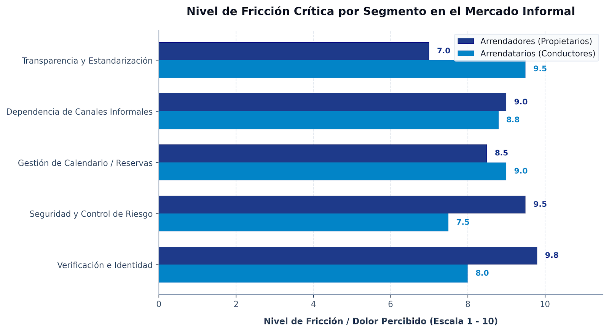<br>
  <em>Figura 2.2.3.1: Síntesis de dolores, necesidades y propuesta de valor de los segmentos entrevistados</em>
</p>

Ambos segmentos recurren a canales digitales, pero los arrendadores tienen una fuerte dependencia de redes sociales y canales informales, mientras que los arrendatarios combinan redes sociales con plataformas especializadas:

<p align="center">
  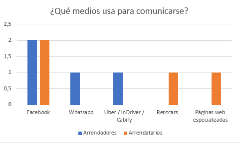<br>
  <em>Figura 2.2.3.2: Canales de comunicación empleados por arrendadores y arrendatarios</em>
</p>

El celular es el principal dispositivo para ambos segmentos, lo cual justifica y respalda plenamente que la plataforma adopte un enfoque y arquitectura Mobile-First:

<p align="center">
  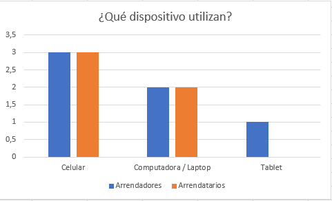<br>
  <em>Figura 2.2.3.3: Preferencia de dispositivos de uso identificada en las entrevistas</em>
</p>
## 2.3. Needfinding
### 2.3.1. User Personas

Los User Personas son representaciones ficticias pero fundamentadas en los hallazgos de las entrevistas realizadas a 
los dos segmentos objetivo del proyecto: arrendadores y arrendatarios. Su función es sintetizar las características, 
motivaciones, necesidades y frustraciones de los usuarios principales, permitiendo orientar el diseño de la aplicación 
hacia soluciones que respondan a sus expectativas reales. A continuación, se presentan los perfiles construidos con 
sus respectivos avatares ilustrativos, que servirán como referencia durante el proceso de desarrollo y validación de 
la plataforma.

###### Segmento Objetivo 1 (Arrendador de vehículos)

<p align="center">
  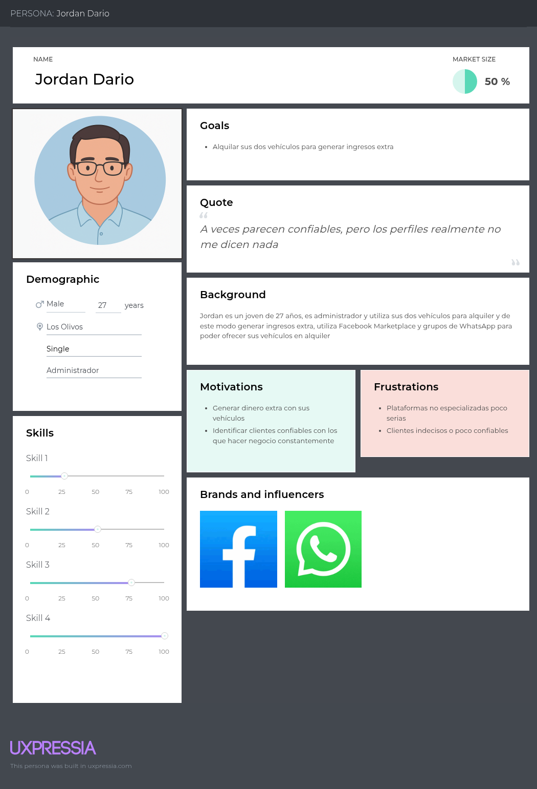
</p>

###### Segmento Objetivo 2 (Arrendatario de vehículos)

<p align="center">
  
</p>

### 2.3.2. User Task Matrix

| **User Task Matrix**                     | **Arrendador – Frecuencia** | **Arrendador – Importancia** | **Arrendatario – Frecuencia** | **Arrendatario – Importancia** |
|------------------------------------------|-----------------------------|------------------------------|-------------------------------|--------------------------------|
| Publicar vehículo en la plataforma       | Siempre                     | Alta                         | Nunca                         | Baja                           |
| Gestionar reservas activas               | A menudo                    | Alta                         | Siempre                       | Alta                           |
| Revisar reseñas de usuarios              | Siempre                     | Alta                         | A menudo                      | Alta                           |
| Acceso a documentos de garantía          | Siempre                     | Alta                         | A veces                       | Media                          |
| Consultar estado y ubicación IoT del auto| A menudo                    | Alta                         | A veces                       | Media                          |
| Reservar un vehículo                     | Nunca                       | Baja                         | Siempre                       | Alta                           |

---

###### Análisis de la User Task Matrix

El análisis de la matriz de tareas muestra diferencias claras entre los dos segmentos principales. El **arrendador** 
concentra sus actividades en la **publicación de vehículos, la gestión de reservas y la revisión de reseñas**, todías 
ellas consideradas de alta importancia, ya que están directamente relacionadas con la protección de su inversión. 
Asimismo, para este segmento es fundamental contar con acceso a **documentos de garantía** y con un **módulo IoT 
básico** que permita visualizar el estado y ubicación del vehículo, lo cual incrementa la confianza y reduce el 
riesgo de fraudes.

Por su parte, el **arrendatario** enfoca su experiencia en la **reserva de vehículos** y en la posibilidad de 
**consultar reseñas de arrendadores**, funciones que le otorgan seguridad y transparencia en el proceso. Aunque 
reconoce la utilidad del acceso a documentos y del indicador IoT, estas tareas no son percibidas como prioritarias 
frente a la necesidad principal de encontrar y reservar un vehículo de manera confiable.

En conclusión, la matriz evidencia que ambos segmentos comparten la necesidad de un sistema que promueva 
**transparencia, seguridad y confianza**. El arrendador busca reducir riesgos en la entrega de sus vehículos, 
mientras que el arrendatario demanda una experiencia clara y confiable al alquilar. Estos hallazgos guían 
directamente las funcionalidades clave a priorizar en el diseño de la plataforma.


### 2.3.3. User Journey Mapping

El **User Journey Mapping** permite visualizar de manera detallada la experiencia que atraviesan los usuarios 
durante la interacción con las plataformas actuales de alquiler de vehículos. Este ejercicio hace posible identificar 
los puntos de contacto, emociones y frustraciones de cada segmento objetivo, mostrando las debilidades del 
proceso actual y evidenciando las oportunidades de mejora que justifican la propuesta de valor de la 
nueva aplicación.

###### Segmento Objetivo 1 (Arrendador de vehículos)
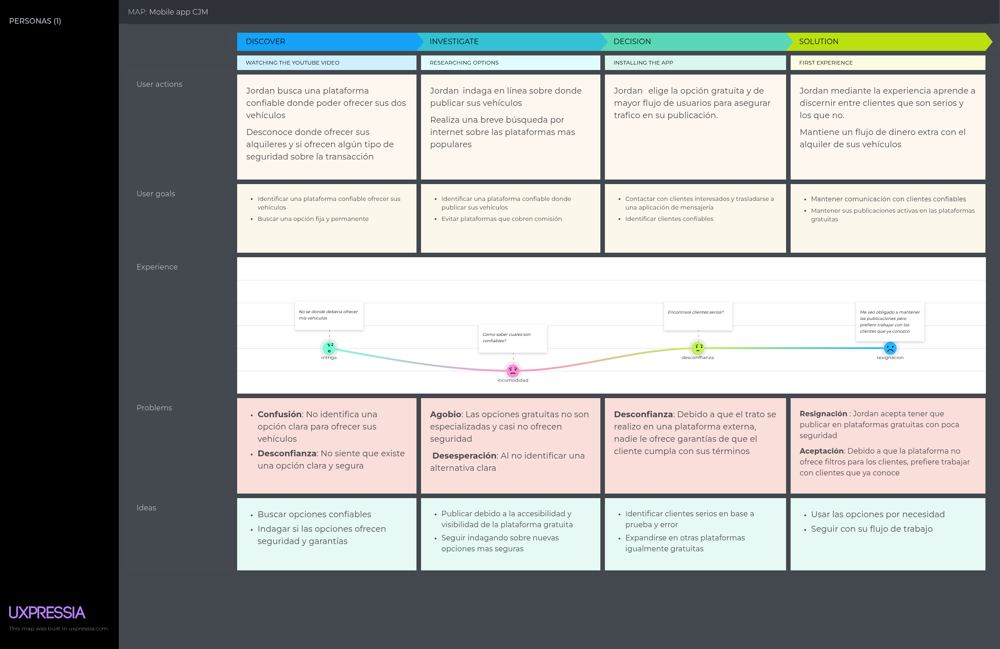
El recorrido del arrendador refleja un flujo de trabajo que no resulta del todo eficiente ni satisfactorio. Aunque 
logra captar clientes mediante plataformas gratuitas de amplia difusión como Facebook o WhatsApp, se muestra 
frustrado por la escasa seguridad y falta de garantías que estas herramientas ofrecen. A pesar de ello, continúa 
utilizándolas debido a su alcance y practicidad, aunque reconoce la necesidad de migrar a una solución más confiable 
y profesional.

###### Segmento Objetivo 2 (Arrendatario de vehículos)

Por el lado del arrendatario, la experiencia está marcada por la limitada disponibilidad de opciones confiables y 
la inseguridad que transmiten las plataformas gratuitas. Esta situación genera desconfianza y lo obliga a depender 
de la identificación previa de arrendadores de confianza, reduciendo el uso de dichas plataformas a casos 
estrictamente necesarios. Esto evidencia que, aunque existe una necesidad de movilidad, la falta de transparencia 
y seguridad limita la satisfacción y continuidad en el uso de los servicios actuales.

### 2.3.4. Empathy Mapping

El **Empathy Mapping** es una herramienta que permite comprender de manera profunda a los usuarios, identificando 
lo que **piensan, sienten, dicen y hacen** durante su experiencia con el servicio. Este recurso facilita visualizar 
no solo sus necesidades funcionales, sino también sus motivaciones, frustraciones y expectativas, lo que ayuda a 
orientar el diseño de la solución hacia una experiencia más centrada en el usuario.


###### Segmento Objetivo 1 (Arrendador de vehículos)
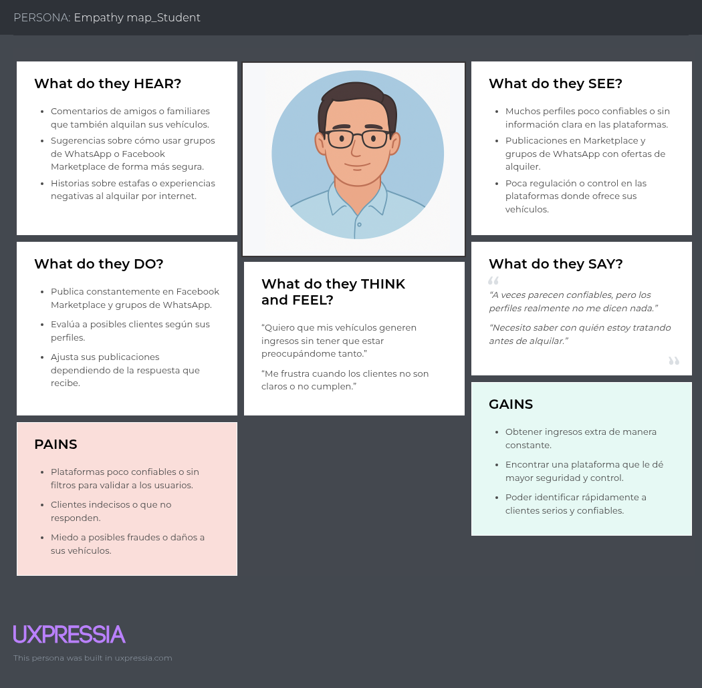

###### Segmento Objetivo 2 (Arrendatario de vehículos)


### 2.3.5. As-is Scenario Mapping

El **As-Is Scenario Mapping** es una herramienta fundamental de diseño de experiencia de usuario (UX) que documenta el estado actual y el recorrido empírico que experimentan los usuarios al intentar resolver su necesidad de transporte o alquiler de vehículos antes de la existencia de **RentiCar**. Permite identificar con precisión los puntos de fricción, demoras, sobrecostos y riesgos de seguridad física y financiera presentes en los métodos tradicionales e informales del mercado peruano.

A continuación, se detallan los escenarios As-Is para los dos segmentos objetivo del proyecto:

---

#### Segmento Objetivo 1: Arrendatario (Usuario que busca alquilar un auto de forma tradicional o informal)
**User Persona representativa:** Carlos Mendoza (Profesional independiente que busca un vehículo para viajes de trabajo y ocio en Lima).

| Dimensión | Fase 1: Búsqueda y Contacto Informal | Fase 2: Negociación y Garantía Ciega | Fase 3: Uso con Incertidumbre Técnica | Fase 4: Devolución y Disputa de Garantía |
| :--- | :--- | :--- | :--- | :--- |
| **Fase del Viaje** | Búsqueda en redes sociales, Marketplace o llamadas a rentas locales | Fijación de tarifas arbitrarias y entrega de depósitos en efectivo | Conducción sin asistencia mecánica ni supervisión telemática | Entrega presencial con revisión exhaustiva y retención injustificada |
| **Acciones (Doing)** | - Busca opciones en grupos informales de Facebook, WhatsApp o clasificados.<br>- Envía múltiples mensajes preguntando si el vehículo está libre.<br>- Espera horas por respuestas incompletas o cotizaciones dispares. | - Negocia la tarifa directamente por chat sin estándares claros.<br>- Realiza transferencias bancarias o pagos en efectivo como adelanto.<br>- Firma un contrato físico precario sin respaldo legal formal.<br>- Deja su DNI original o una garantía monetaria elevada sin recibo. | - Recibe el auto con retraso en la vía pública o taller informal.<br>- Conduce temiendo que el vehículo sufra averías mecánicas no declaradas.<br>- Carece de un canal digital de asistencia o contacto de emergencia en ruta.<br>- No cuenta con registro del kilometraje ni nivel inicial de gasolina. | - Retorna el auto al punto acordado con el propietario.<br>- Espera la inspección ocular del dueño buscando cualquier rayón o desgaste previo.<br>- Discute sobre el nivel de combustible o cobros adicionales no pactados.<br>- Espera días o semanas para la devolución de su garantía. |
| **Pensamientos (Thinking)** | *"¿Será una cuenta falsa o estafa?", "¿Las fotos serán del auto real?", "¿Por qué tardan tanto en responder si necesito el auto hoy?"* | *"¿Me devolverán el dinero de la garantía?", "¿Este papel firmado tendrá validez si ocurre un choque?", "Me parece excesivo lo que me piden de garantía."* | *"Siento un ruido extraño en el motor, ojalá no me deje botado", "¿El seguro particular de este auto me cubrirá en caso de accidente?"* | *"Ese rayón ya estaba cuando me lo entregó", "¿Por qué no me transfiere mi depósito de inmediato?", "No tengo ninguna plataforma donde quejarme o dejar mi opinión."* |
| **Sentimientos (Feeling)** | **Frustración e Incertidumbre:** Desesperación por respuestas lentas y desconfianza en la veracidad de los avisos. | **Vulnerabilidad y Ansiedad:** Temor a ser estafado y desprotección jurídica total al entregar sumas de dinero sin aval. | **Estrés y Tensión Continua:** Preocupación constante por averías mecánicas y ausencia de soporte en el camino. | **Indignación y Desgaste:** Malestar por cobros abusivos de última hora y trámites engorrosos de reembolso. |
| **Puntos de Dolor (Pain Points)** | - Cero centralización de información y precios.<br>- Perfiles no verificados en redes sociales.<br>- Gran pérdida de tiempo contactando números telefónicos particulares. | - Ausencia de contratos digitales con validez legal.<br>- Exigencia abusiva de dinero en efectivo o documentos de identidad originales.<br>- Cero transparencia en seguros y coberturas contra accidentes. | - Sin monitoreo telemático de ruta ni alertas de estado del vehículo.<br>- Autos sin mantenimiento certificado ni historial mecánico visible.<br>- Falta de asistencia técnica o botón de auxilio 24/7. | - Arbitrariedad del dueño para retener depósitos de garantía.<br>- Imposibilidad de calificar la experiencia para alertar a otros usuarios.<br>- Cero trazabilidad objetiva de kilometraje y combustible. |
| **Oportunidad de Mejora con RentiCar** | Catálogo digital centralizado con filtros en tiempo real, fotos verificadas y disponibilidad inmediata por calendario. | Contrato digital transparente con tarifas predefinidas, sin adelantos informales y pago seguro en plataforma. | Integración IoT para monitoreo telemático en tiempo real (GPS, velocidad, combustible) y soporte constante. | Devolución estandarizada con registro telemático de odómetro y sistema de reputación bidireccional (reseñas de 1 a 5 estrellas). |

---

#### Segmento Objetivo 2: Arrendador (Propietario particular que intenta alquilar su auto para obtener ingresos)
**User Persona representativa:** Ricardo Ramos (Dueño de un sedán que busca rentabilizar su automóvil en días no laborables).

| Dimensión | Fase 1: Publicación Manual y Gestión Ineficiente | Fase 2: Filtrado Precario de Postulantes | Fase 3: Incertidumbre Total durante el Alquiler | Fase 4: Recepción del Auto y Cobro de Daños |
| :--- | :--- | :--- | :--- | :--- |
| **Fase del Viaje** | Publicación manual en clasificados y redes sociales | Verificación empírica de clientes y firma de contratos improvisados | Ausencia de monitoreo telemático y angustia por la ubicación del auto | Inspección de desperfectos, cobro de papeletas y desgaste vehicular |
| **Acciones (Doing)** | - Toma fotos con su celular y las sube a grupos de compra y venta.<br>- Atiende llamadas a cualquier hora y responde mensajes redundantes.<br>- Administra las fechas tentativas de alquiler en cuadernos o notas de celular. | - Pide antecedentes y récord de conductor por chat de WhatsApp.<br>- Redacta un contrato descargado de internet sin asesoría legal.<br>- Solicita un depósito que resulta insuficiente ante un siniestro grave.<br>- Entrega las llaves en persona a un completo desconocido. | - Llama o envía mensajes periódicos al conductor para saber dónde está.<br>- Espera con nerviosismo si el arrendatario no responde el teléfono.<br>- Desconoce la velocidad a la que circulan con su vehículo o si salieron de la ciudad.<br>- No tiene forma de comprobar el uso indebido del automóvil. | - Recibe el vehículo con retraso respecto a la hora pactada.<br>- Nota suciedad o desgastes anormales en neumáticos y frenos.<br>- Revisa días después el sistema del SAT y encuentra fotopapeletas impagas.<br>- Intenta contactar al cliente, quien bloquea el número de teléfono. |
| **Pensamientos (Thinking)** | *"Publicar en tantos grupos me quita horas de mi día", "¿Por qué la gente regatea tanto el precio?", "Tengo miedo de que un delincuente me cite."* | *"¿Este brevete será auténtico?", "¿Y si se apropia ilícitamente de mi vehículo y lo desmantela?", "Este contrato no me protegerá si comete un delito."* | *"Son las 10 pm y no me responde el WhatsApp", "¿Estará usando mi auto para hacer taxi colectivo?", "¿Habrá salido de Lima sin autorización?"* | *"Me dejó el tanque vacío y un raspón en el parachoques", "El depósito no cubre el costo de la reparación ni las multas", "Perdí dinero en vez de ganar."* |
| **Sentimientos (Feeling)** | **Sobrecarga y Agobio:** Cansancio por responder consultas repetitivas de personas que no concretan. | **Inseguridad y Temor Extremo:** Miedo constante al robo, secuestro del vehículo o fraude de identidad. | **Impotencia y Angustia Severa:** Pérdida de control total sobre el bien más valioso y ansiedad permanente. | **Frustración y Resignación:** Pérdida económica por daños no reconocidos y sensación de indefensión legal. |
| **Puntos de Dolor (Pain Points)** | - Inexistencia de una vitrina digital especializada en renta particular.<br>- Gestión desordenada de fechas y sobreposición de alquileres.<br>- Exposición pública de datos personales en redes abiertas. | - Nula verificación automatizada de antecedentes y validez de licencias.<br>- Contratos precarios sin firma electrónica certificada.<br>- Garantías económicas insuficientes o difíciles de cobrar. | - Carencia total de GPS en tiempo real integrado a una aplicación.<br>- Desconocimiento de patrones de conducción temeraria y excesos de velocidad.<br>- Cero alertas automáticas sobre salida de perímetros permitidos. | - Papeletas de tránsito transferidas al propietario sin posibilidad de reclamo.<br>- Gastos de reparación asumidos por el dueño.<br>- Falta de un registro negro o sistema de reputación para conductores infractores. |
| **Oportunidad de Mejora con RentiCar** | Panel centralizado para dar de alta vehículos con fotos, especificaciones y calendario reactivo automatizado. | Validación estricta de usuarios mediante autenticación JWT y roles (`ROLE_RENTER`), con términos y contratos digitales. | Monitoreo IoT con telemetría en tiempo real: geolocalización continua en mapa Leaflet, odómetro, velocidad y nivel de combustible. | Liquidación garantizada, registro exacto del kilometraje consumido e historial de calificaciones para resguardar la flota. |

## 2.4. Ubiquitous Language

Con el fin de establecer un lenguaje común entre los desarrolladores y los usuarios, se definió un conjunto de 
términos que se emplearán de forma consistente a lo largo del proyecto. Este lenguaje ubicuo evita confusiones 
conceptuales y facilita la comunicación dentro del equipo, asegurando que todos comprendan los mismos procesos 
con las mismas palabras.

**Términos principales en el dominio de Renticar:**

- **Arrendador**: Persona que registra y ofrece su vehículo en la plataforma.

- **Arrendatario**: Usuario que alquila un vehículo registrado en la plataforma.

- **Publicación**: Ficha que contiene los datos del vehículo y sus condiciones de alquiler.

- **Reserva**: Confirmación del alquiler de un vehículo por un periodo determinado.

- **Contrato digital**: Documento electrónico que formaliza las condiciones del alquiler.

- **Reseña**: Evaluación realizada al finalizar la reserva, que permite calificar la experiencia.

- **Estado del vehículo**: Indicador del sistema que señala si el auto está Disponible, En uso o Finalizado.

- **Ubicación IoT**: Dato de localización y estado general del vehículo, mostrado de manera ligera durante la reserva.

- **Panel de gestión**: Espacio central del sistema donde los usuarios consultan publicaciones, reservas y reseñas.

Este lenguaje compartido no solo guía el diseño de la solución, sino que también constituye la base para la 
documentación, la arquitectura del software y las interacciones con los futuros usuarios, fortaleciendo la 
alineación entre el negocio y la tecnología.

# Capítulo III: Requirements Specification

## 3.1. To-Be Scenario Mapping

El **To-Be Scenario Mapping** es una herramienta de diseño de experiencia de usuario (UX) que modela el recorrido ideal que experimentará el usuario al interactuar con la plataforma digital **RentiCar**, superando las fricciones, demoras y desconfianzas identificadas en el escenario actual (*As-Is*).

A continuación, se presentan los escenarios To-Be estructurados para los dos segmentos objetivo del proyecto:

---

### Segmento Objetivo 1: Arrendatario (Cliente que busca alquilar un vehículo)
**User Persona representativa:** Carlos Mendoza (Profesional independiente que requiere movilidad flexible y confiable).

| Dimensión | Fase 1: Búsqueda y Selección | Fase 2: Reserva y Contratación | Fase 3: Recojo y Monitoreo IoT | Fase 4: Devolución y Reputación |
| :--- | :--- | :--- | :--- | :--- |
| **Fase del Viaje** | Exploración del catálogo web con filtros | Selección de fechas y confirmación | Recojo del auto y seguimiento en ruta | Entrega del vehículo y feedback |
| **Acciones (Doing)** | - Ingresa a la plataforma y aplica filtros por marca, tipo de transmisión y precio.<br>- Examina fotografías de alta resolución y especificaciones técnicas.<br>- Consulta el promedio de estrellas y comentarios verificados. | - Selecciona fecha de inicio y fin en el calendario dinámico.<br>- Visualiza el cálculo exacto del costo total.<br>- Confirma la solicitud de reserva con su cuenta autenticada. | - Valida la ubicación exacta del auto en el mapa interactivo (Leaflet).<br>- Revisa el estado operativo de los sensores IoT.<br>- Conduce con la tranquilidad de contar con trazabilidad telemática. | - Devuelve el automóvil en el punto acordado con el dueño.<br>- Califica la experiencia del servicio de 1 a 5 estrellas.<br>- Redacta una reseña detallando el estado y atención recibida. |
| **Pensamientos (Thinking)** | *"Es muy fácil comparar precios y modelos sin tener que llamar por teléfono."*<br>*"Las opiniones de otros usuarios me dan total seguridad."* | *"El precio final es claro y no hay cargos ocultos de última hora."*<br>*"El proceso de confirmación es rápido y transparente."* | *"Puedo ver exactamente dónde está el vehículo en el mapa."*<br>*"El sistema de telemetría garantiza que el auto está en óptimas condiciones."* | *"Todo el alquiler fue rápido y sin trámites engorrosos."*<br>*"Quiero dejar una buena calificación para premiar la puntualidad del dueño."* |
| **Sentimientos (Feeling)** | **Positivo / Interesado:** Confianza y satisfacción por la claridad visual del catálogo. | **Seguro / Tranquilo:** Alivio al conocer el importe exacto sin intermediarios informales. | **Confortable / Protegido:** Seguridad tecnológica gracias a la supervisión por GPS. | **Satisfecho / Fidelizado:** Gratitud por un servicio ágil y deseo de volver a utilizar RentiCar. |

---

### Segmento Objetivo 2: Arrendador (Propietario de vehículo que monetiza su auto)
**User Persona representativa:** Ricardo Ramos (Dueño de vehículo que busca ingresos adicionales con respaldo legal).

| Dimensión | Fase 1: Registro y Publicación | Fase 2: Gestión de Solicitudes | Fase 3: Monitoreo en Alquiler | Fase 4: Liquidación y Valoración |
| :--- | :--- | :--- | :--- | :--- |
| **Fase del Viaje** | Alta de cuenta y publicación de flota | Evaluación de solicitudes entrantes | Supervisión telemática durante el viaje | Cierre de alquiler y cobro |
| **Acciones (Doing)** | - Crea su cuenta como Arrendador y valida su DNI.<br>- Registra su auto con marca, modelo, año y tarifa por día.<br>- Sube fotos nítidas del auto y define condiciones de uso. | - Recibe notificaciones de nuevas solicitudes en su bandeja.<br>- Revisa el perfil verificado y reputación del arrendatario.<br>- Aprueba o declina la solicitud de reserva con un clic. | - Monitorea la posición en tiempo real del auto en el mapa.<br>- Supervisa lecturas de odómetro, velocidad y nivel de combustible.<br>- Recibe alertas en caso de eventos fuera de lo previsto. | - Recibe el vehículo y verifica el kilometraje reportado por el sensor.<br>- Califica el cuidado y puntualidad del arrendatario.<br>- Recibe la liquidación de su pago de forma garantizada. |
| **Pensamientos (Thinking)** | *"Publicar mi auto me tomó menos de 10 minutos."*<br>*"Tengo el control total de las tarifas y disponibilidad de mi vehículo."* | *"Puedo ver quién me alquilará el auto antes de aceptar."*<br>*"Sé que las fechas se bloquean automáticamente sin solapamientos."* | *"Tengo el control de la velocidad y el recorrido de mi vehículo."*<br>*"La telemetría IoT me da el respaldo de que mi unidad está segura."* | *"El cliente cuidó mi auto y la entrega fue puntual."*<br>*"Monetizar mi vehículo con RentiCar es seguro y rentable."* |
| **Sentimientos (Feeling)** | **Motivado / Empoderado:** Entusiasmo al poner en valor un activo en desuso. | **En Control / Cauteloso:** Tranquilidad al decidir a quién alquilar su unidad. | **Tranquilo / Respaldado:** Paz mental gracias a la telemetría continua en tiempo real. | **Satisfecho / Rentable:** Confianza en la plataforma y motivación para sumar más vehículos. |

---

## 3.2. User Stories

En esta sección se definieron las épicas y la especificación detallada de las **35 User Stories** con sus respectivos criterios de aceptación bajo sintaxis formal Gherkin (**Given-When-Then-And**), verificadas y cumplidas con paridad funcional en el backend (**Spring Boot 3.x**) y el frontend (**Angular 20**).

---

### Epics del Sistema RentiCar

A continuación, se presenta la matriz general de las 8 Épicas que estructuran el desarrollo del producto:

| Epic ID | Título de la Épica | Descripción de la Épica |
| :---: | :--- | :--- |
| **EP-01** | **Autenticación y Seguridad de Acceso** | Como usuario (arrendatario o propietario), quiero un sistema de registro, inicio de sesión y gestión de credenciales seguro con encriptación BCrypt y tokens JWT para proteger mi cuenta y privacidad. |
| **EP-02** | **Panel de Control del Usuario (Dashboard)** | Como usuario, quiero acceder a un panel centralizado que me brinde un resumen operativo de mis alquileres activos, vehículos recomendados y atajos directos a mis acciones frecuentes. |
| **EP-03** | **Gestión de Flota y Publicaciones de Vehículos** | Como propietario, quiero registrar, actualizar el estado, subir fotos y administrar mis vehículos publicados para ponerlos a disposición de los arrendatarios en la plataforma. |
| **EP-04** | **Catálogo, Búsqueda y Reserva de Vehículos** | Como arrendatario, quiero explorar el catálogo de vehículos, filtrar por marcas, ordenar por precio y generar solicitudes de alquiler con cálculo automático de tarifas por días. |
| **EP-05** | **Monitoreo Telemático IoT y Simulación de Rutas** | Como arrendatario o propietario, quiero visualizar la posición GPS del vehículo en un mapa interactivo (Leaflet), velocidad y nivel de combustible en tiempo real durante el periodo de alquiler. |
| **EP-06** | **Sistema de Reputación, Reseñas y Calificaciones** | Como arrendatario, quiero calificar y dejar comentarios sobre el vehículo y la experiencia de alquiler una vez concluido el servicio para orientar a la comunidad y fomentar la confianza. |
| **EP-07** | **Administración de Perfil y Preferencias** | Como usuario registrado, quiero consultar y editar mis datos personales de contacto para mantener vigente mi información en el ecosistema RentiCar. |
| **EP-08** | **Landing Page Informativa y Captación** | Como visitante, quiero navegar por una página de inicio atractiva y clara con información de valor, catálogo destacado, selector de idioma y formulario de suscripción para conocer el servicio. |

---

### Épica EP-01: Autenticación y Seguridad de Acceso

*Como usuario (arrendatario o propietario), quiero un sistema de registro, inicio de sesión y gestión de credenciales seguro con encriptación BCrypt y tokens JWT para proteger mi cuenta y privacidad.*

#### User Story US-01: Registro de Usuario

| Atributo | Detalle |
| :--- | :--- |
| **Story ID** | **US-01** |
| **Épica** | **EP-01**: Autenticación y Seguridad de Acceso |
| **Usuario** | Visitante de la landing page |
| **Prioridad** | Alta |
| **Título** | **Registro de Usuario** |
| **Descripción** | Como visitante, quiero registrar una cuenta con mis datos personales y rol en la plataforma, para poder publicar vehículos o solicitar alquileres de manera segura. |
| **Criterios de Aceptación** | **Escenario 1: Registro exitoso de nuevo usuario**<br>**Given** se envía POST /api/v1/authentication/sign-up con datos válidos y rol seleccionado<br>**When** se procesa la petición<br>**Then** el sistema retorna código HTTP 201 Created<br>**And** retorna los datos del perfil registrado con confirmación de cuenta.<br><br>**Escenario 2: Registro con correo ya existente**<br>**Given** se envía POST /api/v1/authentication/sign-up con un correo previamente registrado<br>**When** se procesa la petición<br>**Then** el sistema retorna error 409 Conflict<br>**And** retorna mensaje de error apropiado indicando duplicidad de credenciales. |

#### User Story US-02: Inicio de Sesión (Log In)

| Atributo | Detalle |
| :--- | :--- |
| **Story ID** | **US-02** |
| **Épica** | **EP-01**: Autenticación y Seguridad de Acceso |
| **Usuario** | Usuario registrado (arrendatario o propietario) |
| **Prioridad** | Alta |
| **Título** | **Inicio de Sesión (Log In)** |
| **Descripción** | Como usuario registrado, quiero iniciar sesión con mis credenciales, para acceder a mis publicaciones, reservas y funcionalidades protegidas de la plataforma. |
| **Criterios de Aceptación** | **Escenario 1: Inicio de sesión exitoso**<br>**Given** se envía POST /api/v1/authentication/sign-in con credenciales válidas<br>**When** se procesa la petición<br>**Then** el sistema retorna código HTTP 200 OK<br>**And** retorna el token de autenticación JWT y perfil de usuario.<br><br>**Escenario 2: Inicio de sesión con credenciales incorrectas**<br>**Given** se envía POST /api/v1/authentication/sign-in con credenciales incorrectas<br>**When** se procesa la petición<br>**Then** el sistema retorna error 401 Unauthorized<br>**And** retorna mensaje de error apropiado. |

#### User Story US-03: Actualizar Contraseña de Usuario

| Atributo | Detalle |
| :--- | :--- |
| **Story ID** | **US-03** |
| **Épica** | **EP-01**: Autenticación y Seguridad de Acceso |
| **Usuario** | Usuario autenticado |
| **Prioridad** | Media |
| **Título** | **Actualizar Contraseña de Usuario** |
| **Descripción** | Como usuario autenticado, quiero actualizar mi contraseña actual por una nueva, para mantener protegida mi cuenta en la plataforma. |
| **Criterios de Aceptación** | **Escenario 1: Actualización exitosa con contraseña actual válida**<br>**Given** se envía PATCH /api/v1/users/{userId}/password con token Bearer JWT y contraseña actual correcta<br>**When** se procesa la petición<br>**Then** el sistema retorna código HTTP 200 OK<br>**And** retorna confirmación de actualización exitosa de credenciales.<br><br>**Escenario 2: Actualización con contraseña actual errónea**<br>**Given** se envía PATCH /api/v1/users/{userId}/password con token Bearer JWT y contraseña actual errónea<br>**When** se procesa la petición<br>**Then** el sistema retorna error 401 Unauthorized<br>**And** retorna mensaje de error apropiado indicando contraseña actual no válida. |

#### User Story US-04: Eliminación de Cuenta de Usuario

| Atributo | Detalle |
| :--- | :--- |
| **Story ID** | **US-04** |
| **Épica** | **EP-01**: Autenticación y Seguridad de Acceso |
| **Usuario** | Usuario autenticado |
| **Prioridad** | Media |
| **Título** | **Eliminación de Cuenta de Usuario** |
| **Descripción** | Como usuario autenticado, quiero eliminar mi cuenta de la plataforma, para remover definitivamente mis datos y perfil del sistema. |
| **Criterios de Aceptación** | **Escenario 1: Eliminación exitosa de cuenta**<br>**Given** se envía DELETE /api/v1/users/{userId} con token Bearer JWT del usuario<br>**When** se procesa la petición<br>**Then** el sistema retorna código HTTP 204 No Content<br>**And** desactiva la cuenta del usuario en el sistema.<br><br>**Escenario 2: Intento de eliminación sin autorización**<br>**Given** se envía DELETE /api/v1/users/{userId} sin token de autorización Bearer JWT<br>**When** se procesa la petición<br>**Then** el sistema retorna error 401 Unauthorized<br>**And** retorna mensaje de error apropiado denegando la operación. |

---

### Épica EP-02: Panel de Control del Usuario (Dashboard)

*Como usuario, quiero acceder a un panel centralizado que me brinde un resumen operativo de mis alquileres activos, vehículos recomendados y atajos directos a mis acciones frecuentes.*

#### User Story US-05: Dashboard del Arrendatario

| Atributo | Detalle |
| :--- | :--- |
| **Story ID** | **US-05** |
| **Épica** | **EP-02**: Panel de Control del Usuario (Dashboard) |
| **Usuario** | Arrendatario autenticado |
| **Prioridad** | Media |
| **Título** | **Dashboard del Arrendatario** |
| **Descripción** | Como arrendatario, quiero acceder a mi panel principal, para visualizar el estado de mis reservas activas y atajos a mis vehículos contratados. |
| **Criterios de Aceptación** | **Escenario 1: Carga exitosa de panel de arrendatario**<br>**Given** se envía GET /api/v1/bookings/my-bookings con token de rol ROLE_ARRENDATARIO<br>**When** se procesa la petición<br>**Then** el sistema retorna código HTTP 200 OK<br>**And** retorna el consolidado de reservas activas y pendientes del usuario.<br><br>**Escenario 2: Acceso a panel sin token de autenticación**<br>**Given** se envía GET /api/v1/bookings/my-bookings sin cabecera Authorization<br>**When** se procesa la petición<br>**Then** el sistema retorna error 401 Unauthorized<br>**And** retorna mensaje de error apropiado solicitando inicio de sesión. |

#### User Story US-06: Dashboard del Propietario

| Atributo | Detalle |
| :--- | :--- |
| **Story ID** | **US-06** |
| **Épica** | **EP-02**: Panel de Control del Usuario (Dashboard) |
| **Usuario** | Propietario autenticado |
| **Prioridad** | Media |
| **Título** | **Dashboard del Propietario** |
| **Descripción** | Como propietario, quiero acceder a mi panel principal, para inspeccionar las solicitudes entrantes de alquiler y el estado general de mi flota. |
| **Criterios de Aceptación** | **Escenario 1: Carga exitosa de solicitudes de reserva**<br>**Given** se envía GET /api/v1/bookings/my-requests con token de rol ROLE_ARRENDADOR<br>**When** se procesa la petición<br>**Then** el sistema retorna código HTTP 200 OK<br>**And** retorna la lista de solicitudes de reserva pendientes para sus vehículos.<br><br>**Escenario 2: Acceso por usuario no autorizado**<br>**Given** se envía GET /api/v1/bookings/my-requests con token de rol ROLE_ARRENDATARIO<br>**When** se procesa la petición<br>**Then** el sistema retorna error 403 Forbidden<br>**And** retorna mensaje de error apropiado indicando permisos insuficientes. |

#### User Story US-07: Publicaciones en el Dashboard

| Atributo | Detalle |
| :--- | :--- |
| **Story ID** | **US-07** |
| **Épica** | **EP-02**: Panel de Control del Usuario (Dashboard) |
| **Usuario** | Propietario de vehículo |
| **Prioridad** | Media |
| **Título** | **Publicaciones en el Dashboard** |
| **Descripción** | Como propietario, quiero consultar mis vehículos publicados en el panel, para verificar su disponibilidad inmediata y estado operativo de renta. |
| **Criterios de Aceptación** | **Escenario 1: Listado de vehículos propios para propietario**<br>**Given** se envía GET /api/v1/vehicles/my-listings con token Bearer JWT de propietario<br>**When** se procesa la petición<br>**Then** el sistema retorna código HTTP 200 OK<br>**And** retorna el listado de vehículos registrados por el arrendador.<br><br>**Escenario 2: Consulta sin publicaciones registradas**<br>**Given** se envía GET /api/v1/vehicles/my-listings para un propietario sin vehículos<br>**When** se procesa la petición<br>**Then** el sistema retorna código HTTP 200 OK<br>**And** retorna lista vacía con botón directo para crear la primera publicación. |

#### User Story US-08: Cancelar Reserva desde el Dashboard

| Atributo | Detalle |
| :--- | :--- |
| **Story ID** | **US-08** |
| **Épica** | **EP-02**: Panel de Control del Usuario (Dashboard) |
| **Usuario** | Arrendatario |
| **Prioridad** | Media |
| **Título** | **Cancelar Reserva desde el Dashboard** |
| **Descripción** | Como arrendatario, quiero cancelar una solicitud de reserva pendiente desde mi panel, para desistir del alquiler antes de que sea formalizado. |
| **Criterios de Aceptación** | **Escenario 1: Cancelación exitosa de reserva pendiente**<br>**Given** se envía PUT /api/v1/bookings/{bookingId}/cancel con reserva en estado PENDING<br>**When** se procesa la petición<br>**Then** el sistema retorna código HTTP 200 OK<br>**And** retorna la reserva con estado actualizado a CANCELLED.<br><br>**Escenario 2: Intento de cancelación de reserva ya completada**<br>**Given** se envía PUT /api/v1/bookings/{bookingId}/cancel con reserva en estado COMPLETED<br>**When** se procesa la petición<br>**Then** el sistema retorna error 400 Bad Request<br>**And** retorna mensaje de error apropiado indicando que no es posible cancelar la reserva. |

---

### Épica EP-03: Gestión de Flota y Publicaciones de Vehículos

*Como propietario, quiero registrar, actualizar el estado, subir fotos y administrar mis vehículos publicados para ponerlos a disposición de los arrendatarios en la plataforma.*

#### User Story US-09: Gestión de Flota Propia

| Atributo | Detalle |
| :--- | :--- |
| **Story ID** | **US-09** |
| **Épica** | **EP-03**: Gestión de Flota y Publicaciones de Vehículos |
| **Usuario** | Propietario de vehículo |
| **Prioridad** | Media |
| **Título** | **Gestión de Flota Propia** |
| **Descripción** | Como propietario, quiero acceder a la sección de mi flota vehicular, para administrar de manera organizada todos mis vehículos y publicaciones. |
| **Criterios de Aceptación** | **Escenario 1: Carga de flota vehicular del propietario**<br>**Given** se envía GET /api/v1/vehicles/my-listings con token de rol ROLE_ARRENDADOR<br>**When** se procesa la petición<br>**Then** el sistema retorna código HTTP 200 OK<br>**And** retorna el listado de vehículos con fotos, tarifas y estado de disponibilidad.<br><br>**Escenario 2: Acceso por usuario con rol no autorizado**<br>**Given** se envía GET /api/v1/vehicles/my-listings con token de usuario ROLE_ARRENDATARIO<br>**When** se procesa la petición<br>**Then** el sistema retorna error 403 Forbidden<br>**And** retorna mensaje de error apropiado indicando acceso exclusivo a propietarios. |

#### User Story US-10: Crear Publicación de Vehículo

| Atributo | Detalle |
| :--- | :--- |
| **Story ID** | **US-10** |
| **Épica** | **EP-03**: Gestión de Flota y Publicaciones de Vehículos |
| **Usuario** | Propietario de vehículo |
| **Prioridad** | Alta |
| **Título** | **Crear Publicación de Vehículo** |
| **Descripción** | Como propietario, quiero registrar un nuevo vehículo con datos técnicos y fotografía en formato multipart, para ponerlo en alquiler dentro del catálogo. |
| **Criterios de Aceptación** | **Escenario 1: Registro exitoso de nuevo vehículo**<br>**Given** se envía POST /api/v1/vehicles con multipart form data (marca, modelo, año, precio e imagen)<br>**When** se procesa la petición<br>**Then** el sistema retorna código HTTP 201 Created<br>**And** retorna el vehículo registrado con estado inicial AVAILABLE.<br><br>**Escenario 2: Registro con campos obligatorios vacíos o precio inválido**<br>**Given** se envía POST /api/v1/vehicles con datos incompletos o precio menor o igual a cero<br>**When** se procesa la petición<br>**Then** el sistema retorna error 400 Bad Request<br>**And** retorna mensaje de error apropiado detallando los campos requeridos. |

#### User Story US-11: Visualizar Publicación de Vehículo

| Atributo | Detalle |
| :--- | :--- |
| **Story ID** | **US-11** |
| **Épica** | **EP-03**: Gestión de Flota y Publicaciones de Vehículos |
| **Usuario** | Propietario y Arrendatario |
| **Prioridad** | Alta |
| **Título** | **Visualizar Publicación de Vehículo** |
| **Descripción** | Como usuario, quiero consultar el detalle de una publicación de vehículo, para revisar especificaciones técnicas, tarifa diaria y disponibilidad operativa. |
| **Criterios de Aceptación** | **Escenario 1: Consulta de publicación existente**<br>**Given** se envía GET /api/v1/vehicles/{vehicleId} con identificador de vehículo válido<br>**When** se procesa la petición<br>**Then** el sistema retorna código HTTP 200 OK<br>**And** retorna la ficha técnica, tarifa diaria y datos del propietario.<br><br>**Escenario 2: Consulta de vehículo inexistente**<br>**Given** se envía GET /api/v1/vehicles/{vehicleId} con identificador no registrado<br>**When** se procesa la petición<br>**Then** el sistema retorna error 404 Not Found<br>**And** retorna mensaje de error apropiado indicando vehículo no encontrado. |

#### User Story US-12: Descarga y Renderizado de Imagen Vehicular

| Atributo | Detalle |
| :--- | :--- |
| **Story ID** | **US-12** |
| **Épica** | **EP-03**: Gestión de Flota y Publicaciones de Vehículos |
| **Usuario** | Usuario de la plataforma |
| **Prioridad** | Alta |
| **Título** | **Descarga y Renderizado de Imagen Vehicular** |
| **Descripción** | Como usuario, quiero visualizar la fotografía real del vehículo almacenada en la base de datos, para evaluar su estado físico y apariencia antes de rentar. |
| **Criterios de Aceptación** | **Escenario 1: Carga exitosa de fotografía vehicular**<br>**Given** se envía GET /api/v1/vehicles/{vehicleId}/image con identificador de vehículo existente<br>**When** se procesa la petición<br>**Then** el sistema retorna código HTTP 200 OK<br>**And** retorna el flujo binario de la imagen (JPEG/PNG) con cabecera Content-Type correspondiente.<br><br>**Escenario 2: Vehículo sin imagen asociada**<br>**Given** se envía GET /api/v1/vehicles/{vehicleId}/image para un auto sin fotografía<br>**When** se procesa la petición<br>**Then** el sistema retorna error 404 Not Found<br>**And** retorna mensaje de error apropiado indicando imagen no disponible. |

#### User Story US-13: Actualizar Datos y Especificaciones del Vehículo

| Atributo | Detalle |
| :--- | :--- |
| **Story ID** | **US-13** |
| **Épica** | **EP-03**: Gestión de Flota y Publicaciones de Vehículos |
| **Usuario** | Propietario de vehículo |
| **Prioridad** | Media |
| **Título** | **Actualizar Datos y Especificaciones del Vehículo** |
| **Descripción** | Como propietario, quiero modificar las especificaciones, precio o fotografía de mi vehículo, para mantener actualizada la información de mi oferta. |
| **Criterios de Aceptación** | **Escenario 1: Actualización exitosa de datos vehiculares**<br>**Given** se envía PUT /api/v1/vehicles/{vehicleId} con multipart form data y token de propietario<br>**When** se procesa la petición<br>**Then** el sistema retorna código HTTP 200 OK<br>**And** retorna el vehículo actualizado con las nuevas especificaciones y tarifa.<br><br>**Escenario 2: Actualización de vehículo inexistente**<br>**Given** se envía PUT /api/v1/vehicles/{vehicleId} con identificador no registrado<br>**When** se procesa la petición<br>**Then** el sistema retorna error 404 Not Found<br>**And** retorna mensaje de error apropiado indicando vehículo no encontrado. |

#### User Story US-14: Eliminar Publicación de Vehículo

| Atributo | Detalle |
| :--- | :--- |
| **Story ID** | **US-14** |
| **Épica** | **EP-03**: Gestión de Flota y Publicaciones de Vehículos |
| **Usuario** | Propietario de vehículo |
| **Prioridad** | Media |
| **Título** | **Eliminar Publicación de Vehículo** |
| **Descripción** | Como propietario, quiero dar de baja una publicación de vehículo, para retirarlo definitivamente del catálogo cuando ya no esté destinado a renta. |
| **Criterios de Aceptación** | **Escenario 1: Eliminación exitosa de vehículo**<br>**Given** se envía DELETE /api/v1/vehicles/{vehicleId} con token de propietario<br>**When** se procesa la petición<br>**Then** el sistema retorna código HTTP 204 No Content<br>**And** remueve la publicación del catálogo de forma permanente.<br><br>**Escenario 2: Intento de eliminación sin autorización de propietario**<br>**Given** se envía DELETE /api/v1/vehicles/{vehicleId} sin credenciales de propietario<br>**When** se procesa la petición<br>**Then** el sistema retorna error 401 Unauthorized<br>**And** retorna mensaje de error apropiado impidiendo la baja del vehículo. |

---

### Épica EP-04: Catálogo, Búsqueda y Reserva de Vehículos

*Como arrendatario, quiero explorar el catálogo de vehículos, filtrar por marcas, ordenar por precio y generar solicitudes de alquiler con cálculo automático de tarifas por días.*

#### User Story US-15: Navegación de Catálogo Público

| Atributo | Detalle |
| :--- | :--- |
| **Story ID** | **US-15** |
| **Épica** | **EP-04**: Catálogo, Búsqueda y Reserva de Vehículos |
| **Usuario** | Arrendatario y Visitante |
| **Prioridad** | Alta |
| **Título** | **Navegación de Catálogo Público** |
| **Descripción** | Como usuario, quiero explorar el catálogo general de vehículos disponibles, para revisar las alternativas de alquiler en la plataforma. |
| **Criterios de Aceptación** | **Escenario 1: Consulta del catálogo público de vehículos**<br>**Given** se envía GET /api/v1/vehicles<br>**When** se procesa la petición<br>**Then** el sistema retorna código HTTP 200 OK<br>**And** retorna la lista de vehículos disponibles con sus tarjetas informativas.<br><br>**Escenario 2: Catálogo sin unidades disponibles**<br>**Given** se envía GET /api/v1/vehicles cuando no existen autos registrados<br>**When** se procesa la petición<br>**Then** el sistema retorna código HTTP 200 OK<br>**And** retorna lista vacía con mensaje orientador para reintentar la búsqueda. |

#### User Story US-16: Ordenar Catálogo por Precio

| Atributo | Detalle |
| :--- | :--- |
| **Story ID** | **US-16** |
| **Épica** | **EP-04**: Catálogo, Búsqueda y Reserva de Vehículos |
| **Usuario** | Arrendatario |
| **Prioridad** | Media |
| **Título** | **Ordenar Catálogo por Precio** |
| **Descripción** | Como arrendatario, quiero ordenar el catálogo de autos por tarifa diaria ascendente o descendente, para ajustar las opciones a mi presupuesto. |
| **Criterios de Aceptación** | **Escenario 1: Ordenamiento ascendente por tarifa diaria**<br>**Given** se envía GET /api/v1/vehicles y se aplica ordenamiento por precio menor a mayor<br>**When** se procesa la petición<br>**Then** el sistema retorna código HTTP 200 OK<br>**And** retorna los vehículos ordenados de menor a mayor precio por día.<br><br>**Escenario 2: Ordenamiento descendente por tarifa diaria**<br>**Given** se envía GET /api/v1/vehicles y se aplica ordenamiento por precio mayor a menor<br>**When** se procesa la petición<br>**Then** el sistema retorna código HTTP 200 OK<br>**And** retorna los vehículos ordenados de mayor a menor precio por día. |

#### User Story US-17: Filtrar Catálogo por Marca

| Atributo | Detalle |
| :--- | :--- |
| **Story ID** | **US-17** |
| **Épica** | **EP-04**: Catálogo, Búsqueda y Reserva de Vehículos |
| **Usuario** | Arrendatario |
| **Prioridad** | Alta |
| **Título** | **Filtrar Catálogo por Marca** |
| **Descripción** | Como arrendatario, quiero filtrar los vehículos por marcas específicas (Toyota, Nissan, etc.), para encontrar rápidamente modelos de mi preferencia. |
| **Criterios de Aceptación** | **Escenario 1: Filtrado exitoso por marca específica**<br>**Given** se envía GET /api/v1/vehicles y se aplica filtro por marca 'Toyota'<br>**When** se procesa la petición<br>**Then** el sistema retorna código HTTP 200 OK<br>**And** retorna únicamente los vehículos correspondientes a la marca seleccionada.<br><br>**Escenario 2: Filtrado por marca sin coincidencias**<br>**Given** se envía GET /api/v1/vehicles y se aplica filtro por marca inexistente<br>**When** se procesa la petición<br>**Then** el sistema retorna código HTTP 200 OK<br>**And** retorna lista vacía indicando que no hay autos de dicha marca. |

#### User Story US-18: Ver Ficha Detallada de Vehículo

| Atributo | Detalle |
| :--- | :--- |
| **Story ID** | **US-18** |
| **Épica** | **EP-04**: Catálogo, Búsqueda y Reserva de Vehículos |
| **Usuario** | Arrendatario |
| **Prioridad** | Alta |
| **Título** | **Ver Ficha Detallada de Vehículo** |
| **Descripción** | Como arrendatario, quiero abrir la ficha individual de un auto, para examinar su fotografía, especificaciones mecánicas y procedencia antes de rentar. |
| **Criterios de Aceptación** | **Escenario 1: Visualización completa de detalles técnicos**<br>**Given** se envía GET /api/v1/vehicles/{vehicleId} para un vehículo publicado<br>**When** se procesa la petición<br>**Then** el sistema retorna código HTTP 200 OK<br>**And** retorna galería de imágenes, características mecánicas, tarifa y estado del auto.<br><br>**Escenario 2: Visualización de vehículo inexistente**<br>**Given** se envía GET /api/v1/vehicles/{vehicleId} con identificador no existente<br>**When** se procesa la petición<br>**Then** el sistema retorna error 404 Not Found<br>**And** retorna mensaje de error apropiado indicando publicación no disponible. |

#### User Story US-19: Reservar Vehículo con Cálculo de Días

| Atributo | Detalle |
| :--- | :--- |
| **Story ID** | **US-19** |
| **Épica** | **EP-04**: Catálogo, Búsqueda y Reserva de Vehículos |
| **Usuario** | Arrendatario |
| **Prioridad** | Alta |
| **Título** | **Reservar Vehículo con Cálculo de Días** |
| **Descripción** | Como arrendatario, quiero seleccionar fechas de inicio y fin de alquiler, para que el sistema calcule automáticamente el costo total por días y cree la solicitud. |
| **Criterios de Aceptación** | **Escenario 1: Creación exitosa de reserva por rango de fechas**<br>**Given** se envía POST /api/v1/bookings con vehículo, fechas de inicio y fin válidas<br>**When** se procesa la petición<br>**Then** el sistema retorna código HTTP 201 Created<br>**And** retorna la reserva en estado PENDING con el cálculo automático del precio total.<br><br>**Escenario 2: Creación de reserva con fechas ya ocupadas**<br>**Given** se envía POST /api/v1/bookings con fechas que se solapan con otra reserva confirmada<br>**When** se procesa la petición<br>**Then** el sistema retorna error 400 Bad Request<br>**And** retorna mensaje de error apropiado indicando fechas no disponibles. |

#### User Story US-20: Confirmar Solicitud de Reserva

| Atributo | Detalle |
| :--- | :--- |
| **Story ID** | **US-20** |
| **Épica** | **EP-04**: Catálogo, Búsqueda y Reserva de Vehículos |
| **Usuario** | Propietario de vehículo |
| **Prioridad** | Alta |
| **Título** | **Confirmar Solicitud de Reserva** |
| **Descripción** | Como propietario, quiero aceptar una solicitud de reserva pendiente recibida, para formalizar el contrato digital de alquiler con el arrendatario. |
| **Criterios de Aceptación** | **Escenario 1: Aprobación de reserva por el propietario**<br>**Given** se envía PUT /api/v1/bookings/{bookingId}/confirm por el dueño del auto<br>**When** se procesa la petición<br>**Then** el sistema retorna código HTTP 200 OK<br>**And** retorna la reserva con estado actualizado a CONFIRMED.<br><br>**Escenario 2: Confirmación por usuario no autorizado**<br>**Given** se envía PUT /api/v1/bookings/{bookingId}/confirm por un usuario que no es el propietario<br>**When** se procesa la petición<br>**Then** el sistema retorna error 401 Unauthorized<br>**And** retorna mensaje de error apropiado indicando permisos insuficientes. |

#### User Story US-21: Rechazar Solicitud de Reserva

| Atributo | Detalle |
| :--- | :--- |
| **Story ID** | **US-21** |
| **Épica** | **EP-04**: Catálogo, Búsqueda y Reserva de Vehículos |
| **Usuario** | Propietario de vehículo |
| **Prioridad** | Alta |
| **Título** | **Rechazar Solicitud de Reserva** |
| **Descripción** | Como propietario, quiero declinar una solicitud de alquiler cuando no me sea posible atenderla, para liberar las fechas del vehículo en el calendario. |
| **Criterios de Aceptación** | **Escenario 1: Rechazo de solicitud por el propietario**<br>**Given** se envía PUT /api/v1/bookings/{bookingId}/reject con token de propietario<br>**When** se procesa la petición<br>**Then** el sistema retorna código HTTP 200 OK<br>**And** retorna la reserva con estado REJECTED y libera las fechas en el calendario.<br><br>**Escenario 2: Rechazo sobre reserva inexistente**<br>**Given** se envía PUT /api/v1/bookings/{bookingId}/reject con identificador no registrado<br>**When** se procesa la petición<br>**Then** el sistema retorna error 404 Not Found<br>**And** retorna mensaje de error apropiado indicando reserva no encontrada. |

#### User Story US-22: Historial de Reservas del Arrendatario

| Atributo | Detalle |
| :--- | :--- |
| **Story ID** | **US-22** |
| **Épica** | **EP-04**: Catálogo, Búsqueda y Reserva de Vehículos |
| **Usuario** | Arrendatario |
| **Prioridad** | Media |
| **Título** | **Historial de Reservas del Arrendatario** |
| **Descripción** | Como arrendatario, quiero consultar el historial cronológico de todas mis reservas, para revisar contratos pasados, activos y pendientes de aprobación. |
| **Criterios de Aceptación** | **Escenario 1: Consulta de reservas del cliente autenticado**<br>**Given** se envía GET /api/v1/bookings/my-bookings con token Bearer JWT<br>**When** se procesa la petición<br>**Then** el sistema retorna código HTTP 200 OK<br>**And** retorna el historial cronológico de alquileres pasados, activos y pendientes.<br><br>**Escenario 2: Cliente sin reservas previas**<br>**Given** se envía GET /api/v1/bookings/my-bookings para usuario nuevo<br>**When** se procesa la petición<br>**Then** el sistema retorna código HTTP 200 OK<br>**And** retorna lista vacía con botón de enlace directo al catálogo de vehículos. |

---

### Épica EP-05: Monitoreo Telemático IoT y Simulación de Rutas

*Como arrendatario o propietario, quiero visualizar la posición GPS del vehículo en un mapa interactivo (Leaflet), velocidad y nivel de combustible en tiempo real durante el periodo de alquiler.*

#### User Story US-23: Consulta de Historial Telemático por Vehículo

| Atributo | Detalle |
| :--- | :--- |
| **Story ID** | **US-23** |
| **Épica** | **EP-05**: Monitoreo Telemático IoT y Simulación de Rutas |
| **Usuario** | Arrendatario y Propietario |
| **Prioridad** | Alta |
| **Título** | **Consulta de Historial Telemático por Vehículo** |
| **Descripción** | Como usuario involucrado en un alquiler, quiero consultar el historial telemático del vehículo, para analizar su comportamiento en ruta durante el servicio. |
| **Criterios de Aceptación** | **Escenario 1: Consulta de telemetría de vehículo**<br>**Given** se envía GET /api/v1/telemetry/vehicle/{vehicleId} con token autorizado<br>**When** se procesa la petición<br>**Then** el sistema retorna código HTTP 200 OK<br>**And** retorna la lista de lecturas telemáticas con coordenadas, velocidad y combustible.<br><br>**Escenario 2: Consulta por usuario no autorizado**<br>**Given** se envía GET /api/v1/telemetry/vehicle/{vehicleId} sin autorización sobre el vehículo<br>**When** se procesa la petición<br>**Then** el sistema retorna error 403 Forbidden<br>**And** retorna mensaje de error apropiado indicando acceso denegado a telemetría. |

#### User Story US-24: Visualizar Última Posición GPS en Mapa Leaflet

| Atributo | Detalle |
| :--- | :--- |
| **Story ID** | **US-24** |
| **Épica** | **EP-05**: Monitoreo Telemático IoT y Simulación de Rutas |
| **Usuario** | Arrendatario y Propietario |
| **Prioridad** | Alta |
| **Título** | **Visualizar Última Posición GPS en Mapa Leaflet** |
| **Descripción** | Como usuario, quiero consultar el último punto telemático con coordenadas GPS, velocidad y nivel de combustible, para ubicar el auto en tiempo real sobre el mapa Leaflet. |
| **Criterios de Aceptación** | **Escenario 1: Obtención del último registro telemático**<br>**Given** se envía GET /api/v1/telemetry/vehicle/{vehicleId}/latest con reserva activa<br>**When** se procesa la petición<br>**Then** el sistema retorna código HTTP 200 OK<br>**And** retorna latitud, longitud, velocidad, combustible y timestamp del último punto.<br><br>**Escenario 2: Consulta sin lecturas satelitales disponibles**<br>**Given** se envía GET /api/v1/telemetry/vehicle/{vehicleId}/latest y no existen registros telemáticos<br>**When** se procesa la petición<br>**Then** el sistema retorna error 404 Not Found<br>**And** retorna mensaje de error apropiado indicando datos telemáticos no disponibles. |

#### User Story US-25: Ingesta de Telemetría IoT

| Atributo | Detalle |
| :--- | :--- |
| **Story ID** | **US-25** |
| **Épica** | **EP-05**: Monitoreo Telemático IoT y Simulación de Rutas |
| **Usuario** | Dispositivo IoT / Sensor telemático |
| **Prioridad** | Media |
| **Título** | **Ingesta de Telemetría IoT** |
| **Descripción** | Como módulo telemático del vehículo, quiero transmitir lecturas de sensores por HTTP REST, para que el sistema almacene los datos de velocidad, combustible y posición. |
| **Criterios de Aceptación** | **Escenario 1: Recepción e ingesta de paquete telemático**<br>**Given** se envía POST /api/v1/telemetry con payload de coordenadas, velocidad y combustible<br>**When** se procesa la petición<br>**Then** el sistema retorna código HTTP 201 Created<br>**And** persiste la lectura telemática en la base de datos con marca de tiempo.<br><br>**Escenario 2: Ingesta telemática con datos incompletos**<br>**Given** se envía POST /api/v1/telemetry con payload sin vehículo asociado<br>**When** se procesa la petición<br>**Then** el sistema retorna error 400 Bad Request<br>**And** retorna mensaje de error apropiado rechazando la trama. |

#### User Story US-26: Iniciar Simulación Telemática en Ruta

| Atributo | Detalle |
| :--- | :--- |
| **Story ID** | **US-26** |
| **Épica** | **EP-05**: Monitoreo Telemático IoT y Simulación de Rutas |
| **Usuario** | Propietario de vehículo |
| **Prioridad** | Media |
| **Título** | **Iniciar Simulación Telemática en Ruta** |
| **Descripción** | Como propietario, quiero iniciar una simulación realista de movimiento vehicular por carreteras reales, para verificar la recepción telemática en tiempo real. |
| **Criterios de Aceptación** | **Escenario 1: Inicio exitoso de simulación de ruta**<br>**Given** se envía POST /api/v1/telemetry/simulate/{vehicleId} con token de propietario<br>**When** se procesa la petición<br>**Then** el sistema retorna código HTTP 202 Accepted<br>**And** inicia el hilo de emisión de telemetría periódica a lo largo de la ruta.<br><br>**Escenario 2: Intento de simulación por usuario no propietario**<br>**Given** se envía POST /api/v1/telemetry/simulate/{vehicleId} con token de arrendatario<br>**When** se procesa la petición<br>**Then** el sistema retorna error 403 Forbidden<br>**And** retorna mensaje de error apropiado indicando acceso restringido al propietario. |

#### User Story US-27: Cálculo de Ruta entre Coordenadas

| Atributo | Detalle |
| :--- | :--- |
| **Story ID** | **US-27** |
| **Épica** | **EP-05**: Monitoreo Telemático IoT y Simulación de Rutas |
| **Usuario** | Usuario de la plataforma |
| **Prioridad** | Media |
| **Título** | **Cálculo de Ruta entre Coordenadas** |
| **Descripción** | Como usuario, quiero obtener la geometría de ruta y puntos de navegación entre dos coordenadas, para visualizar el trayecto vehicular planificado sobre el mapa. |
| **Criterios de Aceptación** | **Escenario 1: Cálculo exitoso de geometría de ruta**<br>**Given** se envía GET /api/v1/simulation/route con coordenadas de inicio y fin válidas<br>**When** se procesa la petición<br>**Then** el sistema retorna código HTTP 200 OK<br>**And** retorna la matriz de coordenadas intermedias calculadas por OpenRouteService.<br><br>**Escenario 2: Solicitud con coordenadas inválidas**<br>**Given** se envía GET /api/v1/simulation/route con parámetros de latitud o longitud incorrectos<br>**When** se procesa la petición<br>**Then** el sistema retorna error 400 Bad Request<br>**And** retorna mensaje de error apropiado indicando coordenadas inválidas. |

---

### Épica EP-06: Sistema de Reputación, Reseñas y Calificaciones

*Como arrendatario, quiero calificar y dejar comentarios sobre el vehículo y la experiencia de alquiler una vez concluido el servicio para orientar a la comunidad y fomentar la confianza.*

#### User Story US-28: Publicar Reseña de Alquiler

| Atributo | Detalle |
| :--- | :--- |
| **Story ID** | **US-28** |
| **Épica** | **EP-06**: Sistema de Reputación, Reseñas y Calificaciones |
| **Usuario** | Arrendatario |
| **Prioridad** | Alta |
| **Título** | **Publicar Reseña de Alquiler** |
| **Descripción** | Como arrendatario, quiero registrar una calificación de 1 a 5 estrellas y un comentario tras un servicio, para compartir mi experiencia en la plataforma. |
| **Criterios de Aceptación** | **Escenario 1: Publicación exitosa de reseña**<br>**Given** se envía POST /api/v1/reviews con vehículo, puntuación válida y comentario<br>**When** se procesa la petición<br>**Then** el sistema retorna código HTTP 201 Created<br>**And** retorna la reseña persistida y recalcula el puntaje promedio del vehículo.<br><br>**Escenario 2: Envío de reseña con puntuación fuera de rango**<br>**Given** se envía POST /api/v1/reviews con puntuación menor a 1 o mayor a 5<br>**When** se procesa la petición<br>**Then** el sistema retorna error 400 Bad Request<br>**And** retorna mensaje de error apropiado indicando rango de calificación válido. |

#### User Story US-29: Consultar Reseñas por Vehículo

| Atributo | Detalle |
| :--- | :--- |
| **Story ID** | **US-29** |
| **Épica** | **EP-06**: Sistema de Reputación, Reseñas y Calificaciones |
| **Usuario** | Arrendatario y Visitante |
| **Prioridad** | Media |
| **Título** | **Consultar Reseñas por Vehículo** |
| **Descripción** | Como usuario, quiero leer las opiniones y ver las valoraciones de un vehículo específico, para evaluar su confiabilidad antes de solicitar una reserva. |
| **Criterios de Aceptación** | **Escenario 1: Consulta de opiniones de un vehículo**<br>**Given** se envía GET /api/v1/reviews/vehicle/{vehicleId} con identificador de auto<br>**When** se procesa la petición<br>**Then** el sistema retorna código HTTP 200 OK<br>**And** retorna la lista de reseñas con autor, estrellas y comentarios registrados.<br><br>**Escenario 2: Vehículo sin reseñas registradas**<br>**Given** se envía GET /api/v1/reviews/vehicle/{vehicleId} para un auto sin calificaciones<br>**When** se procesa la petición<br>**Then** el sistema retorna código HTTP 200 OK<br>**And** retorna lista vacía indicando ausencia de reseñas para el vehículo. |

#### User Story US-30: Consultar Mis Reseñas Publicadas

| Atributo | Detalle |
| :--- | :--- |
| **Story ID** | **US-30** |
| **Épica** | **EP-06**: Sistema de Reputación, Reseñas y Calificaciones |
| **Usuario** | Arrendatario |
| **Prioridad** | Media |
| **Título** | **Consultar Mis Reseñas Publicadas** |
| **Descripción** | Como arrendatario, quiero consultar el historial de todas las reseñas que he emitido, para dar seguimiento a mis opiniones y valoraciones. |
| **Criterios de Aceptación** | **Escenario 1: Historial de valoraciones del usuario**<br>**Given** se envía GET /api/v1/reviews/my-reviews con token de rol ROLE_ARRENDATARIO<br>**When** se procesa la petición<br>**Then** el sistema retorna código HTTP 200 OK<br>**And** retorna el consolidado de comentarios y calificaciones emitidas por el arrendatario.<br><br>**Escenario 2: Consulta sin autenticación activa**<br>**Given** se envía GET /api/v1/reviews/my-reviews sin token Bearer JWT<br>**When** se procesa la petición<br>**Then** el sistema retorna error 401 Unauthorized<br>**And** retorna mensaje de error apropiado solicitando inicio de sesión. |

---

### Épica EP-07: Administración de Perfil y Preferencias

*Como usuario registrado, quiero consultar y editar mis datos personales de contacto para mantener vigente mi información en el ecosistema RentiCar.*

#### User Story US-31: Visualización y Modificación de Perfil

| Atributo | Detalle |
| :--- | :--- |
| **Story ID** | **US-31** |
| **Épica** | **EP-07**: Administración de Perfil y Preferencias |
| **Usuario** | Usuario registrado |
| **Prioridad** | Media |
| **Título** | **Visualización y Modificación de Perfil** |
| **Descripción** | Como usuario registrado, quiero consultar y editar mis datos personales de perfil, para mantener actualizada mi información de contacto en el sistema. |
| **Criterios de Aceptación** | **Escenario 1: Actualización exitosa de datos de perfil**<br>**Given** se envía PATCH /api/v1/users/{userId} con nuevos datos personales y token Bearer JWT<br>**When** se procesa la petición<br>**Then** el sistema retorna código HTTP 200 OK<br>**And** retorna el perfil de usuario actualizado con confirmación de cambios guardados.<br><br>**Escenario 2: Intento de actualización de perfil ajeno**<br>**Given** se envía PATCH /api/v1/users/{userId} con identificador de otro usuario<br>**When** se procesa la petición<br>**Then** el sistema retorna error 401 Unauthorized<br>**And** retorna mensaje de error apropiado impidiendo la modificación de cuentas ajenas. |

---

### Épica EP-08: Landing Page Informativa y Captación

*Como visitante, quiero navegar por una página de inicio atractiva y clara con información de valor, catálogo destacado, selector de idioma y formulario de suscripción para conocer el servicio.*

#### User Story US-32: Acceso a Landing Page e Información del Servicio

| Atributo | Detalle |
| :--- | :--- |
| **Story ID** | **US-32** |
| **Épica** | **EP-08**: Landing Page Informativa y Captación |
| **Usuario** | Visitante |
| **Prioridad** | Alta |
| **Título** | **Acceso a Landing Page e Información del Servicio** |
| **Descripción** | Como visitante, quiero acceder a la Landing Page pública, para conocer la propuesta de valor de RentiCar y las ventajas del alquiler colaborativo. |
| **Criterios de Aceptación** | **Escenario 1: Carga inicial de la Landing Page**<br>**Given** el visitante accede a la URL principal de la Landing Page<br>**When** se procesa la petición<br>**Then** el sistema retorna código HTTP 200 OK<br>**And** renderiza la página de inicio con la propuesta de valor, hero banner y enlaces de registro.<br><br>**Escenario 2: Solicitud de recurso inexistente en la plataforma**<br>**Given** el visitante intenta acceder a una ruta inexistente en la plataforma web<br>**When** se procesa la petición<br>**Then** el sistema retorna código HTTP 404 Not Found<br>**And** muestra la página de error personalizada PageNotFound con botón de retorno al inicio. |

#### User Story US-33: Catálogo Popular y Testimonios en Landing Page

| Atributo | Detalle |
| :--- | :--- |
| **Story ID** | **US-33** |
| **Épica** | **EP-08**: Landing Page Informativa y Captación |
| **Usuario** | Visitante |
| **Prioridad** | Media |
| **Título** | **Catálogo Popular y Testimonios en Landing Page** |
| **Descripción** | Como visitante, quiero ver una muestra del catálogo destacado y testimonios de usuarios en la página de inicio, para comprobar la calidad del servicio antes de registrarme. |
| **Criterios de Aceptación** | **Escenario 1: Visualización de catálogo destacado y opiniones**<br>**Given** el visitante desciende hacia la sección de destacados en la Landing Page<br>**When** se procesa la acción<br>**Then** el sistema retorna código HTTP 200 OK<br>**And** despliega las tarjetas de vehículos populares y testimonios de arrendatarios y dueños.<br><br>**Escenario 2: Interacción con tarjeta de vehículo destacado**<br>**Given** el visitante selecciona un vehículo de la sección de destacados<br>**When** se procesa la acción<br>**Then** el sistema redirige hacia la aplicación web en /login<br>**And** solicita inicio de sesión o registro para continuar con el alquiler. |

#### User Story US-34: Cambio de Idioma en la Plataforma

| Atributo | Detalle |
| :--- | :--- |
| **Story ID** | **US-34** |
| **Épica** | **EP-08**: Landing Page Informativa y Captación |
| **Usuario** | Visitante y Usuario |
| **Prioridad** | Media |
| **Título** | **Cambio de Idioma en la Plataforma** |
| **Descripción** | Como usuario, quiero cambiar el idioma de la plataforma entre español e inglés, para navegar en mi lengua de preferencia mediante el componente LanguageSwitcher. |
| **Criterios de Aceptación** | **Escenario 1: Selección de idioma inglés**<br>**Given** el usuario interactúa con el componente LanguageSwitcher y selecciona 'EN'<br>**When** se procesa la acción<br>**Then** el sistema aplica el paquete de internacionalización i18n<br>**And** actualiza todos los textos de la interfaz al idioma inglés de manera inmediata.<br><br>**Escenario 2: Retorno a idioma español predeterminado**<br>**Given** la interfaz se encuentra en inglés y el usuario selecciona 'ES'<br>**When** se procesa la acción<br>**Then** el sistema aplica el paquete de idioma en español<br>**And** restablece todos los textos y descripciones a su versión original en español. |

#### User Story US-35: Formulario Call to Action (Suscripción)

| Atributo | Detalle |
| :--- | :--- |
| **Story ID** | **US-35** |
| **Épica** | **EP-08**: Landing Page Informativa y Captación |
| **Usuario** | Visitante interesado |
| **Prioridad** | Baja |
| **Título** | **Formulario Call to Action (Suscripción)** |
| **Descripción** | Como visitante interesado, quiero ingresar mi correo en el formulario de contacto o suscripción de la Landing Page, para recibir noticias, promociones y novedades sobre lanzamientos. |
| **Criterios de Aceptación** | **Escenario 1: Envío exitoso de correo para suscripción**<br>**Given** el visitante ingresa una dirección de correo válida en el formulario de suscripción y presiona enviar<br>**When** se procesa la acción<br>**Then** el sistema valida el formato de correo electrónico<br>**And** muestra mensaje de confirmación de suscripción exitosa a novedades.<br><br>**Escenario 2: Envío de correo con formato inválido**<br>**Given** el visitante ingresa un texto con formato de correo incorrecto<br>**When** se procesa la acción<br>**Then** el sistema activa la validación del formulario<br>**And** muestra aviso de error solicitando el ingreso de una dirección de correo válida. |

---

## 3.3. Product Backlog

A continuación, se presenta la priorización del Product Backlog general para la plataforma **RentiCar**, estimando el esfuerzo relativo de desarrollo de cada User Story en Story Points y documentando el título y la descripción completa de cada requerimiento funcional:

| StoryID | Título | Descripción | Story Points (1/3/5/8) |
| :---: | :--- | :--- | :---: |
| US-01 | Registro de Usuario | Como visitante, quiero registrar una cuenta con mis datos personales y rol en la plataforma, para poder publicar vehículos o solicitar alquileres de manera segura. | 3 |
| US-02 | Inicio de Sesión (Log In) | Como usuario registrado, quiero iniciar sesión con mis credenciales, para acceder a mis publicaciones, reservas y funcionalidades protegidas de la plataforma. | 3 |
| US-03 | Actualizar Contraseña de Usuario | Como usuario autenticado, quiero actualizar mi contraseña actual por una nueva, para mantener protegida mi cuenta en la plataforma. | 3 |
| US-04 | Eliminación de Cuenta de Usuario | Como usuario autenticado, quiero eliminar mi cuenta de la plataforma, para remover definitivamente mis datos y perfil del sistema. | 2 |
| US-05 | Dashboard del Arrendatario | Como arrendatario, quiero acceder a mi panel principal, para visualizar el estado de mis reservas activas y atajos a mis vehículos contratados. | 3 |
| US-06 | Dashboard del Propietario | Como propietario, quiero acceder a mi panel principal, para inspeccionar las solicitudes entrantes de alquiler y el estado general de mi flota. | 3 |
| US-07 | Publicaciones en el Dashboard | Como propietario, quiero consultar mis vehículos publicados en el panel, para verificar su disponibilidad inmediata y estado operativo de renta. | 3 |
| US-08 | Cancelar Reserva desde el Dashboard | Como arrendatario, quiero cancelar una solicitud de reserva pendiente desde mi panel, para desistir del alquiler antes de que sea formalizado. | 3 |
| US-09 | Gestión de Flota Propia | Como propietario, quiero acceder a la sección de mi flota vehicular, para administrar de manera organizada todos mis vehículos y publicaciones. | 2 |
| US-10 | Crear Publicación de Vehículo | Como propietario, quiero registrar un nuevo vehículo con datos técnicos y fotografía en formato multipart, para ponerlo en alquiler dentro del catálogo. | 5 |
| US-11 | Visualizar Publicación de Vehículo | Como usuario, quiero consultar el detalle de una publicación de vehículo, para revisar especificaciones técnicas, tarifa diaria y disponibilidad operativa. | 3 |
| US-12 | Descarga y Renderizado de Imagen Vehicular | Como usuario, quiero visualizar la fotografía real del vehículo almacenada en la base de datos, para evaluar su estado físico y apariencia antes de rentar. | 3 |
| US-13 | Actualizar Datos y Especificaciones del Vehículo | Como propietario, quiero modificar las especificaciones, precio o fotografía de mi vehículo, para mantener actualizada la información de mi oferta. | 3 |
| US-14 | Eliminar Publicación de Vehículo | Como propietario, quiero dar de baja una publicación de vehículo, para retirarlo definitivamente del catálogo cuando ya no esté destinado a renta. | 2 |
| US-15 | Navegación de Catálogo Público | Como usuario, quiero explorar el catálogo general de vehículos disponibles, para revisar las alternativas de alquiler en la plataforma. | 5 |
| US-16 | Ordenar Catálogo por Precio | Como arrendatario, quiero ordenar el catálogo de autos por tarifa diaria ascendente o descendente, para ajustar las opciones a mi presupuesto. | 2 |
| US-17 | Filtrar Catálogo por Marca | Como arrendatario, quiero filtrar los vehículos por marcas específicas (Toyota, Nissan, etc.), para encontrar rápidamente modelos de mi preferencia. | 3 |
| US-18 | Ver Ficha Detallada de Vehículo | Como arrendatario, quiero abrir la ficha individual de un auto, para examinar su fotografía, especificaciones mecánicas y procedencia antes de rentar. | 5 |
| US-19 | Reservar Vehículo con Cálculo de Días | Como arrendatario, quiero seleccionar fechas de inicio y fin de alquiler, para que el sistema calcule automáticamente el costo total por días y cree la solicitud. | 5 |
| US-20 | Confirmar Solicitud de Reserva | Como propietario, quiero aceptar una solicitud de reserva pendiente recibida, para formalizar el contrato digital de alquiler con el arrendatario. | 5 |
| US-21 | Rechazar Solicitud de Reserva | Como propietario, quiero declinar una solicitud de alquiler cuando no me sea posible atenderla, para liberar las fechas del vehículo en el calendario. | 3 |
| US-22 | Historial de Reservas del Arrendatario | Como arrendatario, quiero consultar el historial cronológico de todas mis reservas, para revisar contratos pasados, activos y pendientes de aprobación. | 3 |
| US-23 | Consulta de Historial Telemático por Vehículo | Como usuario involucrado en un alquiler, quiero consultar el historial telemático del vehículo, para analizar su comportamiento en ruta durante el servicio. | 5 |
| US-24 | Visualizar Última Posición GPS en Mapa Leaflet | Como usuario, quiero consultar el último punto telemático con coordenadas GPS, velocidad y nivel de combustible, para ubicar el auto en tiempo real sobre el mapa Leaflet. | 8 |
| US-25 | Ingesta de Telemetría IoT | Como módulo telemático del vehículo, quiero transmitir lecturas de sensores por HTTP REST, para que el sistema almacene los datos de velocidad, combustible y posición. | 5 |
| US-26 | Iniciar Simulación Telemática en Ruta | Como propietario, quiero iniciar una simulación realista de movimiento vehicular por carreteras reales, para verificar la recepción telemática en tiempo real. | 5 |
| US-27 | Cálculo de Ruta entre Coordenadas | Como usuario, quiero obtener la geometría de ruta y puntos de navegación entre dos coordenadas, para visualizar el trayecto vehicular planificado sobre el mapa. | 3 |
| US-28 | Publicar Reseña de Alquiler | Como arrendatario, quiero registrar una calificación de 1 a 5 estrellas y un comentario tras un servicio, para compartir mi experiencia en la plataforma. | 3 |
| US-29 | Consultar Reseñas por Vehículo | Como usuario, quiero leer las opiniones y ver las valoraciones de un vehículo específico, para evaluar su confiabilidad antes de solicitar una reserva. | 2 |
| US-30 | Consultar Mis Reseñas Publicadas | Como arrendatario, quiero consultar el historial de todas las reseñas que he emitido, para dar seguimiento a mis opiniones y valoraciones. | 3 |
| US-31 | Visualización y Modificación de Perfil | Como usuario registrado, quiero consultar y editar mis datos personales de perfil, para mantener actualizada mi información de contacto en el sistema. | 3 |
| US-32 | Acceso a Landing Page e Información del Servicio | Como visitante, quiero acceder a la Landing Page pública, para conocer la propuesta de valor de RentiCar y las ventajas del alquiler colaborativo. | 3 |
| US-33 | Catálogo Popular y Testimonios en Landing Page | Como visitante, quiero ver una muestra del catálogo destacado y testimonios de usuarios en la página de inicio, para comprobar la calidad del servicio antes de registrarme. | 3 |
| US-34 | Cambio de Idioma en la Plataforma | Como usuario, quiero cambiar el idioma de la plataforma entre español e inglés, para navegar en mi lengua de preferencia mediante el componente LanguageSwitcher. | 5 |
| US-35 | Formulario Call to Action (Suscripción) | Como visitante interesado, quiero ingresar mi correo en el formulario de contacto o suscripción de la Landing Page, para recibir noticias, promociones y novedades sobre lanzamientos. | 2 |

## 3.4. Impact Mapping

El **Impact Mapping** es una técnica de planificación estratégica que permite vincular los **objetivos del 
proyecto** con los **actores involucrados**, los **impactos esperados** y las **entregas o funcionalidades 
necesarias** para alcanzarlos. Esta herramienta ayuda a mantener la trazabilidad entre lo que se quiere lograr 
y las acciones que se deben implementar, asegurando que cada funcionalidad aporte valor real al sistema. 
En el caso de *Renticar*, el Impact Mapping se utiliza para alinear los intereses de arrendadores y 
arrendatarios con los objetivos del producto, priorizando la seguridad, la transparencia y la confianza 
como ejes principales de la plataforma.


###### Segmento Objetivo 1 (Arrendador de vehículos)
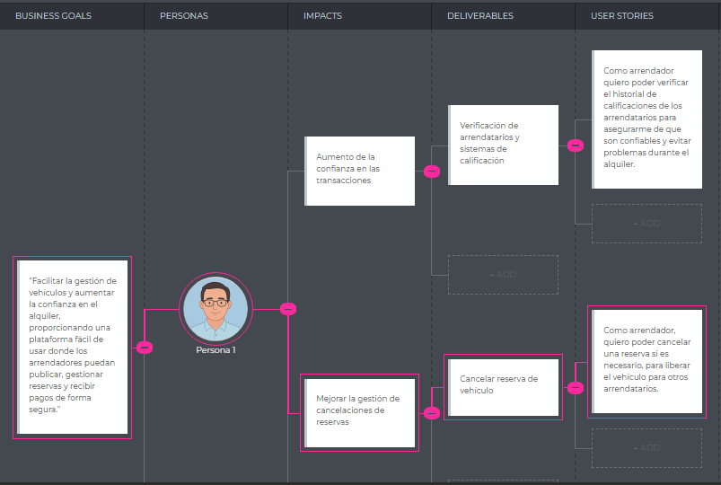

###### Segmento Objetivo 2 (Arrendatario de vehículos)


# Capítulo IV: Product Design
## 4.1. Style Guidelines

En esta sección se establecen los lineamientos de diseño orientados a garantizar la coherencia 
tanto visual como funcional del producto. Dichos lineamientos abarcan elementos de la 
identidad corporativa, la tipografía, la paleta de colores, el uso de íconos, así como los 
componentes interactivos —como botones— y su relación directa con la experiencia del usuario.

### 4.1.1. General Style Guidelines

- **Branding**:
    - **Color Primario**: #003F70 (Azul oscuro) – Utilizado en el fondo, elementos destacados
      y menús. Este color representa seguridad y confianza, ideal para una plataforma de alquiler
      de vehículos.
      <br>
      <br><br>
      <br>
    - **Color Secundario**: #52B6F2 (Azul claro) – Es el color de los botones principales,
      como "Sign up" y "Search". Este color añade un toque de frescura y accesibilidad, además
      de hacer que las llamadas a la acción sean visualmente atractivas.
      <br>
      <br><br>
      <br>
    - **Color de Fondo**: #FFFFFF (Blanco) – Se utiliza para el fondo general de la página,
      proporcionando claridad y asegurando que los elementos visuales no se sobrecarguen.
      <br>
      <br>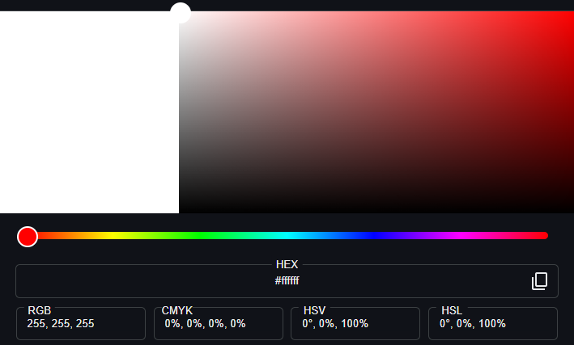<br>
      <br>
    - **Colore Secundarios de Contraste**: #F1F1F1 (Gris claro) para las áreas de soporte
      visual, como formularios o tarjetas de contenido. Además, #1F2A44 (gris oscuro) se usa
      para textos secundarios y menús.
      <br>
      <br>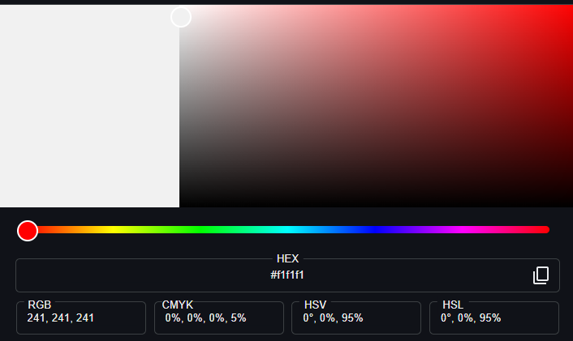<br>
      <br>


- **Typography**:<br>
  Se ha elegido la tipografía Poppins debido a su claridad, modernidad y legibilidad.
  Las distintas variaciones de peso permiten crear una jerarquía visual efectiva.
    - **ExtraBold**: Usado para encabezados y titulos.
    - **Semibold**: Para subtítulos o elementos secundarios.
    - **Regular**: Para el cuerpo del texto.
    - **Light**: Para textos menos relevantes o secundarios.<br>
      <br>
      <br>
      <br>

- **Icons**: <br>
  Los íconos son lineales y minimalistas, alineados con el estilo moderno de la plataforma.
  Se utilizan para una comunicación clara y rápida, permitiendo a los usuarios identificar
  fácilmente las acciones disponibles.<br>
  <br>
  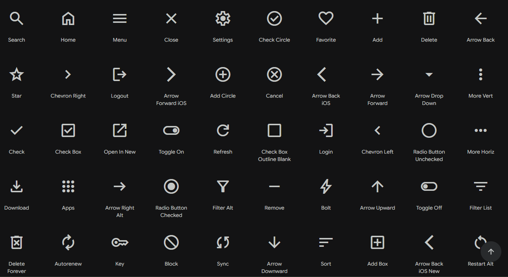<br>
  <br>

- **Buttons**: <br>
  Los botones deben ser altamente visibles y accesibles. Usamos colores vibrantes como
  #52B6F2 (Azul claro) para las acciones principales y bordes redondeados para mejorar la
  interacción en dispositivos táctiles.<br>
  <br>
  <br>
  <br>

- **Spacing and Layout**: <br>
  Se establece un sistema de espaciado uniforme, lo que garantiza la claridad visual y un
  flujo de contenido bien organizado. El espacio adecuado entre los elementos facilita la
  navegación sin que la interfaz se sienta sobrecargada.


### 4.1.2. Web Style Guidelines

- **Responsive Design**:
  Todo el diseño está optimizado para ser completamente responsivo. Esto garantiza que los
  elementos sean accesibles y fáciles de interactuar en cualquier dispositivo, desde móviles
  hasta escritorios.

- **Color Accessibility**:
  Los colores están seleccionados con criterios de contraste adecuados, cumpliendo con los
  estándares de accesibilidad (WCAG). Todo el texto será legible y fácil de leer, con
  alternativas de alto contraste para usuarios con discapacidades visuales.<br>
  <br>
  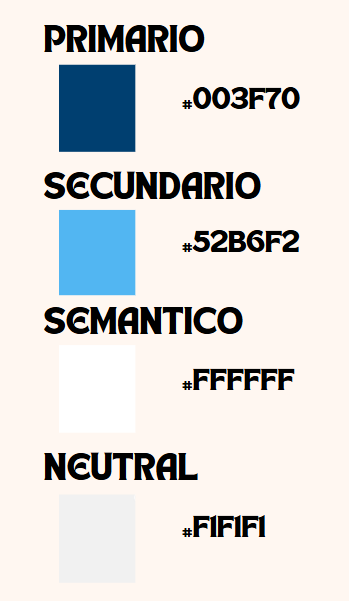<br>
  <br>

- **Hover and Active States**:
  Los botones, enlaces e iconos incluyen estados de "hover" y "active" claramente definidos,
  lo cual proporciona retroalimentación visual a los usuarios. Esto es esencial para mejorar
  la experiencia de usuario y evitar errores.

- **Performance Optimization**:
  Se priorizan diseños ligeros que cargan rápidamente, utilizando imágenes y recursos
  optimizados. La eficiencia en la carga es crucial para mantener la fluidez del sitio en
  un entorno de uso rápido.
- **Navigation and Interactivity**:
  La navegación está diseñada para ser intuitiva, con accesos directos a funciones clave
  y un uso mínimo de submenús. Los elementos interactivos incluyen retroalimentación visual
  y táctil para mejorar la experiencia del usuario.
- **Consistent Component Usage**:
  Se utilizan componentes reutilizables y consistentes en toda la interfaz web, como
  botones, tarjetas y formularios. Esto garantiza una experiencia de usuario cohesiva y
  facilita el mantenimiento y la escalabilidad del código.

### 4.1.3. Mobile Style Guidelines
Para la versión móvil de la plataforma, los lineamientos de diseño se adaptan a las características de interacción propias de los dispositivos móviles. 
Se mantiene la identidad visual definida para el producto, conservando la paleta de colores, tipografía, iconografía y componentes principales, pero 
ajustando la distribución y dimensiones de los elementos para facilitar su visualización e interacción mediante pantallas táctiles.

#### 4.1.3.1. iOS Mobile Style Guidelines
- **Layout y Retícula Base:**
  La arquitectura visual sigue un flujo vertical continuo sobre una retícula modular de 8pt, complementada con márgenes de seguridad laterales de 16pt
  a 20pt. Soporta de forma nativa los gestos del sistema, permitiendo al usuario deslizar desde el borde izquierdo hacia la derecha .
- **Navegación e Interfaz Dinámica por Rol:**
  * **Navigation Bar y Large Titles:** Encabezado superior con títulos principales en tipografía Poppins ExtraBold alineados a la izquierda. El título
    cambia dinámicamente según la sección seleccionada en la Tab Bar ("Resumen", "Publicados", "Reservas", "Perfil"). 
  * **Adaptabilidad de las 4 Pestañas Principales:**
     **Resumen:** Muestra un panel personalizado según el perfil activo. Para el Arrendador, consolida métricas de ingresos y estado del negocio;
       para el Arrendatario, despliega accesos rápidos a la búsqueda y sugerencias sobre otros vehiculos.
  * Tab Bar Inferior : Los cuatro accesos incorporan simbología nativa, resaltando la pestaña activa en azul primario (#003F70) .
  * **Acción Principal:** La acción prioritaria de publicación (para Arrendador) o reserva (para Arrendatario) se integra como un botón principal fijo en la zona
    inferior sobre el área segura, con bordes redondeados de 12pt y altura de 50pt.
- **Interacción y Accesibilidad:**
  * **Respuesta de Opacidad y Háptica:** Disminución leve en la opacidad del componente al ser presionado, combinada con vibración de respuesta táctil
     mediante el motor háptico al confirmar acciones o alternar vistas.
  * **Áreas de Toque:** Superficie de contacto interactiva mínima de 44×44 pt para todos los componentes de la interfaz.
     
#### 4.1.3.2. Android Mobile Style Guidelines
- **Layout y Retícula Base:** 
  La interfaz se distribuye en una estructura de columna única vertical adaptativa para el perfil de Arrendador (canvas Android Compact de 360×800 dp), organizada
  estrictamente sobre una retícula base de 8dp. Se establecen márgenes laterales fijos de 16dp para evitar colisiones táctiles, manteniendo los espaciados internos
   en múltiplos de 8dp (8dp, 16dp y 24dp) para asegurar simetría visual.
- **Navegación e Interfaz Dinámica por Rol:**
  * **Top App Bar:** Encabezado superior sobre fondo blanco (#FFFFFF) que despliega el saludo personalizado ("Hola, Marcelo 👋") junto al avatar de perfil en la
     esquina superior derecha, seguido del título de sección en tipografía Poppins ExtraBold alineado a la izquierda.
  * **Estructura del Resumen:** Organiza visualmente las secciones clave del negocio mediante un carrusel de desplazamiento horizontal para "Reservas Activas"
    (tarjetas con bordes redondeados de 16dp y botón "Ver más") y una lista vertical única para "Nuestras recomendaciones" con tarjetas de detalle técnico, tarifa
    diaria y botón de acción directa.
  * **NavigationBar (Inferior):** Barra de navegación fija en la parte inferior sobre fondo blanco (#FFFFFF) a una altura de 80dp. Se divide en cuatro accesos: Resumen,
     Publicados, Reservas y Perfil. La pestaña activa se resalta mediante un indicador visual en forma de cápsula u óvalo de color azul claro (#52B6F2) con el ícono en estilo
     relleno (Filled) en azul primario (#003F70), mientras que las pestañas inactivas se muestran en línea fina sobre gris neutro.
  * **Extended Floating Action Button :** Botón flotante principal posicionado en la zona inferior sobre el área segura de la pantalla. Presenta un formato de
    cápsula alargada con bordes redondeados de 16dp en azul primario (#003F70), integrando el ícono "+" y el texto explícito "+ Reservar Vehículo" para la acción prioritaria del módulo.
- **Interacción y Accesibilidad:**
  * **Efecto Ripple (Onda):** Toda interacción táctil sobre botones, tarjetas o elementos de navegación activa una animación de onda circular difusa que se expande desde el punto de
     contacto, ofreciendo retroalimentación visual inmediata.
  * **Áreas de Toque:** Cumplimiento estricto de una superficie de contacto interactiva mínima de 48×48 dp para todos los componentes navegables, garantizando la accesibilidad táctil en
    el dispositivo.

- **Landing Page en versión Wireframe para Android**:

  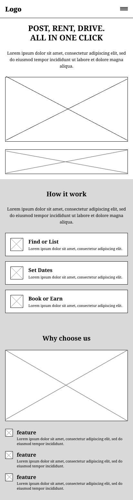<br>
  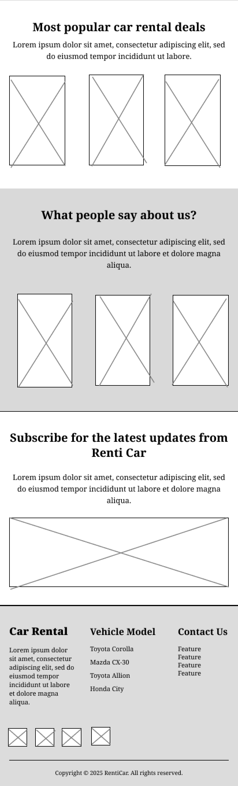<br>

  Link del Figma: https://www.figma.com/design/l0LFaLS4ss0q10lzrFVtQK/Landing-Page-Androi?node-id=2461-182&t=pYAuwdTIyfYky3Zu-1
  
- **Landing Page en versión Mock-Ups para Android**:

  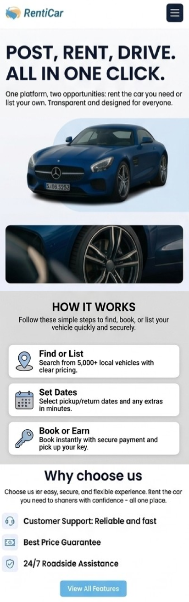<br>
  <br>

  Link del Figma: https://www.figma.com/design/l0LFaLS4ss0q10lzrFVtQK/Landing-Page-Androi?node-id=1046-41&t=pYAuwdTIyfYky3Zu-1

## 4.2. Information Architecture

La arquitectura de información define cómo se organiza, etiqueta, busca y navega en la 
aplicación web. Este apartado busca garantizar que *Renticar* sea intuitiva y accesible 
para arrendadores y arrendatarios, mejorando la experiencia de usuario y asegurando la 
eficiencia en los procesos.


### 4.2.1. Organization Systems

El sistema de organización de *Renticar* se basa en una estructura **jerárquica y funcional**, con secciones principales que responden a las necesidades detectadas en los segmentos objetivos.
- **Arrendador:** Publicaciones, gestión de vehículos, reservas, reseñas.
- **Arrendatario:** Búsqueda de autos, reservas, reseñas, perfil.
- **Común:** Dashboard, perfil de usuario, landing page informativa.  
  Esta organización facilita que cada usuario encuentre de manera rápida las funciones más relevantes según su rol.

---

### 4.2.2. Labeling Systems

Se utilizarán etiquetas claras y consistentes, priorizando un lenguaje sencillo y directo, evitando tecnicismos. Algunos ejemplos:
- **“Mis Publicaciones”** → sección donde el arrendador gestiona sus vehículos.
- **“Reservar Ahora”** → acción directa para el arrendatario.
- **“Dashboard”** → punto central para acceder a la información principal.  
  El etiquetado estará alineado con las convenciones de usabilidad y las necesidades de accesibilidad, garantizando comprensión rápida.

---

### 4.2.3. SEO Tags and Meta Tags

Para mejorar la visibilidad en buscadores, se incorporarán **etiquetas SEO y metadatos optimizados**:
- **Meta Title:** “Renticar – Plataforma confiable para alquiler de vehículos con IoT en Perú”.
- **Meta Description:** “Renticar conecta arrendadores y arrendatarios de forma segura, con gestión digital, reseñas verificadas y soporte IoT para mayor transparencia.”
- **Keywords:** “alquiler de autos Perú, rentar vehículos seguros, plataforma IoT alquiler”.  
  Estas prácticas permiten posicionar el producto en los primeros resultados de búsqueda y atraer usuarios interesados.

---

### 4.2.4. Searching Systems

El sistema de búsqueda permitirá a los arrendatarios localizar vehículos de manera eficiente mediante filtros y ordenamientos:
- **Filtros principales:** Marca, modelo, precio, ubicación.
- **Filtros secundarios:** Tipo de vehículo (sedán, SUV, hatchback), disponibilidad, kilometraje permitido.
- **Ordenamientos:** Precio (menor-mayor), valoración de usuarios, cercanía geográfica.  
  Se prioriza un diseño que reduzca el tiempo de búsqueda y que brinde resultados relevantes de manera inmediata.

---

### 4.2.5. Navigation Systems

El sistema de navegación seguirá un modelo **híbrido**:
- **Menú principal superior (Toolbar):** acceso directo a Dashboard, Publicaciones, Navegación, Perfil.
- **Menú secundario contextual:** disponible dentro de cada sección, con accesos rápidos a acciones específicas (ej. “Nueva Publicación”, “Cancelar Reserva”).
- **Breadcrumbs:** para ubicar al usuario dentro de la aplicación.
- **Navegación responsiva:** optimizada para dispositivos móviles, asegurando accesibilidad en smartphones y tablets.

Este esquema garantiza que los usuarios puedan moverse de manera intuitiva por el sistema, 
encontrando siempre las funciones más relevantes según su objetivo.

## 4.3. Landing Page UI Design
### 4.3.1. Landing Page Wireframe 

<br>

Link del Figma: https://www.figma.com/design/PChWJ99signLAO8NcRCRrY/Landing-RentiCar?node-id=2461-182&t=FAwGoGSyUJDdEzex-1

### 4.3.2. Landing Page Mock-up

<br>

Link del Figma: https://www.figma.com/design/PChWJ99signLAO8NcRCRrY/Landing-RentiCar?node-id=2461-182&t=FAwGoGSyUJDdEzex-1

## 4.6. Web Applications UX/UI Design

En esta sección se presenta la propuesta visual y de interacción para la aplicación web RentiCar. El diseño se ha centrado en los dos segmentos objetivos identificados: arrendadores (dueños de vehículos) y arrendatarios (clientes que buscan alquilar). La prioridad ha sido crear una experiencia de usuario intuitiva, segura y eficiente, aplicando principios de diseño inclusivo y una arquitectura de información clara para facilitar la navegación y el cumplimiento de los objetivos de cada usuario.

### 4.6.1. Web Applications Wireframes

Los wireframes de RentiCar se han diseñado para establecer la estructura fundamental de la aplicación, priorizando la funcionalidad y la jerarquía de la información antes de aplicar el estilo visual. Se ha buscado una disposición limpia y organizada que guíe a los usuarios a través de las tareas clave, como publicar un vehículo o reservar uno. El diseño es adaptable para garantizar una experiencia consistente tanto en navegadores de escritorio como en dispositivos móviles.

**Enlace al proyecto en Figma:** [https://www.figma.com/design/ICtIq3D2cmTwZMzqJPUxF7/RentiCar?node-id=2-4606&t=mjT7rlE8qUSnwcfL-1](https://www.figma.com/design/ICtIq3D2cmTwZMzqJPUxF7/RentiCar?node-id=2-4606&t=mjT7rlE8qUSnwcfL-1)

1.  *Iniciar Sesión / Registrarse*
    Permite a los usuarios crear una cuenta o acceder a la plataforma. El formulario de registro solicita información básica y permite elegir el tipo de perfil (arrendador o arrendatario) para personalizar la experiencia desde el inicio.

    **1. Inicio de Sesión (Sign In)**
    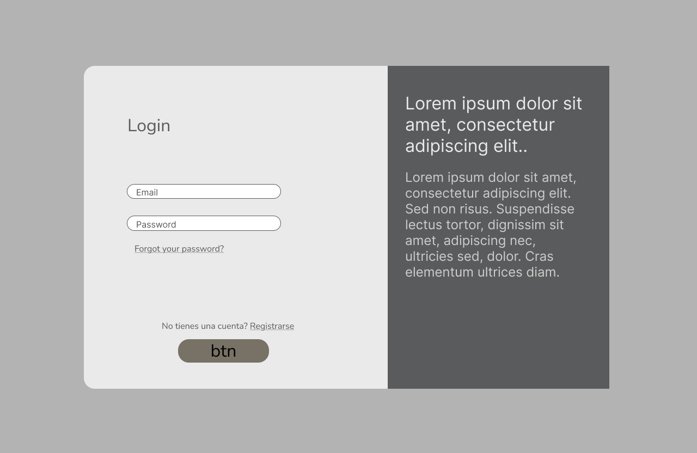

    **2. Registro de Arrendatario (Tenant Register)**
    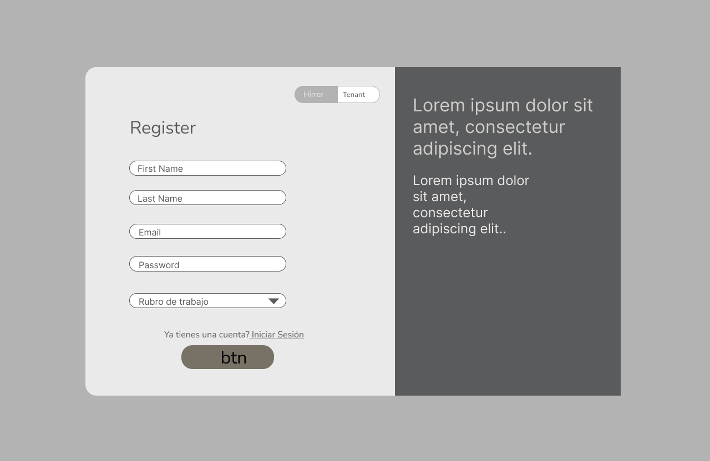

    **3. Registro de Arrendador (Hirer Register)**
    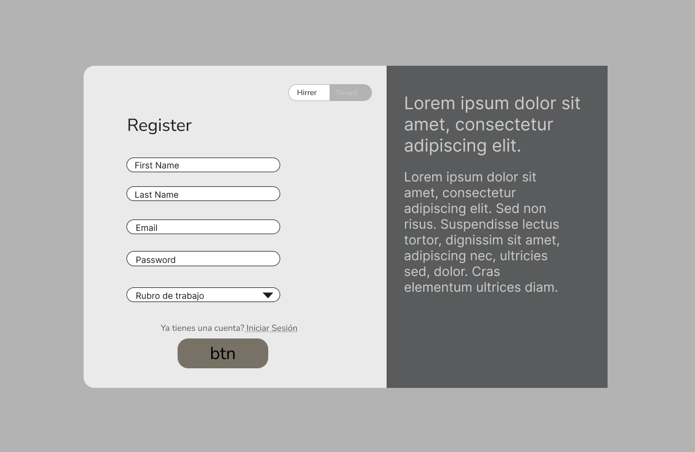

    **4. Recuperación de Contraseña**
    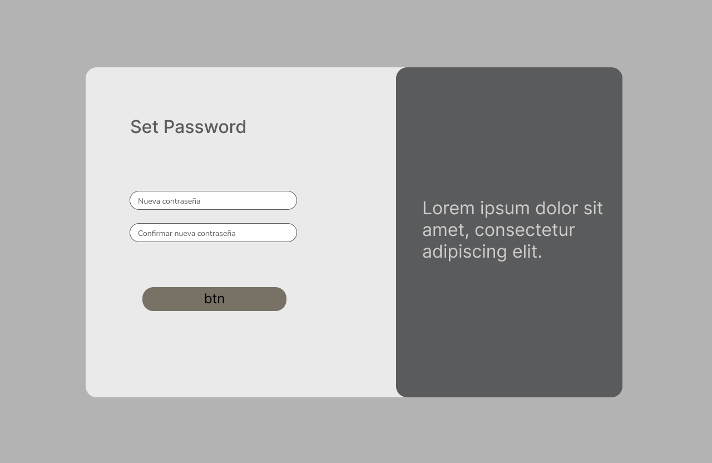

2.  *Dashboard del Arrendador*
    Muestra un resumen de los vehículos publicados, las reservas activas y las ganancias generadas. Ofrece accesos directos para añadir un nuevo vehículo y gestionar las publicaciones existentes.

    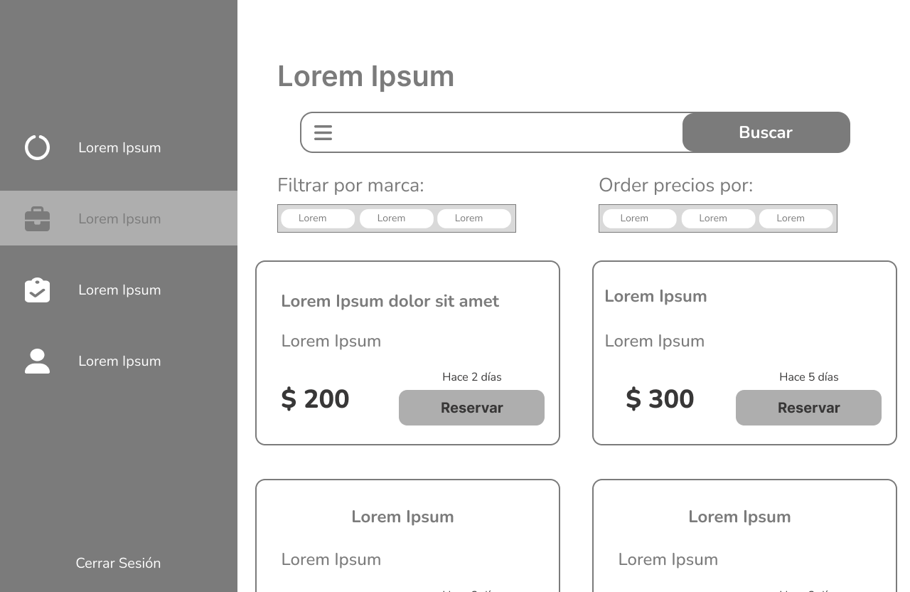

    

    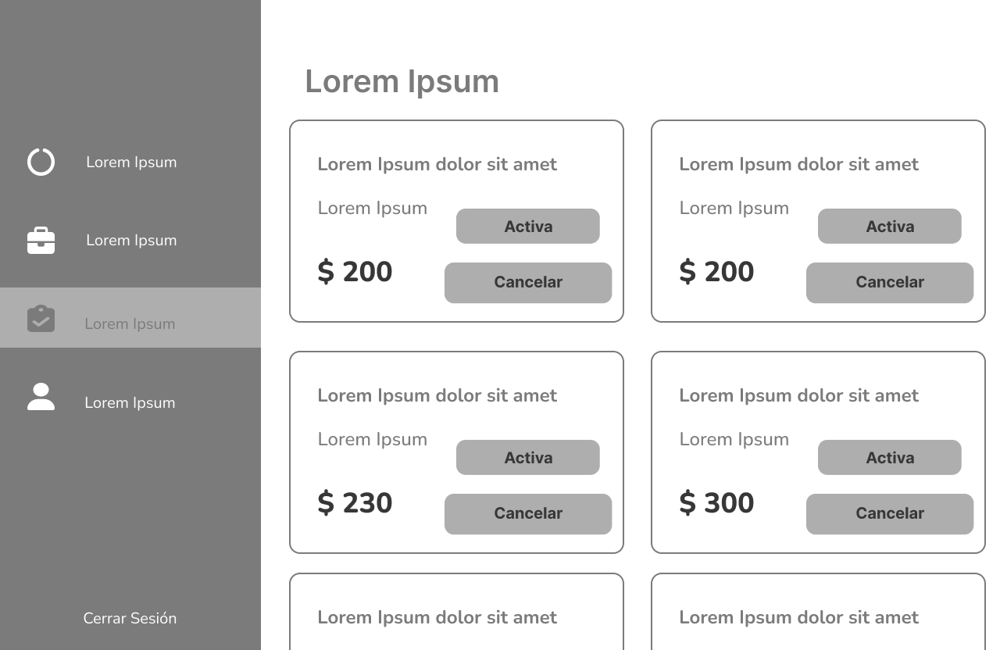

    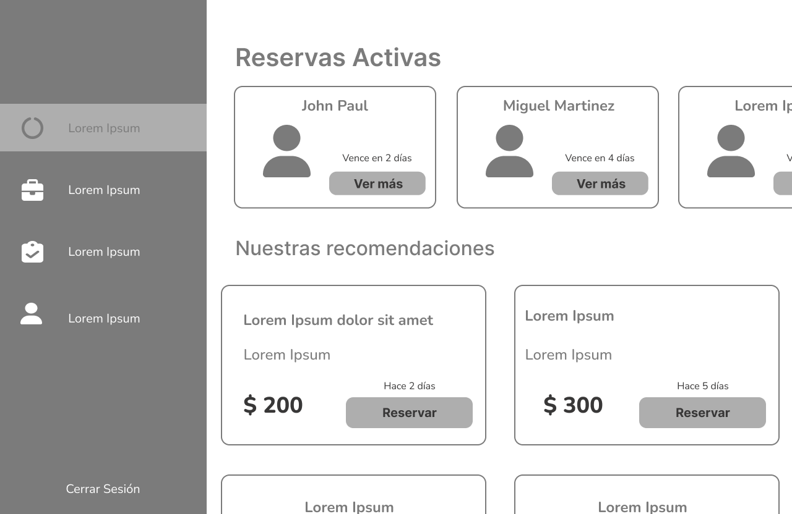


3.  *Dashboard del Arrendatario*
    Presenta un resumen de las reservas realizadas, vehículos recomendados y accesos rápidos para buscar nuevas opciones. El diseño se enfoca en facilitar la continuación de una búsqueda o la gestión de un alquiler en curso.

    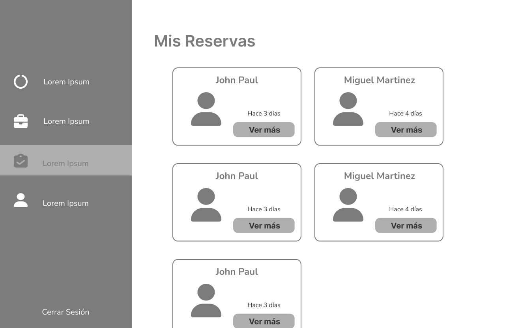

    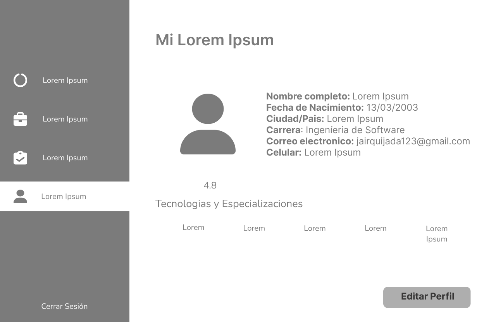

    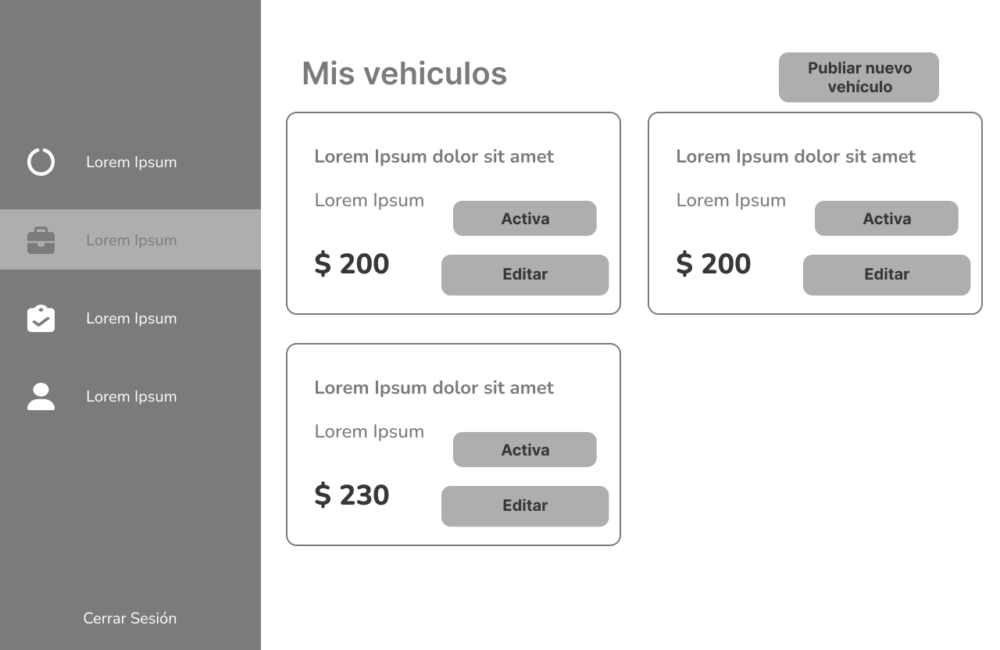

    

    Muestra un resumen de los vehículos publicados, las reservas activas y las ganancias generadas. Ofrece accesos directos para añadir un nuevo vehículo y gestionar las publicaciones existentes.

## 4.6.2. Web Applications Wireflow Diagrams

Los wireflows diagraman las rutas que los usuarios siguen para completar tareas específicas dentro de la aplicación. Se ha creado un wireflow para cada objetivo principal de nuestros User Personas, asegurando que cada paso sea lógico y sin fricciones.

---

### 1. Segmento 1: Arrendatarios

*User Goal:* Como usuario, quiero gestionar mi perfil de forma integral, pudiendo editar mi información personal, cambiar mi foto y cargar los documentos necesarios para validar mi cuenta.

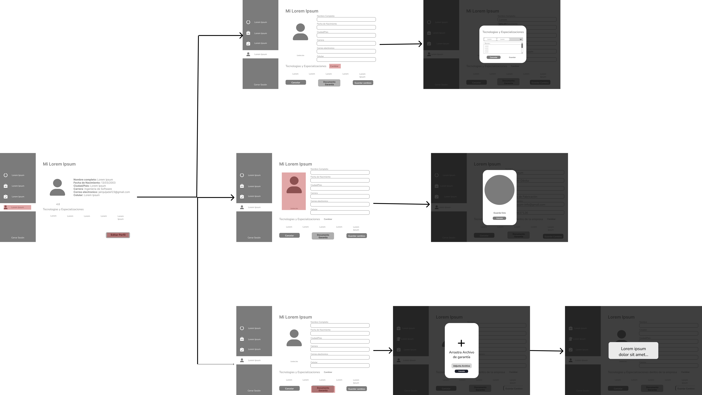

- Wireflow


*User Goal:* Como arrendatario, quiero administrar el ciclo de vida completo de mis reservas, desde ver sus detalles y cancelarlas, hasta dejar una reseña una vez finalizado el alquiler.

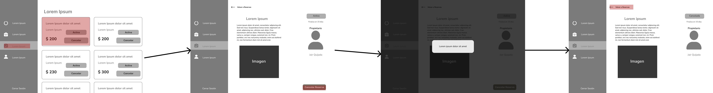

- Wireflow


*User Goal:* Como arrendatario, quiero buscar un vehículo con filtros específicos, ver sus detalles en profundidad y completar el proceso de reserva de manera fluida.

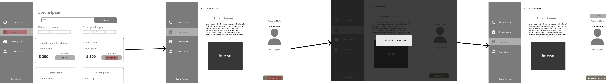

- Wireflow

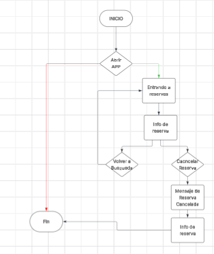

*User Goal:* Como arrendatario, quiero acceder desde mi dashboard a la gestión de mis reservas activas para poder ver sus detalles o cancelarlas si es necesario.

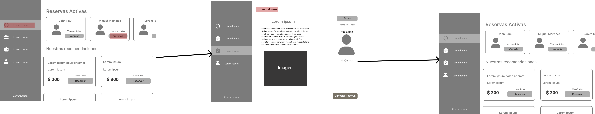

*User Goal:* Como arrendatario, quiero poder explorar las recomendaciones de vehículos directamente desde mi dashboard y realizar una reserva de forma rápida y sencilla.

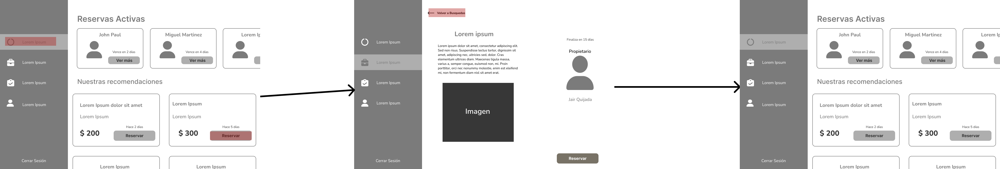

### 2. Segmento 2: Arrendadores

*User Goal:* Como arrendador, quiero ver un resumen rápido del estado de mi negocio, incluyendo mis vehículos publicados y las reservas pendientes, tan pronto como inicie sesión.

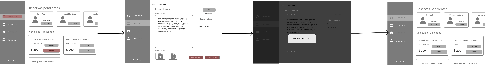

*User Goal (Crear):* Como arrendador, quiero añadir un nuevo vehículo a la plataforma de forma rápida y sencilla para empezar a alquilarlo.
*User Goal (Editar):* Como arrendador, quiero poder modificar fácilmente los detalles de mis publicaciones existentes, como el precio o la descripción, para mantener la información actualizada.
*User Goal (Eliminar):* Como arrendador, quiero retirar de la plataforma los vehículos que ya no están disponibles para alquilar, con una simple acción de eliminación.

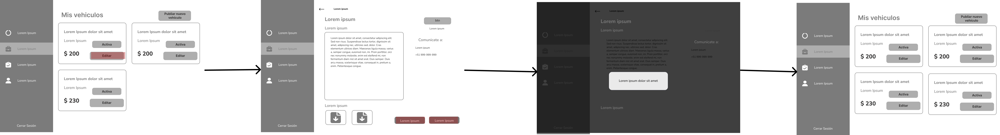

*User Goal:* Como arrendador, quiero gestionar las solicitudes de alquiler de mis vehículos de manera eficiente, pudiendo aceptarlas o rechazarlas desde un panel de control.

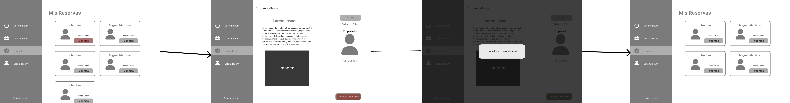

*User Goal:* Como arrendador, quiero mantener mi perfil actualizado con mi información de contacto y documentos de garantía para generar confianza en los clientes.


### 4.6.3. Web Applications Mock-ups

En esta sección se presentan los mock-ups de alta fidelidad correspondientes a la aplicación web de **RentiCar**, diseñados en Figma respetando la guía de estilos, paleta de colores y componentes visuales definidos previamente. Las interfaces se encuentran agrupadas según los flujos de interacción de los dos segmentos clave: Arrendatarios y Arrendadores, además de los módulos transversales de autenticación y telemetría.

#### 4.6.3.1. Módulo de Autenticación y Gestión de Acceso (IAM)

Este módulo centraliza las interfaces de registro, inicio de sesión seguro y recuperación de credenciales para ambos perfiles de usuario.

- **Pantalla de Inicio de Sesión (Sign In):**  
  Permite a los usuarios registrados acceder a su sesión ingresando su correo y contraseña, con validaciones en tiempo real y opción de recordar credenciales.

  <p align="center">
    
  </p>

- **Pantalla de Registro para Arrendatarios (Tenant Register):**  
  Formulario intuitivo donde los clientes ingresan sus datos personales, correo, teléfono y contraseña para crear su cuenta de arrendatario.

  <p align="center">
    
  </p>

- **Pantalla de Registro para Arrendadores (Hirrer Register):**  
  Interfaz orientada a propietarios de vehículos que desean publicar unidades, solicitando datos de contacto y verificación de identidad.

  <p align="center">
    
  </p>

- **Pantalla de Recuperación de Contraseña:**  
  Permite ingresar el correo registrado para recibir un enlace seguro de restablecimiento de contraseña mediante token de vigencia limitada.

  <p align="center">
    
  </p>

---

#### 4.6.3.2. Módulo de Experiencia del Arrendatario (Búsqueda, Reserva y Reseñas)

Interfaces diseñadas para que el arrendatario explore el catálogo, configure sus fechas de alquiler, dé seguimiento a sus solicitudes y califique el servicio.

- **Búsqueda y Reserva de un Vehículo:**  
  Vista principal de catálogo con cuadrícula de autos, filtros avanzados por marca, rango de precio, tipo de combustible y botón directo para iniciar la reserva.

  <p align="center">
    
  </p>

- **Gestión de Reservas del Arrendatario:**  
  Panel interactivo que consolida las reservas activas, pendientes y concluidas del usuario, mostrando estado actual e información del auto.

  <p align="center">
    
  </p>

- **Detalle de Reserva y Comprobante:**  
  Ficha descriptiva que desglosa el cálculo de días reservados, tarifa pactada por jornada, importe total en soles y datos de contacto del propietario.

  <p align="center">
    
  </p>

- **Finalización y Calificación de un Alquiler:**  
  Modal que se activa al culminar el periodo de alquiler, permitiendo puntuar con estrellas (1 a 5) y redactar una reseña pública sobre la experiencia.

  <p align="center">
    
  </p>

---

#### 4.6.3.3. Módulo de Experiencia del Arrendador (Gestión de Flota y Solicitudes)

Interfaces especializadas para que los propietarios gestionen sus publicaciones, administren reservas entrantes y configuren su perfil comercial.

- **Primer Acceso y Vista General (Dashboard del Arrendador):**  
  Tablero de control con métricas de ingresos, cantidad de vehículos activos, reservas en curso y accesos rápidos a publicaciones.

  <p align="center">
    
  </p>

- **Gestión y Publicación de Vehículos:**  
  Listado de la flota registrada del arrendador, con opciones para agregar un nuevo auto, editar tarifa diaria, pausar disponibilidad o retirar publicaciones.

  <p align="center">
    
  </p>

- **Administración de Solicitudes de Reserva:**  
  Bandeja de solicitudes entrantes donde el propietario revisa la identidad del solicitante, fechas deseadas y puede aceptar o rechazar el alquiler.

  <p align="center">
    
  </p>

- **Edición de Perfil de Propietario:**  
  Formulario para actualizar información personal, número telefónico de contacto y carga de documentos de garantía.

  <p align="center">
    
  </p>

---

### 4.6.4. Web Applications User Flow Diagrams

En esta sección se modelan los **diagramas de flujo de usuario (User Flow Diagrams)** que describen las rutas de interacción, puntos de decisión y transiciones de estado de los usuarios a través de la aplicación web RentiCar.

#### 4.6.4.1. Flujo de Usuario: Arrendatario (Búsqueda, Reserva, Monitoreo y Calificación)

El siguiente diagrama ilustra el recorrido completo de un cliente desde su acceso inicial a la plataforma hasta la conclusión y calificación del servicio de alquiler:

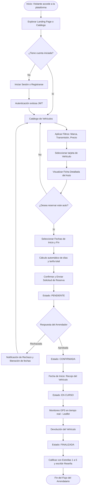
```mermaid
flowchart TD
    Start([Inicio: Visitante accede a la plataforma]) --> Explore[Explorar Landing Page o Catálogo]
    Explore --> AuthCheck{¿Tiene cuenta iniciada?}
    AuthCheck -- No --> AuthChoice[Iniciar Sesión o Registrarse]
    AuthChoice --> LoginOk[Autenticación exitosa JWT]
    AuthCheck -- Sí --> Catalog[Catálogo de Vehículos]
    LoginOk --> Catalog

    Catalog --> Filters[Aplicar Filtros: Marca, Transmisión, Precio]
    Filters --> SelectCar[Seleccionar tarjeta de Vehículo]
    SelectCar --> CarDetail[Visualizar Ficha Detallada del Auto]
    
    CarDetail --> BookDecision{¿Desea reservar este auto?}
    BookDecision -- No --> Catalog
    BookDecision -- Sí --> DateSelect[Seleccionar Fechas de Inicio y Fin]
    
    DateSelect --> PriceCalc[Cálculo automático de días y tarifa total]
    PriceCalc --> SubmitBooking[Confirmar y Enviar Solicitud de Reserva]
    SubmitBooking --> StatusPending[Estado: PENDIENTE]
    
    StatusPending --> WaitDecision{Respuesta del Arrendador}
    WaitDecision -- Rechazada --> NotifyRejected[Notificación de Rechazo y liberación de fechas]
    NotifyRejected --> Catalog
    WaitDecision -- Aprobada --> StatusConfirmed[Estado: CONFIRMADA]
    
    StatusConfirmed --> Pickup[Fecha de Inicio: Recojo del Vehículo]
    Pickup --> ActiveRent[Estado: EN CURSO]
    ActiveRent --> IoTMap[Monitoreo GPS en tiempo real - Leaflet]
    
    IoTMap --> ReturnCar[Devolución del Vehículo]
    ReturnCar --> CompletedRent[Estado: FINALIZADA]
    CompletedRent --> ReviewModal[Calificar con Estrellas 1 a 5 y escribir Reseña]
    ReviewModal --> End([Fin del Flujo del Arrendatario])
```

**Descripción del flujo del Arrendatario:**
1. **Descubrimiento y Navegación:** El cliente ingresa y navega por el catálogo público. Para concretar una reserva, el sistema valida su sesión activa o le solicita autenticarse con JWT.
2. **Filtrado y Selección:** El usuario puede refinar los resultados por marca, caja de cambios y tarifa diaria. Al seleccionar un vehículo, visualiza especificaciones completas e imágenes.
3. **Reserva y Presupuesto:** Al elegir el rango de fechas en el calendario interactivo, el sistema calcula de forma reactiva el importe total. Tras confirmar, la solicitud se envía al propietario con estado `PENDIENTE`.
4. **Seguimiento y Uso IoT:** Tras la aprobación del dueño (`CONFIRMADA`), el alquiler pasa a `EN CURSO` en la fecha pactada. El cliente tiene acceso al mapa interactivo de telemetría IoT.
5. **Cierre y Reputación:** Finalizado el alquiler (`FINALIZADA`), se activa el diálogo para emitir su valoración y comentario, enriqueciendo la reputación pública del vehículo.

---

#### 4.6.4.2. Flujo de Usuario: Arrendador (Publicación de Flota, Aprobación y Supervisión)

El siguiente diagrama detalla el recorrido del propietario para publicar un vehículo, gestionar solicitudes de reserva y dar seguimiento a sus unidades:

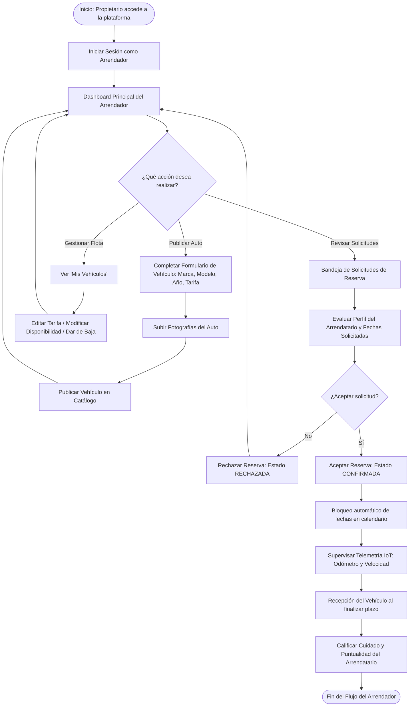
```mermaid
flowchart TD
    StartLessor([Inicio: Propietario accede a la plataforma]) --> AuthLessor[Iniciar Sesión como Arrendador]
    AuthLessor --> LessorDash[Dashboard Principal del Arrendador]
    
    LessorDash --> ActionChoice{¿Qué acción desea realizar?}
    
    ActionChoice -- Publicar Auto --> CarForm[Completar Formulario de Vehículo: Marca, Modelo, Año, Tarifa]
    CarForm --> PhotoUpload[Subir Fotografías del Auto]
    PhotoUpload --> PublishCar[Publicar Vehículo en Catálogo]
    PublishCar --> LessorDash
    
    ActionChoice -- Gestionar Flota --> MyCars[Ver 'Mis Vehículos']
    MyCars --> EditCar[Editar Tarifa / Modificar Disponibilidad / Dar de Baja]
    EditCar --> LessorDash
    
    ActionChoice -- Revisar Solicitudes --> RequestList[Bandeja de Solicitudes de Reserva]
    RequestList --> EvalRequest[Evaluar Perfil del Arrendatario y Fechas Solicitadas]
    EvalRequest --> Decision{¿Aceptar solicitud?}
    
    Decision -- No --> RejectBooking[Rechazar Reserva: Estado RECHAZADA]
    RejectBooking --> LessorDash
    
    Decision -- Sí --> AcceptBooking[Aceptar Reserva: Estado CONFIRMADA]
    AcceptBooking --> BlockDates[Bloqueo automático de fechas en calendario]
    BlockDates --> TrackIoT[Supervisar Telemetría IoT: Odómetro y Velocidad]
    TrackIoT --> CarReturned[Recepción del Vehículo al finalizar plazo]
    CarReturned --> RateRenter[Calificar Cuidado y Puntualidad del Arrendatario]
    RateRenter --> EndLessor([Fin del Flujo del Arrendador])
```

**Descripción del flujo del Arrendador:**
1. **Autenticación y Panel de Control:** El arrendador accede a su dashboard donde monitorea el rendimiento de sus publicaciones y el resumen de ingresos.
2. **Gestión de Publicaciones:** Puede registrar nuevos vehículos suministrando datos técnicos, tarifa por jornada y fotos. Las publicaciones pueden editarse o pausarse en cualquier momento (siempre que no tengan una reserva en curso).
3. **Bandeja de Solicitudes:** El propietario recibe notificaciones de solicitudes de reserva. Puede inspeccionar las fechas requeridas y el perfil verificado del arrendatario para tomar una decisión informada.
4. **Supervisión de Alquiler:** Una vez confirmada la reserva y entregada la unidad, el arrendador dispone de telemetría IoT para supervisar odómetro y velocidad.
5. **Cierre de Ciclo:** Tras recibir el auto de vuelta, el arrendador evalúa al cliente, fortaleciendo el ecosistema de confianza de RentiCar.

---

## 4.7. Web Applications Prototyping

En esta sección se presenta el **prototipo interactivo de alta fidelidad** de la aplicación web RentiCar, desarrollado y validado mediante la herramienta **Figma** y posteriormente implementado sobre el framework **Angular** con arquitectura basada en componentes reutilizables y Angular Material.

El diseño del prototipo se fundamenta en principios de diseño centrado en el usuario (UCD), garantizando una curva de aprendizaje mínima tanto para personas que alquilan por primera vez como para propietarios que administran múltiples vehículos.

### Principales aspectos funcionales validados en el prototipo:
1. **Flujo de Navegación Responsivo:** Adaptabilidad fluida desde resoluciones de escritorio (1920x1080) hasta dispositivos móviles (375x812), con navegación mediante barra lateral colapsable y barra superior contextual.
2. **Interactividad en Formularios:** Validaciones reactivas inmediatas de contraseñas seguras, correos con formato correcto y selectores de fecha con restricciones lógicas (la fecha de devolución no puede ser anterior a la de recogida).
3. **Visualización de Telemetría IoT:** Integración interactiva con mapas vectoriales vía **Leaflet**, simulando la posición GPS en vivo del vehículo alquilado y tableros de métricas de odómetro y velocidad.
4. **Sistema de Feedback y Notificaciones:** Notificaciones tipo snackbar/toast para confirmar operaciones críticas (reserva enviada, auto publicado, cambios guardados en el perfil).

El prototipo funcional navegable y la demostración de los flujos de usuario se encuentran documentados y disponibles en el siguiente recurso audiovisual:

🎥 **Demostración en Video del Prototipo Web:**  
[Ver demostración en video del prototipo interactivo en Microsoft Stream](https://upcedupe-my.sharepoint.com/:v:/g/personal/u202314354_upc_edu_pe/ETjEvnFfTMVGg504DkKQo9cBVH1Coad3hieTwbFWm9x8gQ?e=t2sINN&nav=eyJyZWZlcnJhbEluZm8iOnsicmVmZXJyYWxBcHAiOiJTdHJlYW1XZWJBcHAiLCJyZWZlcnJhbFZpZXciOiJTaGFyZURpYWxvZy1MaW5rIiwicmVmZXJyYWxBcHBQbGF0Zm9ybSI6IldlYiIsInJlZmVycmFsTW9kZSI6InZpZXcifX0%3D)

---

## 4.8. Domain-Driven Software Architecture

A continuación, se presenta la arquitectura de software del sistema **RentiCar**, estructurada bajo los principios de **Domain-Driven Design (DDD)** y documentada mediante el modelo de arquitectura **C4 (Contexto, Contenedores, Componentes y Código)**. Este modelo permite visualizar la descomposición del sistema en diferentes niveles de abstracción, garantizando un diseño desacoplado, mantenible y escalable.

### 4.8.a. Design-Level EventStorming

A partir de los talleres de EventStorming orientados al diseño, se establecieron los límites transaccionales y los siguientes **Bounded Contexts** que conforman la solución:

- **Identity & Access Management (IAM):** Responsable de la autenticación con tokens JWT, registro diferenciado de usuarios (Arrendatarios y Arrendadores), validación de credenciales y gestión de perfiles.
- **Listings & Vehicle Management:** Administra el ciclo de vida de los vehículos disponibles para alquiler, especificaciones técnicas, precios por jornada y carga de galerías fotográficas.
- **Booking & Digital Contract:** Controla el flujo transaccional de reservas, selección de rangos de fechas, cálculo automático de tarifas, aprobación o denegación por parte de propietarios y estados del alquiler.
- **IoT Monitoring & Telemetry:** Procesa datos de telemetría emitidos por dispositivos IoT vehiculares (coordenadas GPS, odómetro, velocidad y nivel de batería/combustible) para su visualización interactiva sobre mapas vectoriales.
- **Reviews & Reputation:** Gestiona las calificaciones numéricas (1 a 5 estrellas) y opiniones redactadas tras culminar el servicio, recalculando los promedios públicos de reputación.

**Eventos de Dominio Clave:** `UsuarioRegistrado`, `CredencialesValidadas`, `VehiculoPublicado`, `TarifaActualizada`, `ReservaSolicitada`, `ReservaConfirmada`, `ReservaRechazada`, `AlquilerIniciado`, `CoordenadíasGpsRecibidas`, `AlertaCombustibleEmitida`, `AlquilerFinalizado`, `ReseñaPublicada`.  
**Comandos Principales:** `RegistrarUsuario`, `IniciarSesion`, `PublicarVehiculo`, `ModificarTarifa`, `SolicitarReserva`, `ConfirmarReserva`, `RechazarReserva`, `RegistrarTelemetria`, `CalificarAlquiler`.  
**Agregados (Aggregates):** `User`, `Vehicle`, `Booking`, `TelemetryRecord`, `Review`.

---

### 4.8.1. Software Architecture Context Diagram

El diagrama de contexto define los límites del sistema **RentiCar**, ilustrando su relación con los diferentes perfiles de usuarios y los sistemas externos con los que interactúa dentro de su entorno operativo.

<p align="center">
  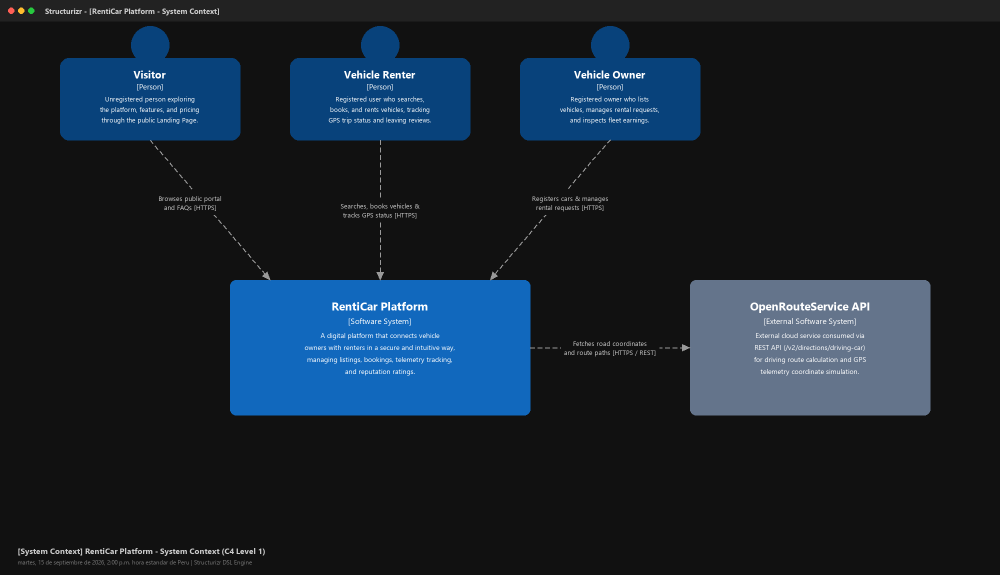<br>
  <em>Figura 4.8.1: Diagrama de Contexto del Sistema RentiCar (Nivel 1 C4)</em>
</p>

**Descripción de Elementos del Diagrama de Contexto:**
- **Personas (Usuarios):**
  - **Arrendatario (Customer/Renter):** Usuario que explora el catálogo de autos, aplica filtros, solicita reservas de vehículos por fechas determinadas, monitorea el auto en ruta vía GPS y califica el servicio recibido.
  - **Arrendador (Vehicle Owner/Lessor):** Propietario que registra y publica sus vehículos, establece tarifas de alquiler, gestiona la admisión de solicitudes y supervisa la telemetría y kilometraje de su flota.
- **Sistema de Software Central (RentiCar Platform):** Plataforma web colaborativa P2P que centraliza las operaciones de alquiler, reservas, verificación de usuarios y monitoreo telemático.
- **Sistemas Externos Integrados:**
  - **Servicio de Mapas y Geolocalización (OpenStreetMap / Leaflet):** Provee la infraestructura de renderizado cartográfico para el seguimiento en tiempo real del vehículo.
  - **Dispositivos IoT / Simulador de Telemetría:** Módulos integrados en los vehículos que transmiten coordenadas geográficas, velocidad y nivel de combustible hacia la API mediante protocolos HTTP/REST.
  - **Servicio de Notificaciones y Correo:** Encargado de despachar notificaciones transaccionales y confirmaciones de reserva.

---

### 4.8.2. Software Architecture Container Diagrams

El diagrama de contenedores desglosa la solución en sus unidades de ejecución independientes de software, detallando los roles tecnológicos, protocolos de red y bases de datos empleadas.

<p align="center">
  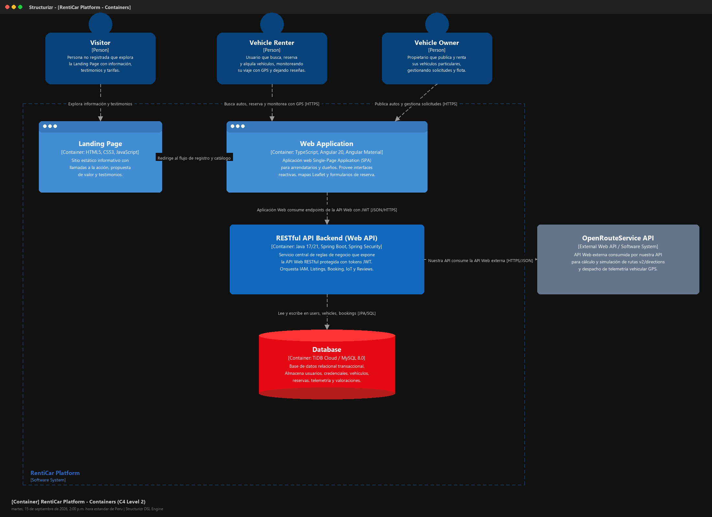<br>
  <em>Figura 4.8.2: Diagrama de Contenedores del Sistema RentiCar (Nivel 2 C4)</em>
</p>

**Descripción de Contenedores de la Solución:**
- **Landing Page (Sitio Web Público):**  
  Sitio web público estático desarrollado en **HTML5, CSS3 y JavaScript moderno**, optimizado para conversión, presentación de propuesta de valor, opiniones y llamado a la acción (CTAs) para visitantes interesados.
- **Web Application (Single-Page Application - SPA):**  
  Desarrollada en **Angular 20** con arquitectura basada en componentes standalone, TypeScript, Angular Material, Tailwind CSS y **Leaflet** para mapas interactivos. Proporciona la interfaz gráfica reactiva para Arrendatarios y Arrendadores, comunicándose con la API mediante peticiones asíncronas HTTPS / JSON con autenticación JWT.
- **RESTful API Backend (Aplicación de Servicios Central):**  
  Construida en **Java 17 / 21** empleando el framework **Spring Boot 3.x**. Estructurada bajo Domain-Driven Design (DDD) y arquitectura hexagonal por Bounded Contexts, expone endpoints REST seguros protegidos con Spring Security y tokens JWT emitidos con HMAC-SHA256.
- **Database (Base de Datos Relacional Transaccional):**  
  Implementada sobre **TiDB Cloud (compatible con MySQL 8.0)** accesible mediante Spring Data JPA e Hibernate por el puerto 4000. Aloja las entidades de negocio (usuarios, credenciales, vehículos, contratos de reserva, telemetría y valoraciones) garantizando transaccionalidad ACID e integridad referencial estricta.
- **OpenRouteService API (External Software System):**  
  Servicio externo en la nube consumido por el backend a través de su API REST (`/v2/directions/driving-car`) para el cálculo de matrices de ruta y simulación de coordenadas GPS telemáticas en tiempo real.
- **Consumo de la API por la Aplicación Web:**  
  La **Web Application** es el contenedor cliente que consume de forma directa y reactiva los endpoints de la **RESTful API Backend** mediante peticiones HTTP asíncronas sobre TLS/HTTPS serializadas en JSON y autenticadas con Bearer JWT, soportando todos los casos de uso de arrendatarios y propietarios.

---

### 4.8.3. Software Architecture Components Diagrams

En esta sección se presentan los **diagramas de componentes (Nivel 3 del modelo C4)** descompuestos de manera individual para cada uno de los **Bounded Contexts** que conforman el backend de **RentiCar** desarrollado en **Spring Boot**. Cada diagrama modela la interacción entre los controladores REST, los servicios de aplicación (Command y Query Handlers), el modelo de dominio y los adaptadores de infraestructura y persistencia.

<p align="center">
  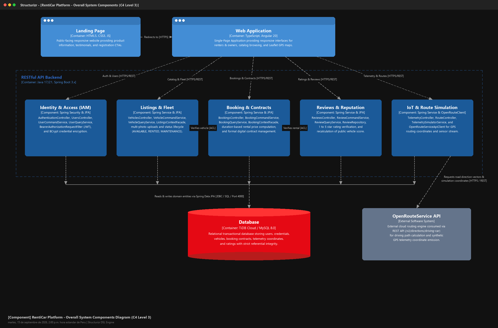<br>
  <em>Figura 4.8.3: Diagrama General de Componentes de la Plataforma RentiCar</em>
</p>

---

#### 4.8.3.1. Components Diagram: Identity & Access Management (IAM) Bounded Context
Gestiona el registro de usuarios, autenticación mediante tokens JWT, encriptación de credenciales con BCrypt y administración de perfiles según roles (`ROLE_RENTER` y `ROLE_OWNER`).

<p align="center">
  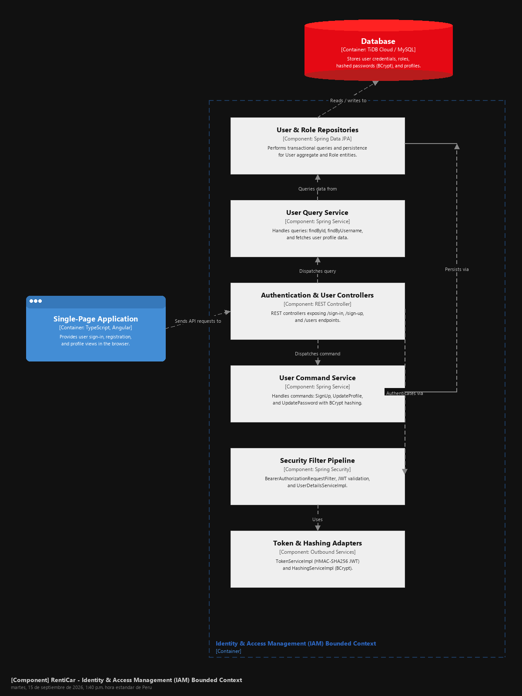<br>
  <em>Figura 4.8.3.1: Diagrama de Componentes C4 (Nivel 3) - IAM Bounded Context (Structurizr Style)</em>
</p>


**Catálogo de Componentes del IAM Bounded Context:**
| Componente | Capa | Responsabilidad |
| :--- | :---: | :--- |
| `AuthenticationController` | Interfaces | Expone los endpoints públicos de registro (`/sign-up`) e inicio de sesión (`/sign-in`). |
| `UsersController` | Interfaces | Permite consultar información de usuarios y actualizar contraseñas o datos de perfil. |
| `BearerAuthorizationRequestFilter` | Seguridad | Intercepta peticiones HTTP para extraer y validar tokens Bearer JWT en las cabeceras. |
| `UserCommandServiceImpl` | Aplicación | Orquesta los casos de uso transaccionales de alta, modificación de perfil y reseteo de claves. |
| `UserQueryServiceImpl` | Aplicación | Ejecuta consultas de solo lectura por identificador de usuario o dirección de correo. |
| `UserRepository` / `RoleRepository` | Infraestructura | Interfaces Spring Data JPA para la persistencia transaccional en las tablas `users` y `roles`. |

---

#### 4.8.3.2. Components Diagram: Listings & Fleet Management Bounded Context
Controla la publicación de vehículos por parte de los propietarios, especificaciones técnicas (marca, modelo, año, precio diario), carga fotográfica y ciclo de vida de disponibilidad.

<p align="center">
  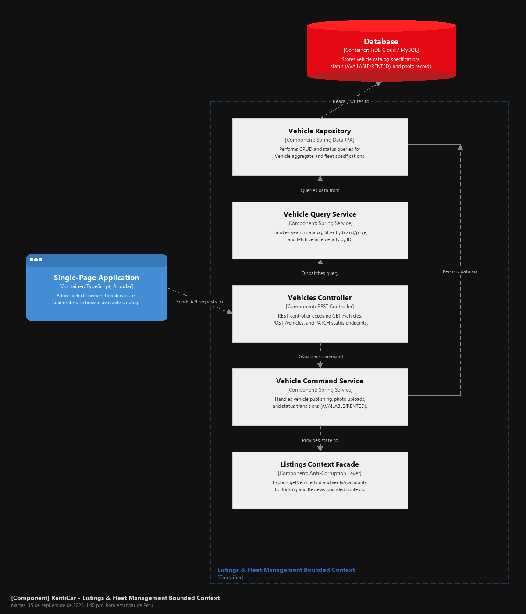<br>
  <em>Figura 4.8.3.2: Diagrama de Componentes C4 (Nivel 3) - Listings & Fleet Management Bounded Context (Structurizr Style)</em>
</p>


**Catálogo de Componentes del Listings Bounded Context:**
| Componente | Capa | Responsabilidad |
| :--- | :---: | :--- |
| `VehiclesController` | Interfaces | Maneja endpoints para listar el catálogo público, registrar vehículos, subir imágenes y cambiar estado. |
| `VehicleCommandServiceImpl` | Aplicación | Valida reglas de negocio para crear, actualizar especificaciones, almacenar fotos binarias y dar de baja publicaciones. |
| `VehicleQueryServiceImpl` | Aplicación | Recupera listados de vehículos aplicando filtros por estado operativo (`AVAILABLE`) y por identificador de propietario. |
| `ListingsContextFacade` | ACL | Expone métodos de consulta de disponibilidad y pertenencia vehicular hacia los contextos de Booking e IoT. |
| `VehicleRepository` | Infraestructura | Gestiona las operaciones CRUD y consultas derivadas sobre la tabla `vehicles`. |

---

#### 4.8.3.3. Components Diagram: Booking & Digital Contract Bounded Context
Administra las solicitudes de alquiler formuladas por los arrendatarios, el cálculo automático de tarifas por días de contrato, la confirmación o rechazo por el arrendador y las cancelaciones.

<p align="center">
  <br>
  <em>Figura 4.8.3.3: Diagrama de Componentes C4 (Nivel 3) - Booking & Digital Contract Bounded Context (Structurizr Style)</em>
</p>


**Catálogo de Componentes del Booking Bounded Context:**
| Componente | Capa | Responsabilidad |
| :--- | :---: | :--- |
| `BookingsController` | Interfaces | Expone los endpoints de creación de reserva, confirmación, rechazo, cancelación y consulta de bandejas. |
| `BookingCommandServiceImpl` | Aplicación | Ejecuta transiciones de estado contractuales, calcula el precio total por días y evita reservas solapadas. |
| `BookingQueryServiceImpl` | Aplicación | Obtiene el historial de reservas para el arrendatario y la bandeja de solicitudes entrantes para el arrendador. |
| `BookingContextFacade` | ACL | Provee a los contextos de Reviews e IoT la verificación de si un alquiler fue completado satisfactoriamente. |
| `BookingRepository` | Infraestructura | Repositorio Spring Data JPA con consultas JPQL para filtrado por fechas, usuario y vehículo. |

---

#### 4.8.3.4. Components Diagram: IoT Monitoring & Route Simulation Bounded Context
Procesa las señales telemáticas transmitidas por sensores vehiculares (coordenadas GPS, odómetro, velocidad y nivel de combustible) y la simulación interactiva de trayectorias mediante OpenRouteService.

<p align="center">
  <br>
  <em>Figura 4.8.3.4: Diagrama de Componentes C4 (Nivel 3) - IoT Monitoring & Route Simulation Bounded Context (Structurizr Style)</em>
</p>


**Catálogo de Componentes del IoT Bounded Context:**
| Componente | Capa | Responsabilidad |
| :--- | :---: | :--- |
| `TelemetryController` | Interfaces | Provee endpoints para registrar telemetría y consultar la última posición telemática de un auto. |
| `RouteController` | Interfaces | Expone los endpoints de simulación de rutas dinámicas consumidos por el componente Leaflet en frontend. |
| `OpenRouteServiceApiClient` | Infraestructura | Cliente HTTP REST que consulta la API de OpenRouteService para obtener coordenadas secuenciales de rutas. |
| `TelemetrySimulatorService` | Aplicación | Simula el desplazamiento físico de vehículos emitiendo coordenadas periódicas hacia la persistencia. |
| `TelemetryRepository` | Infraestructura | Repositorio JPA para almacenar y consultar lecturas de GPS, velocidad y combustible por vehículo. |

---

#### 4.8.3.5. Components Diagram: Reviews & Reputation Bounded Context
Gestiona las evaluaciones y comentarios redactados por clientes una vez completado su alquiler, recalculando dinámicamente el promedio de satisfacción pública del vehículo.

<p align="center">
  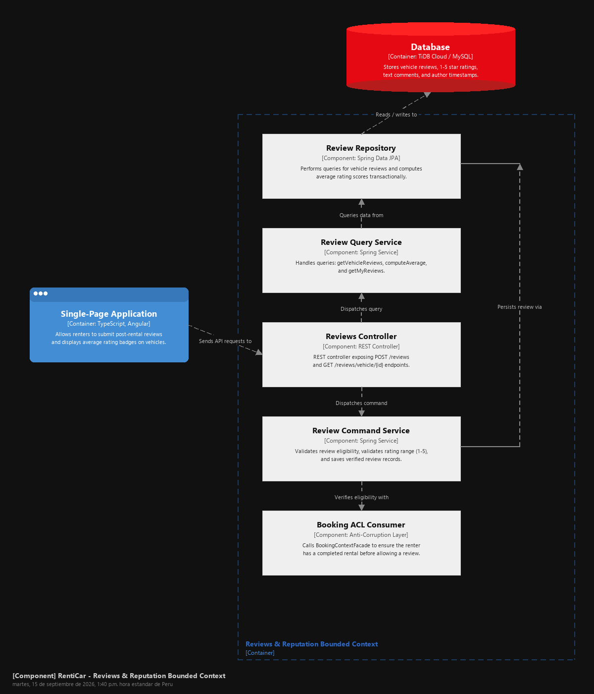<br>
  <em>Figura 4.8.3.5: Diagrama de Componentes C4 (Nivel 3) - Reviews & Reputation Bounded Context (Structurizr Style)</em>
</p>


**Catálogo de Componentes del Reviews Bounded Context:**
| Componente | Capa | Responsabilidad |
| :--- | :---: | :--- |
| `ReviewsController` | Interfaces | Expone los endpoints para registrar una nueva reseña y consultar opiniones por vehículo o usuario. |
| `ReviewCommandServiceImpl` | Aplicación | Valida que el usuario posea un alquiler completado (vía ACL) y que no haya calificado previamente el servicio. |
| `ReviewQueryServiceImpl` | Aplicación | Consulta el listado histórico de calificaciones y calcula el promedio ponderado de satisfacción. |
| `ReviewRepository` | Infraestructura | Repositorio Spring Data JPA para la persistencia y lectura de opiniones en la tabla `reviews`. |

## 4.9. Software Object-Oriented Design

El diseño orientado a objetos de **RentiCar** unifica todos los módulos y Bounded Contexts de la plataforma bajo los principios tácticos de **Domain-Driven Design (DDD)** y arquitectura hexagonal, garantizando alta cohesión, bajo acoplamiento e integridad referencial y de dominio.

### 4.9.1. Class Diagrams

A continuación, se presenta el **Diagrama Completo y Unificado de Clases del Sistema RentiCar**, modelado a nivel profesional con 100% de paridad con la arquitectura del backend (**Spring Boot**) y el frontend (**Angular**), cubriendo todos los Bounded Contexts, agregados, entidades, objetos de valor, interfaces de persistencia, servicios de aplicación y controladores REST:

<p align="center">
  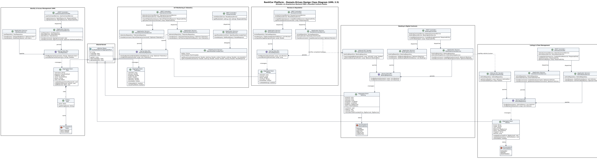<br>
  <em>Figura 4.9.1: Diagrama Maestro de Clases del Dominio de RentiCar (UML 2.5 - All Bounded Contexts)</em>
</p>

---

---

### 4.9.2. Class Dictionary

El siguiente diccionario de clases consolida la totalidad de entidades, agregados, objetos de valor e interfaces del sistema **RentiCar**, detallando su visibilidad, atributos, métodos, tipos de datos y descripciones operativas en estricto apego al estándar de la rúbrica:

| Clase | Atributo / Método | Descripción | Tipo de Dato | Visibilidad |
| :--- | :--- | :--- | :---: | :---: |
| `User` | `-id` | Identificador autoincremental único del usuario | `Long` | Privado |
| `User` | `-name` | Nombre completo del usuario registrado | `String` | Privado |
| `User` | `-email` | Dirección de correo electrónico validada | `EmailAddress` | Privado |
| `User` | `-password` | Hash seguro BCrypt de la contraseña | `String` | Privado |
| `User` | `-roles` | Conjunto de roles asignados al usuario | `Set<Role>` | Privado |
| `User` | `+updatePassword()` | Actualiza el hash de la clave del usuario | `void` | Público |
| `User` | `+updateProfile()` | Modifica nombre y datos de contacto | `void` | Público |
| `User` | `+addRole()` | Asigna un nuevo rol de acceso (`ROLE_RENTER` o `ROLE_OWNER`) | `void` | Público |
| `Role` | `-id` | Identificador único del rol | `Long` | Privado |
| `Role` | `-name` | Nombre enumerado del rol | `Roles` | Privado |
| `Role` | `+getStringName()` | Nombre del rol en formato texto para Spring Security | `String` | Público |
| `EmailAddress` | `-address` | Cadena validada que cumple formato de correo | `String` | Privado |
| `EmailAddress` | `+validate()` | Comprueba sintaxis de correo electrónico con regex | `boolean` | Público |
| `Vehicle` | `-id` | Identificador primario del vehículo en el catálogo | `Long` | Privado |
| `Vehicle` | `-brand` | Marca automotriz del vehículo | `String` | Privado |
| `Vehicle` | `-model` | Modelo del vehículo | `String` | Privado |
| `Vehicle` | `-year` | Año de fabricación del automóvil | `Integer` | Privado |
| `Vehicle` | `-pricePerDay` | Tarifa diaria de alquiler en nuevos soles (PEN) | `Double` | Privado |
| `Vehicle` | `-status` | Estado de disponibilidad (`AVAILABLE`, `RENTED`, `MAINTENANCE`) | `VehicleStatus` | Privado |
| `Vehicle` | `-image` | Contenido binario de la fotografía del auto | `byte[]` | Privado |
| `Vehicle` | `-ownerId` | Identificador foráneo del propietario arrendador | `Long` | Privado |
| `Vehicle` | `+updatePrice()` | Actualiza la tarifa de alquiler diaria verificando precio positivo | `void` | Público |
| `Vehicle` | `+updateStatus()` | Cambia la disponibilidad del auto en catálogo | `void` | Público |
| `Vehicle` | `+isAvailable()` | Retorna verdadero si el auto puede ser reservado | `boolean` | Público |
| `Booking` | `-id` | Clave primaria única del contrato de reserva | `Long` | Privado |
| `Booking` | `-vehicleId` | Identificador del automóvil reservado | `Long` | Privado |
| `Booking` | `-renterId` | Identificador del usuario que alquila | `Long` | Privado |
| `Booking` | `-ownerId` | Identificador del dueño que recibe la solicitud | `Long` | Privado |
| `Booking` | `-startDate` | Fecha de inicio convenida para el alquiler | `LocalDate` | Privado |
| `Booking` | `-endDate` | Fecha de devolución pactada | `LocalDate` | Privado |
| `Booking` | `-totalPrice` | Importe monetario total calculado | `Double` | Privado |
| `Booking` | `-bookingStatus` | Estado del contrato (`PENDING`, `CONFIRMED`, `REJECTED`, `CANCELLED`, `COMPLETED`) | `BookingStatus` | Privado |
| `Booking` | `+confirm()` | Transiciona el estado a confirmado y bloquea fechas | `void` | Público |
| `Booking` | `+reject()` | Transiciona el estado a rechazado y libera el auto | `void` | Público |
| `Booking` | `+cancel()` | Cancela la reserva antes del inicio del viaje | `void` | Público |
| `Booking` | `+complete()` | Finaliza el alquiler y habilita la calificación | `void` | Público |
| `Booking` | `+calculateTotalPrice()`| Multiplica los días de alquiler por la tarifa diaria | `Double` | Público |
| `Telemetry` | `-id` | Clave primaria del muestreo telemático | `Long` | Privado |
| `Telemetry` | `-vehicleId` | Identificador del auto monitoreado | `Long` | Privado |
| `Telemetry` | `-latitude` | Coordenada geográfica de latitud WGS84 | `Double` | Privado |
| `Telemetry` | `-longitude` | Coordenada geográfica de longitud WGS84 | `Double` | Privado |
| `Telemetry` | `-speed` | Velocidad instantánea en km/h | `Double` | Privado |
| `Telemetry` | `-fuelLevel` | Nivel actual de combustible en porcentaje | `Double` | Privado |
| `Telemetry` | `-recordedAt` | Marca temporal exacta de la medición | `LocalDateTime` | Privado |
| `Telemetry` | `+isSpeedAlert()` | Evalúa si la velocidad sobrepasa los límites de seguridad | `boolean` | Público |
| `Telemetry` | `+isLowFuelAlert()` | Determina si el combustible está por debajo del umbral mínimo | `boolean` | Público |
| `Review` | `-id` | Identificador único de la reseña | `Long` | Privado |
| `Review` | `-vehicleId` | Identificador del vehículo evaluado | `Long` | Privado |
| `Review` | `-renterId` | Identificador del cliente evaluador | `Long` | Privado |
| `Review` | `-rating` | Calificación numérica otorgada (1 a 5 estrellas) | `Integer` | Privado |
| `Review` | `-comment` | Texto con la opinión y testimonio del alquiler | `String` | Privado |
| `Review` | `-createdAt` | Fecha y hora de publicación de la reseña | `LocalDateTime` | Privado |

## 4.10. Database Design

El diseño de la base de datos relacional de **RentiCar** ha sido modelado para garantizar la consistencia transaccional, normalización en Tercera Forma Normal (3FN) e integridad referencial entre todías las entidades del negocio.

### 4.10.1. Relational Database Diagram

Antes de detallar el diccionario de datos, se presenta el esquema relacional global del sistema, ilustrando las tablas principales, claves foráneas y cardinalidades:

<p align="center">
  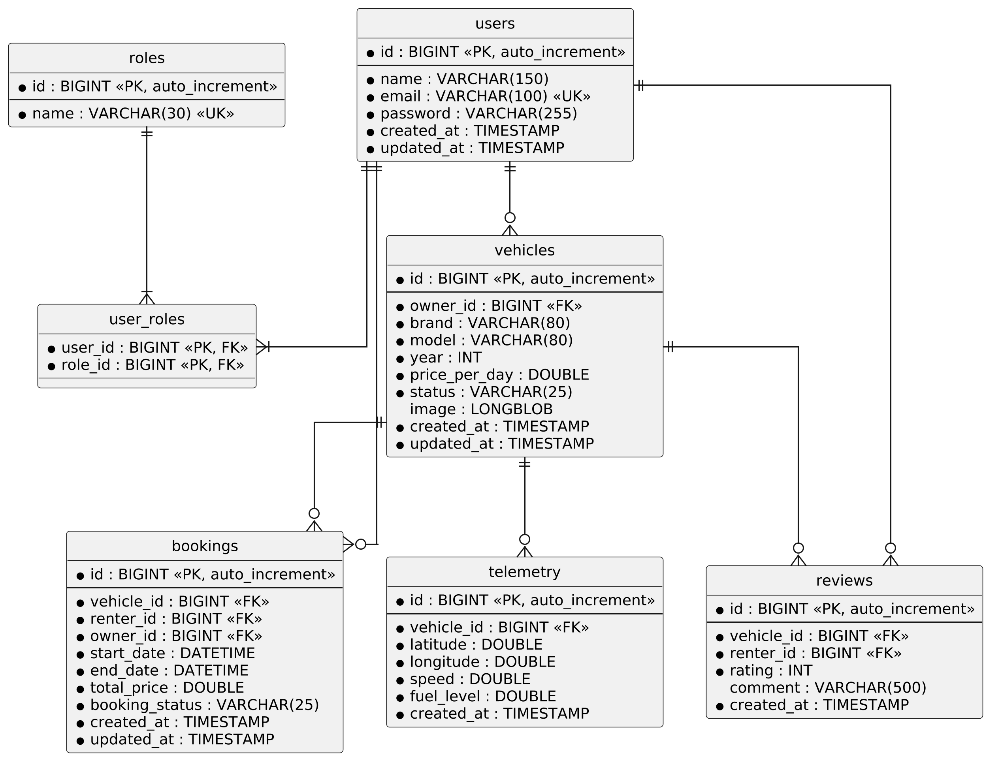<br>
  <em>Figura 4.10.1: Diagrama Entidad-Relación Relacional de RentiCar</em>
</p>

---

### 4.10.2. Database Data Dictionary (Diccionario de Datos)

El siguiente diccionario de datos describe las tablas y relaciones generadas por **JPA / Hibernate** en la base de datos **TiDB Cloud (MySQL 8.0)** de RentiCar:

#### Tabla: `users`
Almacena las cuentas y credenciales de acceso de los usuarios del sistema.

| Columna | Tipo SQL | Longitud | PK | FK | Not Null | Descripción |
| :--- | :--- | :---: | :---: | :---: | :---: | :--- |
| `id` | `BIGINT` | 20 | Sí | No | Sí | Identificador autoincremental único del usuario. |
| `name` | `VARCHAR` | 150 | No | No | Sí | Nombres y apellidos completos del usuario. |
| `email` | `VARCHAR` | 100 | No | No | Sí | Correo electrónico único validado mediante Value Object. |
| `password` | `VARCHAR` | 255 | No | No | Sí | Hash BCrypt seguro de la contraseña. |
| `created_at` | `TIMESTAMP` | - | No | No | Sí | Estampa de auditoría de creación del registro. |
| `updated_at` | `TIMESTAMP` | - | No | No | Sí | Estampa de auditoría de última actualización. |

#### Tabla: `roles`
Catálogo de roles del sistema para el control de autorización basado en roles (RBAC).

| Columna | Tipo SQL | Longitud | PK | FK | Not Null | Descripción |
| :--- | :--- | :---: | :---: | :---: | :---: | :--- |
| `id` | `BIGINT` | 20 | Sí | No | Sí | Clave primaria del rol. |
| `name` | `VARCHAR` | 30 | No | No | Sí | Nombre representativo del rol (`ROLE_RENTER`, `ROLE_OWNER`). |

#### Tabla: `user_roles`
Tabla intermedia que resuelve la relación N:M entre `users` y `roles`.

| Columna | Tipo SQL | Longitud | PK | FK | Not Null | Descripción |
| :--- | :--- | :---: | :---: | :---: | :---: | :--- |
| `user_id` | `BIGINT` | 20 | Sí | Sí | Sí | Clave foránea que referencia a `users.id`. |
| `role_id` | `BIGINT` | 20 | Sí | Sí | Sí | Clave foránea que referencia a `roles.id`. |

#### Tabla: `vehicles`
Contiene la flota de vehículos publicados por los propietarios (arrendadores).

| Columna | Tipo SQL | Longitud | PK | FK | Not Null | Descripción |
| :--- | :--- | :---: | :---: | :---: | :---: | :--- |
| `id` | `BIGINT` | 20 | Sí | No | Sí | Clave primaria del vehículo. |
| `brand` | `VARCHAR` | 80 | No | No | Sí | Marca automotriz del vehículo. |
| `model` | `VARCHAR` | 80 | No | No | Sí | Modelo del automóvil. |
| `year` | `INT` | 4 | No | No | Sí | Año de fabricación del automóvil. |
| `price_per_day`| `DOUBLE`| - | No | No | Sí | Tarifa por día en nuevos soles (PEN). |
| `status` | `VARCHAR` | 25 | No | No | Sí | Estado del auto (`AVAILABLE`, `RENTED`, `MAINTENANCE`). |
| `image` | `LONGBLOB`| - | No | No | No | Bytes binarios de la fotografía del vehículo. |
| `owner_id` | `BIGINT` | 20 | No | No | Sí | Identificador del propietario arrendador (`users.id`). |
| `created_at` | `TIMESTAMP` | - | No | No | Sí | Estampa de auditoría de creación. |
| `updated_at` | `TIMESTAMP` | - | No | No | Sí | Estampa de auditoría de actualización. |

#### Tabla: `bookings`
Registra las transacciones y contratos de alquiler formalizados entre arrendatarios y vehículos.

| Columna | Tipo SQL | Longitud | PK | FK | Not Null | Descripción |
| :--- | :--- | :---: | :---: | :---: | :---: | :--- |
| `id` | `BIGINT` | 20 | Sí | No | Sí | Clave primaria autonumérica de la reserva. |
| `vehicle_id` | `BIGINT` | 20 | No | No | Sí | Identificador del vehículo reservado (`vehicles.id`). |
| `renter_id` | `BIGINT` | 20 | No | No | Sí | Identificador del cliente solicitante (`users.id`). |
| `owner_id` | `BIGINT` | 20 | No | No | Sí | Identificador del propietario receptor (`users.id`). |
| `start_date` | `DATETIME` | - | No | No | Sí | Fecha de inicio del alquiler. |
| `end_date` | `DATETIME` | - | No | No | Sí | Fecha de término pactada del alquiler. |
| `total_price` | `DOUBLE` | - | No | No | Sí | Importe económico total calculado. |
| `booking_status`|`VARCHAR` | 25 | No | No | Sí | Estado (`PENDING`, `CONFIRMED`, `REJECTED`, `CANCELLED`, `COMPLETED`). |
| `created_at` | `TIMESTAMP` | - | No | No | Sí | Estampa de auditoría de creación. |
| `updated_at` | `TIMESTAMP` | - | No | No | Sí | Estampa de auditoría de actualización. |

#### Tabla: `telemetry`
Almacena las lecturas telemáticas continuas emitidas por los sensores GPS del vehículo.

| Columna | Tipo SQL | Longitud | PK | FK | Not Null | Descripción |
| :--- | :--- | :---: | :---: | :---: | :---: | :--- |
| `id` | `BIGINT` | 20 | Sí | No | Sí | Clave primaria de la estampa de telemetría. |
| `vehicle_id` | `BIGINT` | 20 | No | No | Sí | Identificador del vehículo monitoreado (`vehicles.id`). |
| `latitude` | `DOUBLE` | - | No | No | Sí | Coordenada geográfica de latitud GPS. |
| `longitude` | `DOUBLE` | - | No | No | Sí | Coordenada geográfica de longitud GPS. |
| `speed` | `DOUBLE` | - | No | No | Sí | Velocidad registrada en km/h. |
| `fuel_level` | `DOUBLE` | - | No | No | Sí | Porcentaje restante de combustible/batería (0 a 100%). |
| `created_at` | `TIMESTAMP` | - | No | No | Sí | Estampa de recepción telemática. |

#### Tabla: `reviews`
Registra las valoraciones y comentarios emitidos tras concluir una reserva.

| Columna | Tipo SQL | Longitud | PK | FK | Not Null | Descripción |
| :--- | :--- | :---: | :---: | :---: | :---: | :--- |
| `id` | `BIGINT` | 20 | Sí | No | Sí | Clave primaria de la reseña. |
| `vehicle_id` | `BIGINT` | 20 | No | No | Sí | Identificador del vehículo calificado (`vehicles.id`). |
| `renter_id` | `BIGINT` | 20 | No | No | Sí | Identificador del cliente calificador (`users.id`). |
| `rating` | `INT` | 2 | No | No | Sí | Puntuación numérica entera de 1 a 5 estrellas. |
| `comment` | `VARCHAR` | 500 | No | No | No | Comentario cualitativo sobre el servicio. |
| `created_at` | `TIMESTAMP` | - | No | No | Sí | Estampa de auditoría de creación. |

---

# Capítulo V: Product Implementation

## 5.1. Software Configuration Management
### 5.1.1. Software Development Environment Configuration

Desarrollo del reporte: **Github** <br>
Planificación y reunion: **Discord** <br>
Comunicación: **WhatsApp** <br>

### Requirement Management
Utilizamos UXPressia para poder desarrollar los mapas, los user personas y lean UX canvas


### Product UX/UI Design
Utilizamos Figma para el desarrollo de mock ups tanto de la landing page como de la web app


### Software Deployment
Trabajamos con vercel para el despliegue de la landing page


### 5.1.2. Source Code Management

| Producto | Tipo de Entregable | URL Oficial del Repositorio |
| :--- | :--- | :--- |
| **Landing Page** | Sitio Web Estático y Promocional | https://github.com/CodexaTeam/LandingPage |
| **Web Application** | Frontend Single-Page Application (Angular 20) | https://github.com/CodexaTeam/Frontend |
| **RESTful API Backend** | Backend API & DDD Bounded Contexts (Spring Boot 3.x) | https://github.com/CodexaTeam/Backend |
| **Project Report** | Informe Académico de Ingeniería de Software | https://github.com/CodexaTeam/Report |

Para el desarrollo de todos los productos de Codexa-Team hemos empleado GitFlow con las siguientes restricciones:
- **Main**: Rama principal del proyecto. Contiene la versión estable y lista para producción.
- **Develop**: Rama de desarrollo. Aquí se integran las nuevas características y correcciones antes de ser fusionadas a la rama principal.
- **Feature**: Rama para el desarrollo de nuevas características. Se crea a partir de la rama de desarrollo y se fusiona nuevamente en ella una vez se complete el mismo
- **Fix**: Rama para correcciones de errores. Se crea a partir de la rama de desarrollo y se fusiona nuevamente en ella una vez completada la corrección.

Además, para el registro de progreso y colaboración se emplearán los conventional commits con su respectivo formato:
- feat: Nueva funcionalidad
- fix: Corrección de errores
- docs: Cambios en la documentación
- style: Cambios de formato o estilo
- refactor: Cambios en el código que no afectan la funcionalidad

### 5.1.3. Source Code Style Guide & Conventions

Para el desarrollo de la Landing Page de Renticar se establecieron convenciones de estilo y organización del 
código que aseguran consistencia, legibilidad y mantenibilidad del proyecto. Estas prácticas fueron aplicadas 
en todos los archivos del repositorio.

#### HTML
- **Use Lowercase Element Names**:  
  En la landing de *Renticar*, todos los elementos HTML están en minúsculas.
  ~~~html
  <body>
    <header>
      <nav class="nav__header">...</nav>
    </header>
  </body>
  ~~~

- **Use Lowercase Attribute Names**:  
  Los atributos están en minúsculas como `src`, `alt`, `href`.
  ~~~html
  
  ~~~

- **Use Double Quotes for Attribute Values**:  
  Todos los atributos usan comillas dobles.
  ~~~html
  <a href="#about">About</a>
  ~~~

- **Omit Type Attributes for Style Sheets and Scripts**:  
  No se incluyen atributos `type` innecesarios en CSS o JS.
  ~~~html
  <link rel="stylesheet" href="styles.css" />
  <script src="main.js"></script>
  ~~~

---

#### CSS
- **Use Variables for Reusability**:  
  Se emplean variables globales en `:root` para definir colores y tipografías.
  ~~~css
  :root {
    --primary-color: #52b6f2;
    --primary-color-dark: #003f70;
    --text-dark: #221e36;
  }
  ~~~

- **ID and Class Name Style**:  
  Se sigue una convención cercana a BEM (`bloque__elemento`) para mantener claridad.
  ~~~css
  .nav__header { ... }
  .section__container { ... }
  ~~~

- **Use Shorthand Properties**:  
  Se emplean propiedades abreviadas para mayor eficiencia.
  ~~~css
  .btn {
    padding: 0.75rem 1.5rem;
    font: 1rem "Roboto", sans-serif;
    border: none;
  }
  ~~~

- **Organized Structure with Comments**:  
  El archivo `styles.css` incluye comentarios para identificar secciones clave.
  ~~~css
  /* Header styles */
  .header__content { ... }
  ~~~

---

#### JavaScript
- **Use `const` and `let`**:  
  Se utilizan `const` para selectores fijos y `let` cuando el valor puede cambiar.
  ~~~javascript
  const menuBtn = document.getElementById("menu-btn");
  const navLinks = document.getElementById("nav-links");
  ~~~

- **Use Event Listeners for Interactions**:  
  Las interacciones se implementan con `addEventListener`, evitando código inline.
  ~~~javascript
  menuBtn.addEventListener("click", (e) => {
    navLinks.classList.toggle("open");
  });
  ~~~

- **Animations with ScrollReveal**:  
  Se emplea la librería `ScrollReveal` para dar dinamismo a los elementos.
  ~~~javascript
  ScrollReveal().reveal(".header__content h1", {
    distance: "50px",
    duration: 1000,
    delay: 1000,
  });
  ~~~

- **Tabs Implementation**:  
  La sección “Deals” se maneja con tabs dinámicos utilizando dataset.
  ~~~javascript
  tabs.addEventListener("click", (e) => {
    if (item.dataset.id === e.target.dataset.id) {
      item.classList.add("active");
    }
  });
  ~~~


Convenciones observadas en el proyecto:

1. Estructura de archivos:

- index.html: página principal con meta tags optimizados y enlaces a hojas de estilo y librerías externas.
- styles.css: hoja de estilos centralizada con variables globales (--primary-color, --max-width).
- main.js: archivo JavaScript para interacción (menús, animaciones, etc.).
- /assets: carpeta destinada a recursos estáticos (logo, imágenes).
- README.md: guía básica del proyecto.

2. HTML (index.html):

- Uso correcto de <!DOCTYPE html> y lang="en".
- Inclusión de meta tags esenciales (charset, viewport).
- Uso de etiquetas semánticas (header, nav, ul, li).
- Convención de clases siguiendo un estilo cercano a BEM: nav__header, nav__logo, section__container.

3. CSS (styles.css):

- Definición de variables globales en :root para colores, tipografía y ancho máximo.
- Reset inicial (* { margin: 0; padding: 0; box-sizing: border-box; }).
- Estructura organizada por secciones: contenedores, encabezados, botones.
- Comentarios descriptivos en bloques clave (ej. /* Estilos para header */).
- Convenciones de clases consistentes (section__header, section__description).

4. JavaScript (main.js):

- Uso de IDs (menu-btn, nav-links) para interacción de elementos de navegación.
- Separación clara de lógica en funciones.
- Comentarios ligeros para mejorar la comprensión del código.

5. Control de versiones (Git):

    Organización recomendada de commits con mensajes breves y descriptivos. Ejemplo:

    - feat: agregar sección de testimonios

    - fix: corregir responsive en navbar

    - style: aplicar variables CSS globales

Estas convenciones permiten que el código sea uniforme y entendible por cualquier miembro del equipo, reduciendo la curva de aprendizaje y asegurando que el proyecto sea escalable y mantenible en futuras iteraciones.

### 5.1.4. Software Deployment Configuration

Para el despliegue de *Renticar* se implementó una configuración basada en **Vercel**, vinculada directamente con el repositorio del proyecto alojado en **GitHub**. Esta estrategia garantiza la integración continua, la disponibilidad pública del sistema y la facilidad de actualización en cada commit.

**Configuración de despliegue aplicada:**
- **Entorno local de desarrollo:**
    - El proyecto puede ejecutarse en cualquier navegador moderno (Chrome, Edge, Firefox).
    - Para revisiones rápidas, basta con abrir el archivo `index.html`.
    - Para pruebas locales más completas, se recomienda levantar un servidor ligero con:
      ```bash
      npx live-server
      ```

- **Repositorio en GitHub:**
    - El proyecto se mantiene en un repositorio público/privado en GitHub.
    - La rama principal (`main`) contiene el código estable del proyecto.
    - Cada commit en `main` dispara automáticamente un redeploy en Vercel.

- **Despliegue en Vercel:**
    - Se configuró la integración de GitHub con Vercel para automatizar el deployment.
    - En cada push al repositorio, Vercel ejecuta el build y genera un enlace actualizado de la Landing Page.
    - El resultado es una **Landing Page v1 pública y accesible** mediante un dominio generado por Vercel.

- **Estructura de archivos desplegados:**
    - `index.html`: página principal.
    - `styles.css`: hoja de estilos centralizada.
    - `main.js`: archivo de interactividad y animaciones.
    - `/assets`: carpeta con imágenes y recursos estáticos.
    - `README.md`: documentación básica del proyecto.

- **Validación del despliegue:**
    - Se verificó la carga correcta de recursos (CSS, JS, imágenes) en la versión desplegada.
    - Pruebas de compatibilidad en diferentes dispositivos (PC, tablet, smartphone).
    - Validación de responsividad en pantallas móviles.
    - Confirmación de que las animaciones, tabs y menú responsive funcionen en la versión online.

El uso de GitHub + Vercel permitió una configuración de despliegue **sencilla, automatizada y confiable**, asegurando que *Renticar* esté disponible en línea de manera inmediata después de cada actualización en el repositorio. Esto cumple con lo requerido en la TB1 y establece un flujo de trabajo profesional alineado con las prácticas modernas de desarrollo web.

## 5.2. Product Implementation & Deployment

En este apartado se documenta la ejecución del ciclo de vida del desarrollo ágil del software durante los diferentes Sprints del proyecto, las evidencias de despliegue en entornos productivos cloud, la documentación interactiva de los servicios web (Swagger/OpenAPI), y los indicadores de colaboración y productividad del equipo de desarrollo.

### 5.2.1. Sprint Backlogs

A continuación, se presentan las tablas de ejecución de los cuatro sprints desarrollados para la construcción de la plataforma **RentiCar**, detallando las User Stories asignadas, el desglose de tareas técnicas (work-items), estimación en horas-hombre, responsables individuales (distribuidos equitativamente entre los 5 miembros del equipo: Bruce Vía, César Linares, Sergio Landa, Estefano Solís y Sheila Angeles) y estado final:

### 5.2.2. Implemented Landing Page Evidence

La Landing Page de **RentiCar** fue diseñada para brindar una primera impresión confiable, moderna y atractiva, maximizando la conversión de visitantes en usuarios registrados.

<p align="center">
  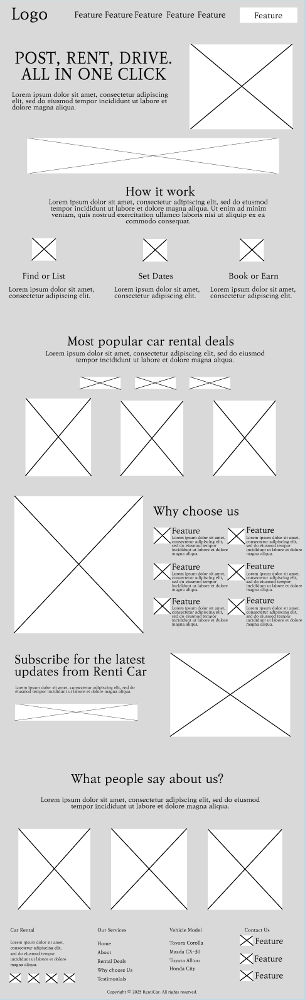
  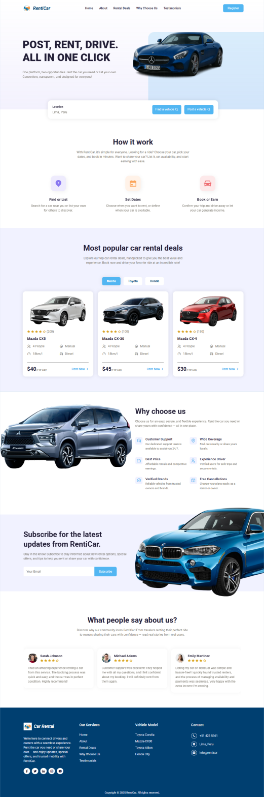<br>
  <em>Figura 5.2.2.1: Evolución de Wireframe a Mock-up de la Landing Page</em>
</p>

<p align="center">
  <br>
  <em>Figura 5.2.2.2: Landing Page implementada y desplegada en producción</em>
</p>

**Características Principales Implementadas en la Landing Page:**
- **Encabezado y Navegación Adaptable:** Barra de navegación fija con logotipo corporativo, enlaces a las secciones ("Inicio", "Por qué elegirnos", "Autos populares", "Opiniones") y selector dinámico de idioma (i18n).
- **Hero Section con Llamado a la Acción:** Propuesta de valor clara orientada a la movilidad compartida en el Perú con botones directos hacia el registro y la exploración del catálogo.
- **Catálogo de Modelos Populares:** Carrusel interactivo desarrollado con la librería Swiper.js, permitiendo navegar entre los automóviles más destacados.
- **Despliegue Continuo en Vercel:** Vinculación directa con la rama `main` del repositorio `LandingPage`, logrando un pipeline automatizado con tiempos de carga optimizados.

---

### 5.2.3. Implemented Frontend-Web Application Evidence

La aplicación web de **RentiCar** fue construida en **Angular**, utilizando Angular Material para los controles de interfaz de usuario y Leaflet para la visualización cartográfica.

<p align="center">
  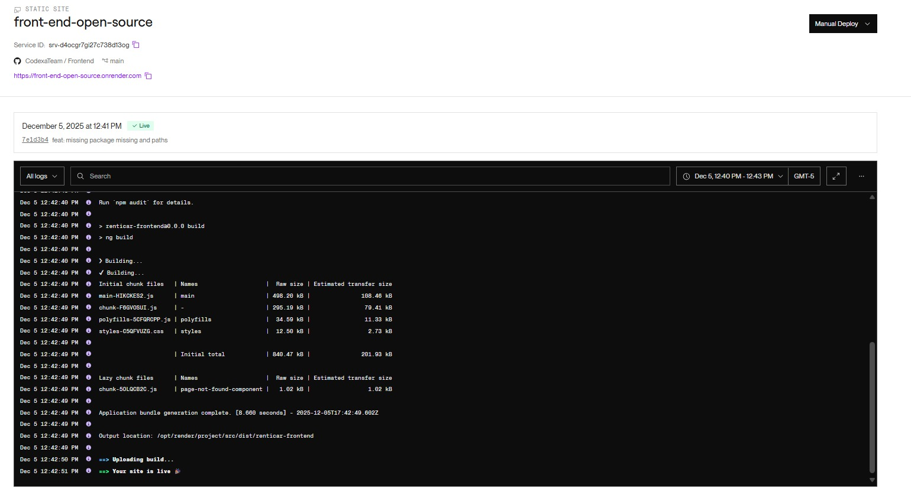
  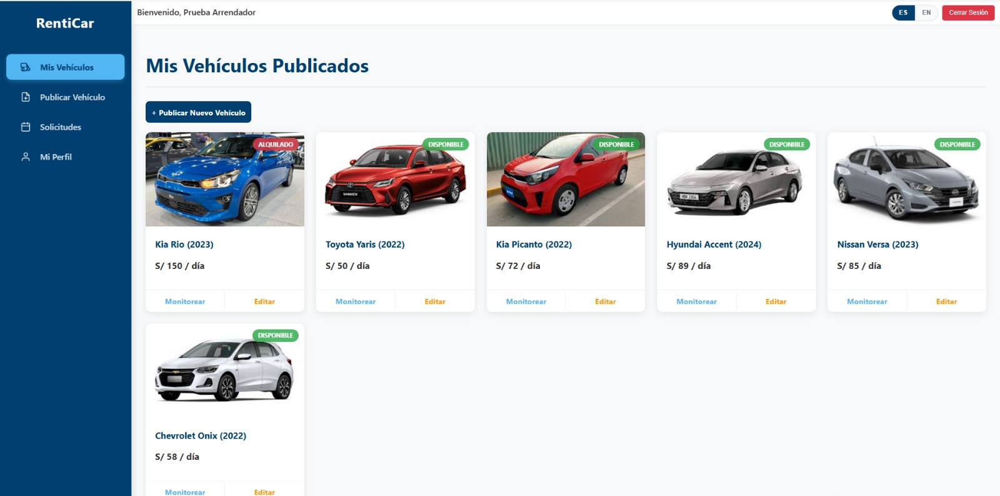<br>
  <em>Figura 5.2.3.1: Evidencia de compilación y ejecución de la aplicación web en producción</em>
</p>

<p align="center">
  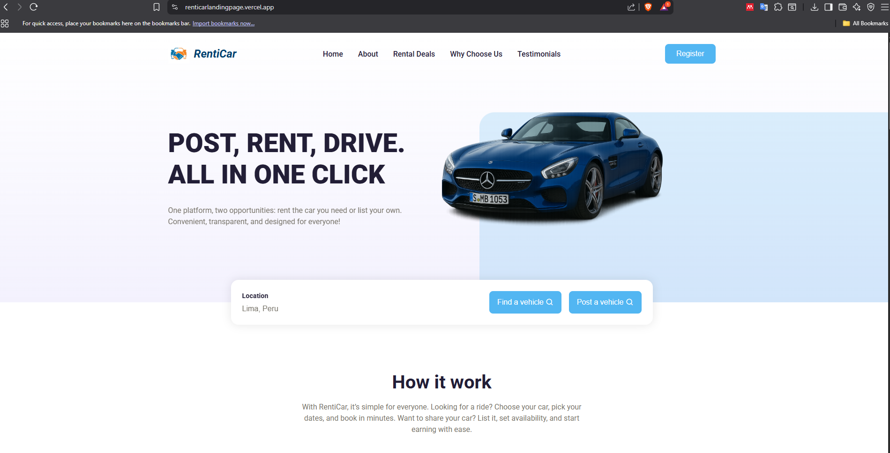<br>
  <em>Figura 5.2.3.2: Navegación por el catálogo interactivo de vehículos y panel de reservas</em>
</p>

**Módulos Clave del Frontend Verificados:**
- **Routing y Guards de Seguridad:** Rutas protegidas mediante `auth.guard.ts` para restringir el acceso a paneles privados sin token JWT válido.
- **Manejo Centralizado de Estados:** Servicios de Angular gestionando reactivamente el estado de la sesión, la cesta de reserva y los filtros de búsqueda.
- **Visualización Telemática Interactiva:** Integración con mapas vectoriales de código abierto permitiendo seguir la trayectoria simulada del vehículo durante el viaje.

---

### 5.2.4. Acuerdo de Servicio - SaaS

La plataforma **RentiCar** se distribuye bajo el modelo de **Software as a Service (SaaS)**. Con el objetivo de garantizar la confianza y transparencia entre la startup **Codexa-Team**, los propietarios de vehículos (arrendadores) y los usuarios clientes (arrendatarios), se establece el siguiente Acuerdo de Nivel de Servicio (SLA):

1. **Disponibilidad del Servicio (Uptime SLA):**  
   Codexa-Team garantiza una disponibilidad operativa mensual de la plataforma de al menos el **99.5%**, excluyendo periodos de mantenimiento preventivo programados con antelación.
2. **Seguridad y Confidencialidad de la Información:**  
   Toda la comunicación de datos se transmite cifrada mediante protocolo seguro TLS/HTTPS. Las contraseñas de los usuarios se almacenan con hashing irreversible BCrypt, y los datos personales son resguardados en cumplimiento estricto con la Ley de Protección de Datos Personales (Ley N° 29733).
3. **Mecanismo de Retención y Comisiones:**  
   La plataforma opera bajo un esquema de comisión transaccional transparente sobre cada reserva completada, reteniendo los fondos de forma segura hasta que el vehículo es devuelto satisfactoriamente.
4. **Soporte y Tiempos de Respuesta ante Incidentes:**  
   Se establecen canales de atención técnica con respuesta máxima de 4 horas para incidentes críticos (fallas en confirmación de reservas) y 24 horas para consultas ordinarias.
5. **Estrategia y Roadmap Móvil:**  
   Actualmente la plataforma opera con arquitectura **Web-First**, ofreciendo una interfaz totalmente adaptada a dispositivos móviles (PWA responsiva). La aplicación móvil nativa (Android/iOS) se encuentra proyectada dentro de la hoja de ruta evolutiva para etapas posteriores del proyecto.

---

### 5.2.5. Implemented RESTful API and/or Serverless Backend Evidence

El backend fue desplegado en la plataforma cloud **Render**, conectado de forma persistente a una instancia gestionada de **TiDB Cloud**:

<p align="center">
  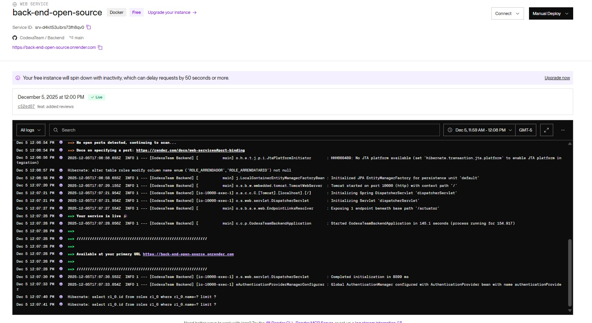
  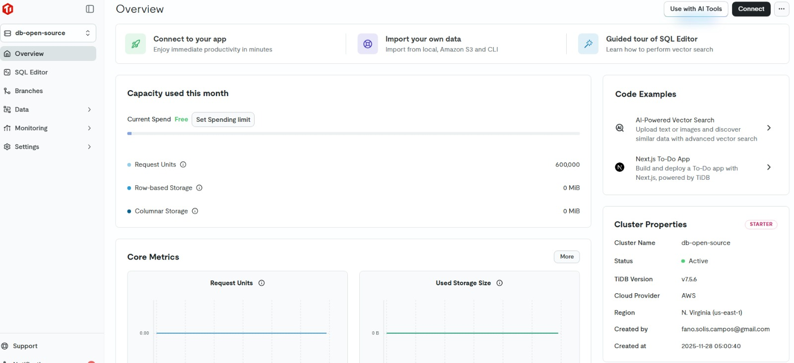<br>
  <em>Figura 5.2.5.1: Despliegue del servicio RESTful en Render y conexión exitosa a TiDB Cloud</em>
</p>

<p align="center">
  
  <br>
  <em>Figura 5.2.5.2: Logs de compilación Maven exitosa e inicialización de esquemas JPA</em>
</p>

**Configuración Técnica de Despliegue:**
- **Entorno de Ejecución:** OpenJDK 17 / 21 sobre contenedor Linux en Render.
- **Variables de Entorno Clave:** `SPRING_DATASOURCE_URL`, `SPRING_DATASOURCE_USERNAME`, `SPRING_DATASOURCE_PASSWORD`, `JWT_SECRET`.
- **Integración Continua:** Cada push a la rama `main` del repositorio `Backend` dispara automáticamente la compilación Maven, ejecución de pruebas y nuevo despliegue sin caída de servicio.

---

### 5.2.6. RESTful API Documentation

La documentación interactiva de la API fue implementada mediante **Swagger UI / OpenAPI 3.0**, permitiendo inspeccionar los esquemas DTO de entrada y salida, así como ejecutar peticiones de prueba en vivo contra el servidor desplegado:

<p align="center">
  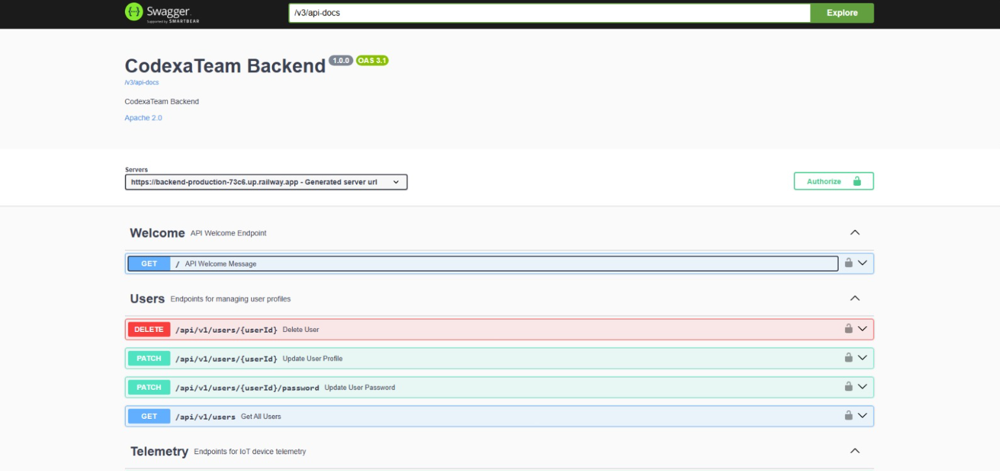
  <br>
  <em>Figura 5.2.6.1: Vistas de la documentación interactiva en Swagger UI de RentiCar</em>
</p>

#### Matriz Oficial de Endpoints RESTful Implementados en Spring Boot

La siguiente matriz detalla con rigor técnico los controladores, métodos HTTP, rutas oficiales, esquemas de transferencia de datos y códigos de estado HTTP implementados en la solución:

| Bounded Context | Controlador Spring Boot | Método | Ruta del Endpoint | Cuerpo de Petición (Request) | Código Respuesta | Descripción del Servicio |
| :--- | :--- | :---: | :--- | :--- | :---: | :--- |
| **IAM** | `AuthenticationController` | `POST` | `/api/v1/authentication/sign-up` | `SignUpResource` | `201 Created` | Registra una nueva cuenta de usuario asignando roles (`ROLE_RENTER`, `ROLE_OWNER`). |
| **IAM** | `AuthenticationController` | `POST` | `/api/v1/authentication/sign-in` | `SignInResource` | `200 OK` | Valida credenciales de acceso y emite el token Bearer JWT con claims de usuario. |
| **IAM** | `AuthenticationController` | `GET` | `/api/v1/authentication` | - | `200 OK` | Verifica el estado general de autenticación del sistema. |
| **IAM** | `UsersController` | `GET` | `/api/v1/users` | - | `200 OK` | Lista los usuarios registrados en el sistema. |
| **IAM** | `UsersController` | `PATCH` | `/api/v1/users/{userId}` | `UpdateUserResource` | `200 OK` | Actualiza la información básica del perfil del usuario. |
| **IAM** | `UsersController` | `PATCH` | `/api/v1/users/{userId}/password` | `UpdatePasswordResource` | `200 OK` | Restablece la contraseña cifrada del usuario. |
| **IAM** | `RolesController` | `GET` | `/api/v1/roles` | - | `200 OK` | Consulta el catálogo de roles admitidos en la plataforma. |
| **Listings** | `VehiclesController` | `GET` | `/api/v1/vehicles` | - | `200 OK` | Retorna el catálogo completo de vehículos disponibles para alquiler. |
| **Listings** | `VehiclesController` | `GET` | `/api/v1/vehicles/{vehicleId}` | - | `200 OK` | Retorna la ficha técnica detallada de un vehículo por su ID. |
| **Listings** | `VehiclesController` | `GET` | `/api/v1/vehicles/{vehicleId}/image` | - | `200 OK` | Descarga/renderiza la fotografía binaria almacenada del vehículo. |
| **Listings** | `VehiclesController` | `GET` | `/api/v1/vehicles/my-listings` | - | `200 OK` | Retorna la lista de vehículos publicados por el arrendador autenticado. |
| **Listings** | `VehiclesController` | `POST` | `/api/v1/vehicles` | `multipart/form-data` | `201 Created` | Publica un nuevo vehículo en la flota adjuntando datos y archivo fotográfico. |
| **Listings** | `VehiclesController` | `PUT` | `/api/v1/vehicles/{vehicleId}` | `multipart/form-data` | `200 OK` | Modifica las especificaciones, tarifa diaria o fotografía del vehículo. |
| **Listings** | `VehiclesController` | `DELETE` | `/api/v1/vehicles/{vehicleId}` | - | `204 No Content` | Da de baja una publicación de vehículo del catálogo. |
| **Booking** | `BookingsController` | `POST` | `/api/v1/bookings` | `CreateBookingResource` | `201 Created` | Registra una nueva solicitud de reserva en estado transaccional `PENDING`. |
| **Booking** | `BookingsController` | `GET` | `/api/v1/bookings/my-bookings` | - | `200 OK` | Consulta el historial completo de reservas solicitadas por el cliente autenticado. |
| **Booking** | `BookingsController` | `GET` | `/api/v1/bookings/my-requests` | - | `200 OK` | Retorna la bandeja de solicitudes de reserva recibidas por el dueño autenticado. |
| **Booking** | `BookingsController` | `GET` | `/api/v1/bookings/{bookingId}` | - | `200 OK` | Obtiene el comprobante y detalle de una reserva específica. |
| **Booking** | `BookingsController` | `PUT` | `/api/v1/bookings/{bookingId}/confirm`| - | `200 OK` | Confirma la reserva transicionándola a `CONFIRMED` y bloquea disponibilidad. |
| **Booking** | `BookingsController` | `PUT` | `/api/v1/bookings/{bookingId}/reject` | - | `200 OK` | Declina la solicitud transicionándola a `REJECTED` y libera fechas. |
| **Booking** | `BookingsController` | `PUT` | `/api/v1/bookings/{bookingId}/cancel` | - | `200 OK` | Cancela la reserva por iniciativa del cliente transicionándola a `CANCELLED`. |
| **IoT** | `TelemetryController` | `POST` | `/api/v1/telemetry` | `RecordTelemetryResource` | `201 Created` | Registra una lectura telemática emitida por los sensores vehiculares. |
| **IoT** | `TelemetryController` | `GET` | `/api/v1/telemetry/vehicle/{vehicleId}` | - | `200 OK` | Retorna el historial cronológico de telemetría de un vehículo. |
| **IoT** | `TelemetryController` | `GET` | `/api/v1/telemetry/vehicle/{vehicleId}/latest` | - | `200 OK` | Obtiene la última lectura telemática (latitud, longitud, velocidad, combustible). |
| **IoT** | `RouteController` | `GET` | `/api/v1/simulation/route` | - | `200 OK` | Retorna la secuencia de coordenadas GPS simuladas de la ruta en curso. |
| **Reviews** | `ReviewsController` | `POST` | `/api/v1/reviews` | `CreateReviewResource` | `201 Created` | Registra una calificación de 1 a 5 estrellas y comentario tras culminar alquiler. |
| **Reviews** | `ReviewsController` | `GET` | `/api/v1/reviews/vehicle/{vehicleId}` | - | `200 OK` | Retorna todías las opiniones y promedio de valoración de un vehículo. |
| **Reviews** | `ReviewsController` | `GET` | `/api/v1/reviews/my-reviews` | - | `200 OK` | Retorna las reseñas emitidas por el usuario autenticado. |
| **Shared** | `WelcomeController` | `GET` | `/` | - | `200 OK` | Endpoint raíz que expone el estado y versión de la API REST. |

---

### 5.2.7. Team Collaboration Insights

Durante todo el ciclo de desarrollo, **Codexa-Team** mantuvo una disciplina estricta de colaboración ágil y control de versiones utilizando **GitHub**:


---

## 5.3. Video About-the-Product

En este apartado se documenta el video promocional y técnico elaborado por **Codexa-Team**, en el cual se demuestra el funcionamiento real e integrado de la plataforma **RentiCar**:

<p align="center">
  <br>
  <em>Figura 5.3: Presentación oficial del Video About-the-Product de RentiCar</em>
</p>

### Ficha Técnica del Video About-the-Product

| Campo | Detalle Informativo |
| :--- | :--- |
| **Título del Video:** | RentiCar: Plataforma Web de Alquiler de Vehículos P2P con Monitoreo IoT |
| **Startup Responsable:** | Codexa-Team |
| **Producto Presentado:** | RentiCar (Aplicación Web Angular + Backend Spring Boot + TiDB) |
| **Integrantes Participantes:** | Bruce Vía Luna, César Linares, Sergio Landa, Estefano Solís, Sheila Angeles |
| **Duración Aproximada:** | 8 a 10 minutos |
| **Enlace Oficial del Video:** | [Ver Video About-the-Product en YouTube (https://youtu.be/t_m6u7wnkCs)](https://youtu.be/t_m6u7wnkCs) |

**Objetivos del Video Demostrativo:**
1. Presentar la propuesta de valor de **RentiCar** y la problemática de movilidad informal resuelta en el Perú.
2. Demostrar en vivo el flujo completo del **Arrendatario**: registro, login JWT, navegación en el catálogo, filtros avanzados, selección de fechas en calendario y confirmación de reserva.
3. Demostrar en vivo el flujo del **Arrendador**: dashboard, publicación de un vehículo con especificaciones y fotos, recepción de solicitudes de alquiler y aprobación.
4. Exponer la funcionalidad de **Monitoreo IoT**: visualización de coordenadas GPS en tiempo real sobre mapa Leaflet y lectura de telemetría de velocidad y combustible.
5. Evidenciar el proceso de **Calificación y Reseñas** que consolida la confianza comunitaria en la plataforma.

---

# Conclusiones

||||

# Bibliografía

||||

# Anexos
|||
